**Datové struktury: Spojový seznam, Strom, Fronta, Zásobník, Halda**

**LinkedList**

[Nepracuje s polem.]{.underline}

[Jednosměrný a Obousměrný]{.underline}

[Celkem 4 druhy]{.underline}

**Jednosměrný (Singly Linked List)**

Obsahuje: datovou část a jednoho ukazatele (na následující prvek)

Jednotlivé prvky v listu jsou v paměti různě rozházené (již tedy nejsou
uložené za sebou) a po sobě jdoucí prvky na sebe odkazují.

První prvek odkazuje na druhý, ten zas na třetí, ten na čtvrtý...
poslední odkazuje na null (neplatnou adresu), tím se pozná, že je
poslední.

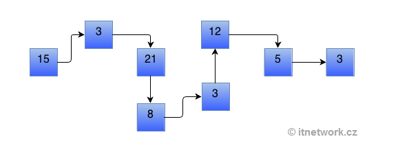{width="4.263999343832021in"
height="1.5028849518810148in"}

Dá se procházet pouze jedním směrem.

**Cyklická verze**

Poslední prvek odkazuje na první prvek.

Tím vznikne spojový seznam, při jehož procházení se nenajde konec.

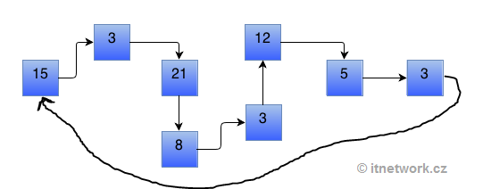{width="3.9018842957130357in"
height="1.503999343832021in"}

**Obousměrný spojový seznam (Doubly Linked List)**

Obsahuje: datovou část, dva ukazatele (na předchozí a následující prvek)

Potřebuje mizivě více paměti než jednosměrný.

[Je v C\#, .NET nepodporuje jednosměrné.]{.underline}

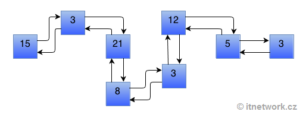{width="3.6319991251093615in"
height="1.4061636045494312in"}

Dá se procházet oběma směry

Poslední prvek odkazuje jako na následují prvek na null (neplatnou
adresu), první prvek odkazuje jako na předchozí na null (neplatou
adresu).

**Cyklický**

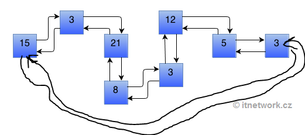{width="3.72799978127734in"
height="1.6529133858267717in"}

Poslední prvek odkazuje jako na následující na první.

První prvek odkazuje jako na předchozí na poslední.

U spojových seznamů není možnost rychle přistoupit k prvku podle jeho
indexu a to kvůli tomu, že prvky již nejsou v paměti za sebou. Když se
třeba chcem dostat na 10 prvek, tak musíme jít z prvního na druhý atd..
nebo od konce (v C\#)

Seznamy se (spolu se stromy) označují jako rekurzivní datové struktury,
neboť každý prvek seznamu obsahuje odkaz na položku stejného typu.

Seznam může mít tzv. hlavu (head) - první prvek seznamu, který obsahuje
v datové části nějakou neplatnou hodnotu. Podle této hodnoty poznáme, že
se jedná o první prvek.

Seznamy obvykle používáme jako dynamické datové struktury. To znamená,
že v programu deklarujeme pouze ukazatel na první prvek seznamu a
jednotlivé prvky seznamu podle potřeby dynamicky alokujeme nebo rušíme.

Poslední prvek seznamu se někdy označuje jako ocas (tail) a může
obsahovat v datové části nějakou neplatnou hodnotu, podle které poznáme,
že se jedná o poslední prvek.

Není omezená velikost, takže mžem přidávat tak dluho, dokud je
k dispozici paměť

**Výhody**

-   kapacita je teoreticky neomezená

-   velikost obsazené paměti je přímo závislá jen na počtu prvků, není
    zde žádné plýtvání

-   rychlost přidávání i odebírání prvků je vždy stejně vysoká

**nevýhody**

-   [při každém přidání je nutná alokace paměti pro přidaný prvek. To
    způsobí při přidání třeba 1M prvků, že je 50krát pomalejší než list,
    který si alokaci paměti udělá jen při vytvoření nového pole za
    účelem zvýšení kapacity]{.underline}

-   stejné množství dat zabírá více paměti než stejné prvky uložené v
    poli (kvůli ukazatelům navíc)

-   pomalý přístup k prvkům

-   pomalejší procházení (při každém posunu je nutná dereference
    ukazatele a skok na místo v paměti)

**vs pole**

Pole má lehčí a rychlejší práci s upravováním prvků v poli, pomocí
indexu. Jeho přidání hodnot může překonat počet míst pro prvky v poli
(4,8,16,32). Když přidáme třeba 5. prvek u dynamické kolekce, tak se
vytvoří nové pole o velikosti 8 a staré se do něj zkopíruje a přidá se
5. prvek. Staré pole pořád na heapu existuje a zabírá paměť dokud ho
neodstraní GC, který zabere nějaký čas, který by mohl být využit jinak.

Příklad

-   Pokud plánujeme data uložit do kolekce, kterou budeme celou
    prohlížet. Iterátor foreach je pro LinkedList nejlepší volba.

-   Zaznamenávání hodnot se senzorů každých 30 sec, číst je nebudeme
    často, takže nás pomalé získání netrápí, ale rychlé přidání je
    hlavní výhodou.

**C\# LinkedList**

Generický

[Je tam necyklický obousměrný typ.]{.underline}

Jak dokázat že není cyklický:

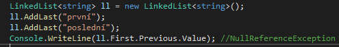{width="5.15625in"
height="0.7291666666666666in"}

**Vlastnosti**

-   Last (Value,Next,Previous)

-   First (Value,Next,Previous)

-   Count

Jsou v něm prvky typu LinkedListNode

**Metody:**

-   AddAfter() - Přidá nový prvek za daný prvek. O(1)

-   AddBefore() - Přidá nový prvek před daný prvek. O(1)

-   AddFirst() - Přidá nový prvek na začátek seznamu. O(1)

-   AddLast() - Přidá nový prvek na konec seznamu. O(1)

-   Contains() -- Zjistí jestli kolekce obsahuje prvek. O(n)

-   Find() -- stejný jako constains, ale vrátí Node. O(n)

-   First - Vlastnost vracející první prvek. O(1)

-   Last - Vlastnost vracející poslední prvek. O(1)

-   Remove -- Odstraní konkretní prvek. O(n)

-   RemoveFirst() - Odstraní první prvek. O(1)

-   RemoveLast() - Odstraní poslední prvek. O(1)

**Vkládání do prostřed**

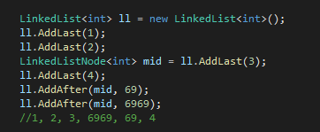{width="3.7708333333333335in"
height="1.5520833333333333in"}

Výhodou obousměrného je třeba projíždění od konce, vypisování.

**Strom**

Stromem se nazývají souvislé grafy, které neobsahují kružnice.

Strom je tedy minimální souvislý graf na daných vrcholech.

Stromy se v informatice velmi často vyskytují, protože reprezentují
základní koncept, kterým je hierarchie.

Se stromy se setkáme všude tam, kde je potřeba rychle vyhledávat,
reprezentovat strukturovaná data nebo rozhodovat.

Strom je i přirozeným modelem rekurze.

Pravidlo binárního stromu: rodič může mít maximálně 2 potomky.

-   **kořen** (root) -- horní prvek

-   **vnitřní uzel** (inner node) = uzel, který není kořenem, ani listem

-   **list** (leaf node, external node) = uzel, který nemá žádné potomky

-   **rodič** (parent node) = uzel, který přímo předchází daný uzel na
    cestě od listu ke kořeni

-   **potomek** (child node) = uzel, který přímo následuje za daným
    uzlem na cestě od kořene k listu

-   **sourozenec** (sibling) = jako sourozenci se označují uzly se
    stejným rodičem

-   předek (ancestor node, predecessor node) = uzel, který leží před
    daným uzlem na cestě ke kořeni (nejbližší předek je rodič)

-   následník (successor node) = uzel, který leží za daným uzlem na
    cestě od kořeni k libovolnému listu (nejbližší následník je potomek)

-   hloubka (depth) = hloubka stromu je délka nejdelší cesty od kořene k
    listu, přičemž prázdný strom má definovánu hloubku jako -1

-   **úroveň** (level) = většinou se používá ve významu množiny uzlů,
    které se nachází ve stejné vzdálenosti od kořene, počítáno dle počtu
    uzlů

**nevyvážený strom**

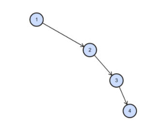{width="1.9919991251093614in"
height="1.7965813648293962in"}

Datová struktura na obrázku je stále binárním stromem, i když
extrémně nevyváženým. Tam, kde nic není, je hodnota null. Zde je to
opravdu velmi nešťastný strom, který svým uspořádáním prvků ztrácí
veškeré výhody a degradoval do spojového seznamu. V takovém stromu si
např. při vyhledávání nemůžeme zkrátit cestu žádnou odbočkou na jinou
větev, ale musíme projít všechny uzly v celém stromu.

**Vyvážený binární vyhledávací strom**

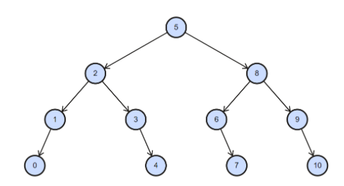{width="3.451715879265092in"
height="1.8719991251093613in"}

Vyvážený Binární vyhledávací strom (anglicky nebo někdy také zkráceně
BBST jako Balanced Binary Search Tree) se již reálně používá pro
efektivní práci s daty. Oproti haldě má přesně dané, kde jaký prvek
leží.

[Pravá větev vždy obsahuje prvky větší než hodnota daného uzlu, levá
větev potom prvky menší než hodnota daného uzlu.]{.underline}

Podle toho funguje přidávání, odebírání a získávání prvků ve stromu.

Tyto operace jsou O( $\log_{2}(n)$), protože se neprojdou všechny větve.

Existuje i Unbalanced: tam je root pořád stejný až do odstranění, ale
hrozí, že budou všechny prvky na levou stranu všech prvků, což by
znamenalo nejhorší případ časové složitosti O(n) u všech operací.

Proto se Balanced Binary seach tree snaží mít co nejméně levelů. Dělá to
pomocí rotací.

Příklad

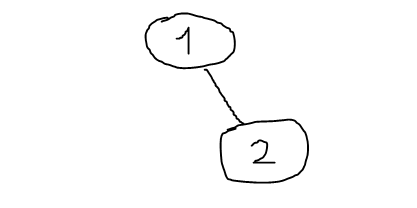{width="2.582191601049869in"
height="1.2879997812773403in"}

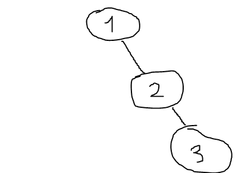{width="2.570547900262467in" height="1.8in"}

Rotace do leva

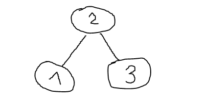{width="3.0959995625546806in"
height="1.5442869641294839in"}

**Úplný binární strom (full) **

každý vnitřní uzel má dva syny.

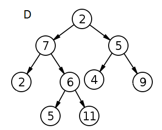{width="2.8879997812773404in"
height="2.3173173665791778in"}

**Plný binární strom (complete) **

[Jeho úrovně jsou plně zaplněné, až na poslední, ale ta se musí plnit z
leva do prava bez vynechání. Není žádné prázdné místo.]{.underline}

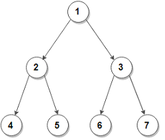{width="2.5in"
height="2.125in"}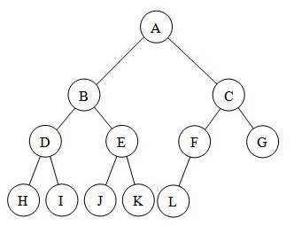{width="3.4583333333333335in"
height="2.65625in"}

**Perfektní binární strom (Perfect)**

[Všechny listy jsou na stejné úrovni a musí být celá vyplněna
v předchozích úrovních nesmí být volné místo]{.underline}

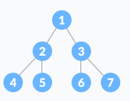{width="2.78125in" height="2.15625in"}

**B-strom**

B-stromy se od většiny ostatních stromů liší v tom, že v jejich uzlech
lze uložit více než jeden prvek. Byly vytvořeny zejména pro efektivní
využití na pevných discích, kdy lze v jednom kroku pracovat s více prvky
najednou. Pro tuto vlastnost jsou často prakticky využívány v
databázových systémech. Co se týká časové složitosti, tak vycházejí
stejně jako binární stromy.

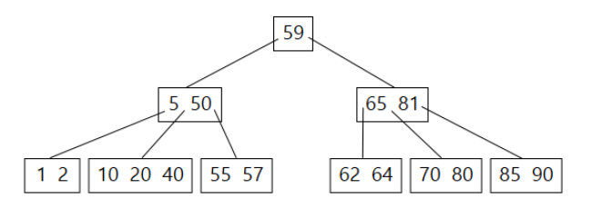{width="4.52in"
height="1.5468722659667542in"}

**Výhoda**

Dá se setřídit podle potřeb, a proto se v něm dá rychleji hledat než
v linked listu

Pokud je podle pravidel binárního stromu

-   Každý uzel má nanejvýš dva následníky - levého a pravého.

-   Každému uzlu je přiřazen určitý klíč. Podle hodnot těchto klíčů jsou
    uzly uspořádány.

-   Levý podstrom uzlu obsahuje pouze klíče menší než je klíč tohoto
    uzlu.

-   Pravý podstrom uzlu obsahuje pouze klíče větší než je klíč tohoto
    uzlu.

LinkedList:

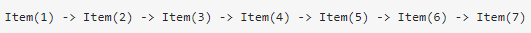{width="5.53125in" height="0.34375in"}

Strom

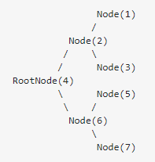{width="1.5279997812773403in"
height="1.605563210848644in"}

Rychlost hledání:

U linkedlistu O(n)

U stromových kolekcí je to O($\log_{2}(n)$)

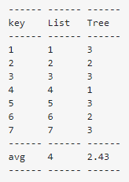{width="1.7083333333333333in"
height="2.40625in"}

**Halda**

[Halda je speciální druh binárního stromu]{.underline}

[Halda je vyváženým plným binárním stromem. To znamená, že je téměř celý
zaplněný.]{.underline}

Druhy: Max-Heap (největší nahoře, nejmenší dole), Min-Heap (nejmenší
nahoře, největší dole)

používá se primárně pro efektivní nalezení minimálního (či maximálního)
prvku v konstantním čase. Aby byl nějaký binární strom haldou, musí
každý jeho uzel splňovat „vlastnost haldy"

Vlastnost: Pro každý uzel platí, že jeho rodič nese stejnou nebo vyšší
hodnotu, než je on sám.

Nový prevek se vkládá na konec haldy (zleva)

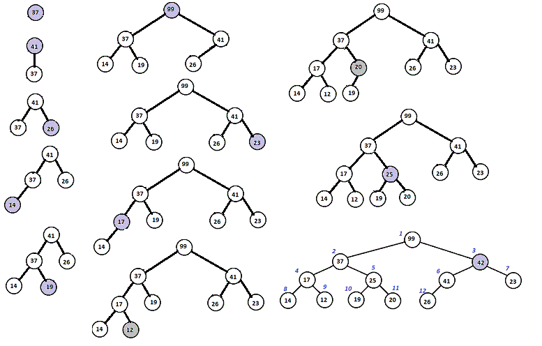{width="6.3in"
height="4.021667760279965in"}

**Fronta (Queue)**

Fronta je lineární datová struktura určená pro ukládání prvků a jejich
opětovný výběr ve stejném pořadí, v jakém byly do fronty přidány,
nejstarší přidaný prvek je vybrán jako první

Kolekce pro dočasné uložení dat

**FIFO -- First In First Out**

{width="3.3892202537182854in"
height="2.2159995625546807in"}

Existuje i Priority queue (java)

To může implementovat pole, spojový seznam, haldu nebo binární strom

Není podle FIFO, na první pozici jdou prvky s nejvyšší prioritou
(předbíhaj)

**C\# Queue**

[Generický]{.underline}, ale existuje taky negenerický

Povoluje duplicitní prvky, dá se přidat null (když to datový typ dovolí)

**Metody:**

Enqueue(prvek) -- přídá prvek na konec fronty -- O(1)/O(n) pokud je
potřeba zvýšit kapacitu pole

Dequeue() -- odebere prvek na prvním místě ve frontě - O(1)

Peek() -- vrátí prvek na prvním místě ve frontě - O(1)

Clear(), Constains(prvek), ToArray(), TryPeek(), TryDequeue

**Vlastnost**

Count

[Thread safe verze:]{.underline} ConcurrentQueue generickej

**Zásobník (Stack)**

Zásobník je lineární datová struktura určená pro ukládání prvků a jejich
opětovný výběr v opačném pořadí.

poslední přidaný prvek je vybrán jako první

**LIFO -- Last In First Out**

Zásobník je jedna z nejdůležitějších datových struktur v informatice.
Používá se pro rekurzi, volání podprogramů, výpočty matematických výrazů

{width="3.079861111111111in"
height="2.6479166666666667in"}

**C\#**

[Generický]{.underline}, ale je i negenerický

Povoluje duplicitní prvky, dá se přidat null (když to datový typ dovolí)

**Metody:**

Push(prvek) -- přídá prvek na vrchol (první pozice) -- O(1)/O(n)

Pop() -- odebere prvek z vrcholu (první pozice) -- O(1)

Peek() -- vrátí prvek z vrcholu (první pozice) -- O(1)

Clear(), Constains(), TryPeek(), TryPop()

**Vlastnost**

Count

[Thread safe verze:]{.underline} ConcurrentStack generickej
