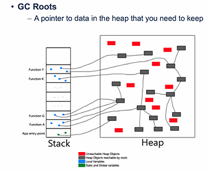
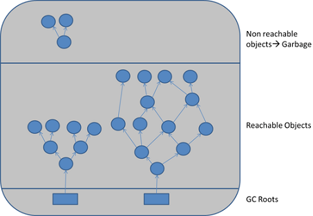
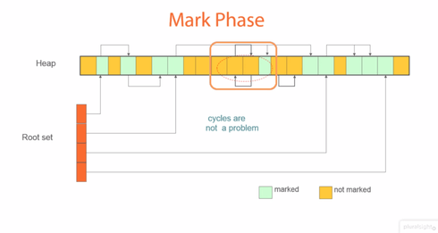
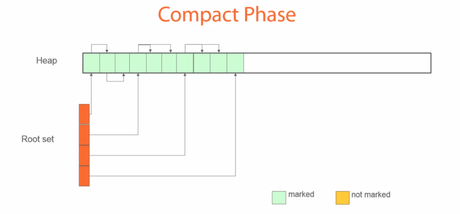
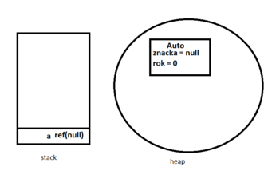
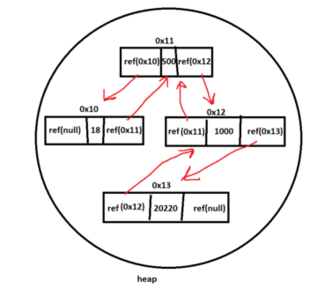
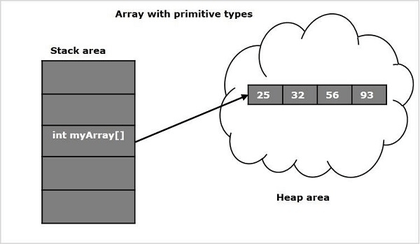
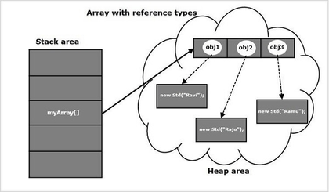

<style type="text/css">
  body{
    font-size: 10.5pt;
  }
</style>

# 1. Adresování a správa paměti, Garbage collector

### Halda a zásobník

#### Halda (Heap)

    Je pouze jedna v celém programu
    Na haldu se ukládají všechny referenční typy:
        ▪ class
        ▪ interface
        ▪ delegate
        ▪ object
        ▪ string
    String je objekt…, vždy je na haldě
    Ve stacku jsou na ně použity ukazatele (pointers)
    • Není jakkoliv organizovaná
    • Je přístupná pro všechny (pokud instanci nezablokujeme modifikátorem přístupu – public, private, internal, protected)
    • Pokud jsou na haldě nějaká data, na které neukazuje žádný ukazatel, smaže je garbage collector

#### Zásobník (Stack)

    Druh paměti, který vlákna využívají pro provedení kódu.Každé vlákno má vlastní zásobník.Je setříděný (LIFO) = Last In First Out.
    Každá metoda je vlastně blok, kde jsou uložena její data, bloky jsou vrstveny na sobě takovým způsobem, že nově přidané bloky padají na starší a tím zabraňují práci s těmi předešlými, dokud nejsou vyřešeny.

    Obsahuje pouze primitivní datové typy:
    bool,byte,char,double,float,int,long, atd.
    Proměnné volané v metodách, se také ukládají na zásobník, jsou ale nepřístupné, a jakmile metoda skončí, smažou se
    Když se vytvoří primitivní proměnná v třídě mimo metodu, je uložena na haldě.

### Garbage Collector

    Automatické zpracování paměti, které pracuje na haldě.
    Automaticky prochází haldu a maže objekty, které nemají žádnou referenci.
    Objekty se rozdělují na živé a mrtvé, a sestaví se z nich strom

|  |  |
| :--------------------------------: | :-----------------------------: |

    Má 3 fáze: 

#### Marking

    Od rootů (kořenů, musí být vždy 1 nebo víc) jsou sledovány reference a objekty jsou přidávány na seznam živých. Všechny objekty, které nejsou na seznamu živých jsou odstraněni z haldy.



#### Relocating

    Reference na objekty, které jsou na seznamu živých jsou aktualizovány  (adresy) a ukazují na adresy objektů, kde se budou nacházet po fázi Compacting.

#### Compacting

    Uvolněné místo po smazání mrtvých objektů je zhutněno a živé objekty se přesunou, aby mezi nimi nebyly mezery volného místa.




#### Generace

    Každý objekt začíná v generaci 0, když se provede garbage collector, tak všechny objekty co přežily jsou povýšeny do generace 1, když přežijou garbage collector 1 nebo víckrát i tam tak jsou povýšeny do generace 2 
    Java přepokládá, že nejnovější objekty umírají rychle, starší se dožijou nejdéle. Třeba statický proměnná na začátku třídy.

##### Generace 0

    Obsahuje krátkodobé objekty (objekty s krátkodobou životností), např: krátkodobá proměnná.K uvolňování paměti dochází nejčastějí v této fázi.
    Může být zavolán Garbage Collector manuálně (metodou) uživatelem.

##### Generace 1

    Tato generace obsahuje krátkodobé objekty a slouží jako vyrovnávací paměť mezi krátkodobé a dlouhodobé objekty – středně dlouhé objekty.
    Garbage collector zde běží méněkrát než v generaci 0.

##### Generace 2

    Obsahuje dlouhodobé objekty.
    Například statické co jsou vytvořeny na začátku programu a žijí po celý program.Garbage Collecter zde uklící ve všech generacích nejméně krát. 

#### Příklady použití Garbage Collectoru

#### 1

```java

    int x = 3;
    int y = 111;

```

    Program běží od shora, takže první na řadě je x, to je lokální proměnná, tak se dá na stack (tam je 32bit prostor pro adresu ukazují na haldu)
    Druhá je y také lokální proměnná, takže taky na stack
    Po skončení metody je stack smaže a bude prázdej

##### 2

```java
    
    Auto a;
    new Auto();

```



    Proměnná a není přiřazené k typu, protože na nic neukazuje.
    na Heap je Auto, protože je objet, ale nic na něj neukazuje, takže ho smaže Garbage collector.Na Heap ho vytvoříl příkaz „new“.

```java

Auto a = new Auto();
System.out.println(a.getClass().getName());
```

    Instance bude ukazovat na Auto, po skončení Main se „a“ smaže ze stack a na Auto už nebude nic ukazovat, takže ho smaže garbage collector

##### 3

```java
  Auto a = null;
  a.znacka = "VW";

```

    a neukazuje na žádný objekt, jeho reference je null (0x00000)

##### 4

```java

    Auto a = new Auto();
    a = null;

```

    Po řádcích
    1. Stack [a ref(Auto)]	Heap [Auto…]
    2. Stack [a ref(null)]	Heap [Auto…]

### Kolekce

#### LinkedList


    Linked list je kolekce kde prvek obsahuje adresu předchozího, data a adresu následujícího



#### Ostatní

    S primitivním typem



    S objektovým typem


    Pole je indexováno od 0, protože 0. prvek je báze a při výpisu jiného prvku nemusíme procházet ostatní. Číslo indexu říká, kolikrát se má ukazatel na prvek posunout. Když ze začátku ukazuje na bázi (první prvek), tak se posune 0krát

