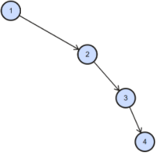
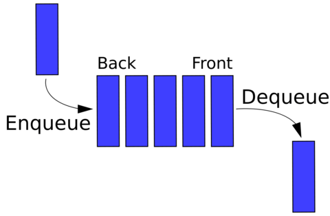
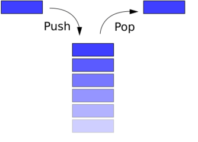

# 10. Datové struktury: Spojový seznam, Strom, Fronta, Zásobník, Halda

### LinkedList

    Nepracuje s polem.
    Jednosměrný a Obousměrný.
    Celkem 4 druhy.

#### Jednosměrný spojový seznam (Singly Linked List)

    Obsahuje: datovou část a jednoho ukazatele (na následující prvek).
    Jednotlivé prvky v listu jsou v paměti různě rozházené(již tedy nejsou uložené za sebou).První prvek odkazuje na druhý, ten zas na třetí, ten na čtvrtý.. poslední odkazuje na null, tím se pozná, že je poslední.Je průchozí jen jedním směrem.
    V Javě si ho uživatel musí naprogramovat sám.

    Cyklická verze
    Poslední prvek ukazuje na první a nikdy se při procházení nedojde konce.

#### Obousměrný spojový seznam (Doubly Linked List)

    Obsahuje: datovou část, dva ukazatele (předchozí a následující prvek)
    Potřebuje mizivě více paměti než jednosměrný.

    Možnost průchodu oběma směry.
    Pokud není cyklický pak první prvek ukazuje na předchozí null a poslední na další null.

#### Souhrn

    U spojových seznamů není možnost rychle přistoupit k prvku podle jeho indexu a to kvůli tomu, že prvky již nejsou v paměti za sebou. Když se třeba chcem dostat na 10 prvek, tak musíme jít z prvního na druhý atd.. nebo od konce (v C#).

    Seznamy se (spolu se stromy) označují jako rekurzivní datové struktury, neboť každý prvek seznamu obsahuje odkaz na položku stejného typu.

    Seznam může mít tzv. hlavu  (head) - první prvek seznamu, který obsahuje v datové části  nějakou neplatnou hodnotu. Podle této hodnoty poznáme, že se jedná o první prvek.

    Poslední prvek  seznamu  se někdy označuje jako ocas (tail) a může obsahovat v datové části  nějakou neplatnou hodnotu, podle které poznáme, že se jedná o poslední prvek.

    Seznamy obvykle používáme jako dynamické datové struktury. To znamená, že v programu deklarujeme pouze ukazatel na první prvek seznamu a jednotlivé prvky seznamu podle potřeby dynamicky alokujeme nebo rušíme.

    Velikost je omezena pouze velikostí paměti přidělené k programu.

    Výhody
    - kapacita je teoreticky neomezená
    - velikost obsazené paměti je přímo závislá jen na počtu prvků,není zde žádné plýtvání
    - rychlost přidávání i odebírání prvků je vždy stejně vysoká
    
    Nevýhody
    - při každém přidání je nutná alokace paměti pro přidaný prvek. To způsobí při přidání třeba 1M prvků, že je 50krát pomalejší než ArrayList, který si alokaci paměti udělá jen při vytvoření nového pole za účelem zvýšení kapacity
    - stejné množství dat zabírá více paměti než stejné prvky uložené v poli (kvůli ukazatelům navíc)
    - pomalý přístup k prvkům
    - pomalejší procházení (při každém posunu je nutná dereference ukazatele a skok na místo v paměti)

    LinkedList vs pole
    Pole má lehčí a rychlejší práci s upravováním prvků v poli, pomocí indexu. Jeho přidání hodnot může překonat počet míst pro prvky v poli (4,8,16,32). Když přidáme třeba 5. prvek u dynamické kolekce, tak se vytvoří nové pole o velikosti 8 a staré se do něj zkopíruje a přidá se 5. prvek. Staré pole stále na heapu existuje a zabírá paměť dokud ho neodstraní GC, který zabere nějaký čas, který by mohl být využit jinak.

    Příklad
    - Pokud plánujeme data uložit do kolekce, kterou budeme celou prohlížet. Iterátor foreach je pro LinkedList nejlepší volba.
    - Zaznamenávání hodnot se senzorů každých 30 sec, číst je nebudeme často, takže nás pomalé získání netrápí, ale rychlé přidání je hlavní výhodou.

### Strom

    Stromem se nazývají souvislé grafy, které neobsahují kružnice.
    Strom je tedy minimální souvislý graf na daných vrcholech.
    Stromy se v informatice velmi často vyskytují, protože reprezentují základní koncept hierarchie.
    Se stromy se setkáme všude tam, kde je potřeba rychle vyhledávat, reprezentovat strukturovaná data nebo rozhodovat.
    Strom je i přirozeným modelem rekurze.

    Pravidlo binárního stromu: rodič může mít maximálně 2 potomky.

    - Kořen (root) – horní prvek
    - Vnitřní uzel (inner node) = uzel, který není kořenem, ani listem
    - List (leaf node, external node) = uzel, který nemá žádné potomky
    - Rodič (parent node) = uzel, který přímo předchází daný uzel na cestě od listu ke kořeni
    - Potomek (child node) = uzel, který přímo následuje za daným uzlem na cestě od kořene k listu
    - Sourozenec (sibling) = jako sourozenci se označují uzly se stejným rodičem
    - Předek (ancestor node, predecessor node) = uzel, který leží před daným uzlem na cestě ke kořeni (nejbližší předek je rodič)
    - Následník (successor node) = uzel, který leží za daným uzlem na cestě od kořeni k libovolnému listu (nejbližší následník je potomek)
    - Hloubka (depth) = hloubka stromu je délka nejdelší cesty od kořene k listu, přičemž prázdný strom má definovánu hloubku jako -1
    - Úroveň (level) = většinou se používá ve významu množiny uzlů, které se nachází ve stejné vzdálenosti od kořene, počítáno dle počtu uzlů

#### Nevyvážený strom

    Datová struktura na obrázku je stále binárním stromem, i když extrémně nevyváženým. Tam, kde nic není, je hodnota null. Zde je to opravdu velmi nešťastný strom, který svým uspořádáním prvků ztrácí veškeré výhody a degradoval do spojového seznamu. V takovém stromu si např. při vyhledávání nemůžeme zkrátit cestu žádnou odbočkou na jinou větev, ale musíme projít všechny uzly v celém stromu.

    Datová struktura na obrázku je stále binárním stromem, i když extrémně nevyváženým. Tam, kde nic není, je hodnota null. Zde je to opravdu velmi nešťastný strom, který svým uspořádáním prvků ztrácí veškeré výhody a degradoval do spojového seznamu. V takovém stromu si např. při vyhledávání nemůžeme zkrátit cestu žádnou odbočkou na jinou větev, ale musíme projít všechny uzly v celém stromu.

#### Vyvážený binární vyhledávací strom

    Vyvážený Binární vyhledávací strom (anglicky nebo zkráceně BBST jako Balanced Binary Search Tree) se používá pro efektivní práci s daty. Oproti haldě má přesně dané, kde jaký prvek leží. 
    Pravá větev vždy obsahuje prvky větší než hodnota daného uzlu, levá větev potom prvky menší než hodnota daného uzlu.
    Podle toho funguje přidávání, odebírání a získávání prvků ve stromu.
    Tyto operace jsou O( ), protože se neprojdou všechny větve.

    Existuje i Unbalanced: tam je root pořád stejný až do odstranění, ale hrozí, že budou všechny prvky na levou stranu všech prvků, což by znamenalo nejhorší případ časové složitosti O(n) u všech operací.
    Proto se Balanced Binary seach tree snaží mít co nejméně levelů. Dělá to pomocí rotací.

### Halda

    V javě lze realizovat jako PriorityQueue.

### Fronta(Queue)

    Fronta je lineární datová struktura určená pro ukládání prvků a jejich opětovný výběr ve stejném pořadí, v jakém byly do fronty přidány, nejstarší přidaný prvek je vybrán jako první
    Kolekce pro dočasné uložení dat

    Existuje i Priority queue (java)
    To může implementovat pole, spojový seznam, haldu nebo binární strom
    Není podle FIFO, na první pozici jdou prvky s nejvyšší prioritou (předbíhaj)

### Zásobník (Stack)

    Zásobník je lineární datová struktura určená pro ukládání prvků a jejich opětovný výběr v opačném pořadí.
    poslední přidaný prvek je vybrán jako první
    LIFO – Last In First Out
    Zásobník je jedna z nejdůležitějších datových struktur v informatice. Používá se pro rekurzi, volání podprogramů, výpočty matematických výrazů

#### Stack v Javě

    Reprezentuje zásobník LIFO. Dědí od třídy Vector s pěti operacemi.
    Typické push a pop operace a peek-at-the top také metodou isEmpty

