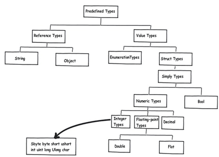
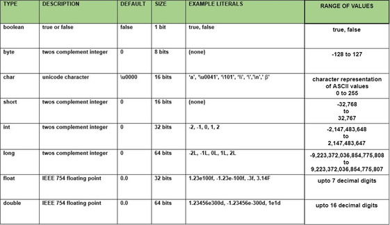

<style type="text/css">
  body{
    font-size: 10.5pt;
  }
</style>

# 11. Datové typy, Generika, Výčtové datové typy, Struktury

### Typy

#### Proměnná

    Pojmenované je to místo v paměti počítače, kam si můžeme uložit nějaká data.
    Toto místo má podle typu proměnné také vyhrazenou určitou velikost, kterou proměnná nesmí přesáhnout.
    Proměnná má vždy nějaký datový typ
    Většinou musíme před prací s proměnnou tuto proměnnou nejdříve tzv. deklarovat (pojmenovat) a jakého datového typu bude. Jazyk ji v paměti založí a teprve potom s ní můžeme pracovat.

#### Konstanta

    Podobná proměnné, ale nelze ji v průběhu programu změnit

### Datový typ

    Definuje velikost místa v paměti a způsob uložení informací
    Určuje hodnoty, které proměnné a konstanta může obsahovat a také operace, které můžou být prováděny
    O každém datovém typu jazyk ví, kolik v paměti zabírá místa a jak s tímto kusem paměti pracovat.

#### Typový systém

    • Dynamický: nepíše se k proměnné datový typ, vnitřně ho má. Proměnné se nemusí deklarovat, jakmile do nějaké proměnné něco uložíme a jazyk zjistí, že nebyla nikdy deklarována, sám ji založí. Do stejné datové proměnné zle ukládat různé hodnoty datových typů (čísla, text, objekty), jazyk sám mění datový typ proměnné. Výhody: méně kódu. Např: Python a Ruby

    • Statický: vyžaduje datový typ proměnné a tento datový typ je neměnný. Jakmile proměnnou jednou deklarujeme, není možné její datový typ změnit. Např: C# a Java Výhoda oproti dynamickému: kód je možno kontrolovat, c# nedovolí kód ani zkompilovat a na chybu upozorní, u dynamického se na to přijde až v běhu programu

#### Rozdělení proměnných

    • Globální proměnné se vytvoří při spuštění programu a existují po celou dobu jeho běhu. To znamená, že mají v programu stálou adresu (např. atributy tříd nebo proměnné static). 
    • Lokální proměnné se vytvářejí během běhu programu v závislosti na zdrojovém kódu a existují do konce bloku, ve kterém jsou deklarovány. Jsou to všechny vstupní parametry metod. Vznikají v okamžiku volání funkce, při ukončení funkce zanikají. Vznikají v okamžiku deklarace a zanikají při ukončení funkce (např. funkce Main). Proměnné deklarované uvnitř cyklu nebo podmíněného příkazu zanikají po cyklu 
    • Dynamické proměnné vznikají za běhu programu na základě příkazu new.  Prostor pro ně čerpá program z volné paměti. O jejich zánik se stará Garbage Collector nebo jsou rušeny voláním příkazu pro zrušení. 

#### Rozdělení podle způsobu deklarace

    Předdefinované – jsou součástí syntaxe daného programovacího jazyka (int,long,bool)
    Definované uživatelem – uživatel musí sám deklarovat (enum,pole)

#### Rozdělení podle počtu hodnot

    Jednoduché – obsahují jednu hodnotu
    Strukturované – obsahují více hodnot

#### Druhy datových typů

    Hodnotové (value) a referenční (reference)



#### Hodnotové

    Do této skupiny patří všechny jednoduché datové typy i některé datové typy strukturované (struct,enum). 
    U těchto jednoduchých typů se hodnota proměnných ukládá přímo do stacku. 
    Pokud přiřadíme proměnnou hodnotového typu jiné proměnné hodnotového typu, zkopíruje se obsah zdrojové proměnné do cílové proměnné a vytvoří se úplná kopie instance.

#### Celočíselné datové typy (integer types)




    Záleží na jeho velikosti
    Čím větší číslo, tím více spotřebuje paměti.
    Když začíná název typu na “u“, tak nemůže obsahovat záporné čísla, takže kladnou část mohou uložit 2x vyšší hodnotu, říká se jim “unsigned“, ostatním “signed“. Protože ten znaménkový bit je použit místo znaménka hodnotu čísla..

### Referenční

    Do této skupiny patří datový typ System.String a všechny třídy. 
    Na rozdíl od proměnných hodnotových datových typů se jejich hodnota uloží do haldy.
    Do proměnné v stacku se uloží pouze reference - adresa paměti na haldě, kde je hodnota uložena.  
    Pokud přiřadíme proměnnou referenčního typu jiné proměnné referenčního typu, bude výsledkem nový odkaz na stejnou adresu na haldě.
    String, objekty, třídy, rozhraní, pole, delegáty

    String je uložen na haldě a obsahuje adresu na pole charů
    Obsahuje hodně metod: Contains(), Replace()
    Má neomezenou délku
    Třeba příklad pole 

### Výčtové datové typy – enum

    Je uložen na stacku.
    Je tvořen seznamem přípustných hodnot (pevně dané možností, které se nemění)

```java
public enum TypeOfWine{red,white,rose};
private TypeOfWine wine;
public static void main(String[]args){
 wine = TypeOfWine.rose;
}
```

    Enum primárně implentuje int, dá se to změnit na short, long, celočíselné datové typy

### Structure

    Neexistuje v Javě.

### Generika

    • obecný datový typ
    • generický kód – ten, který využívá parametrizované typy, Parametrizované typy jsou nahrazeny konkrétními typy v době použití kódu

    Uživatel má volnost zvolit si libovolný datový typ
    Generický typ T se uvádí za název definovaného objektu (třídy, rozhraní, metody, struktury, delegáty)
    Výhody (související s řádkem nad): 
    V prvé řadě dosáhneme silné typové kontroly v době překladu zdrojového kódu, a tedy možného nalezení všech případů, které by mohly způsobit havárii aplikace způsobenou nesprávným využitím použitých typů. 
    Omezení explicitních typových konverzí, které jsou nutné v době překladu, kdy neznáme typ objektu uloženého v univerzální kolekci. 
    Díky těmto výhodám dosáhneme nejen čistějšího, rychlejšího výsledného kódu, ale především náš kód bude hlavně bezpečnější.
    Používá se třeba při vstupních proměnných do metod, nebo při vytváření generických kolekcí

