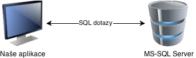

<style type="text/css">
  body{
    font-size: 10.5pt;
  }
</style>

# 12. Komunikace s databázovým systémem

### Databáze

    RDBMS (Relation DataBase Management System)
    Není to jen uložiště dat, je to sofistikovaný nástroj, který řeší sousty problémů a zároveň je jednoduchý k použití.
    Řeší třeba problém současné editace stejné položky několika uživateli ve stejný okamžik, který by jinak mohl zapříčinit nekonzistenci databáze. RDBMS data v tomto případě zamkne a odemkne až po vykonání zápisu.
    Dále umožňuje spojovat několik dotazů do transakcí, kdy se série dotazů vykoná vždy celá nebo vůbec.
    Tyto vlastnosti databázového stroje jsou shrnovány zkratkou ACID
    ACID - Atomicity (nedělitelnost) Consistency (validita), Isolation (izolace) a Durability (odolnost)

    Atomicity- transakce se provede celá nebo vůbec. Provádí se jako jedna atomická operace. 
    = pokud nějaká část operace selže, vrátí se databáze do původního stavu a žádné části transakce nebudou provedeny.
    Třeba tohle je důležité v bankovní databázi, když se peníze nepodaří odečíst z prvního účtu tak se nepřipíší na účet druhý

    Consistency- Stav databáze po dokončení transakce je vždy konzistentní, tedy validní podle všech definovaných pravidel a omezení. Nikdy nenastane situace, že by se databáze nacházela v nekonzistentním stavu.

    Isolation - Operace jsou izolované a navzájem se neovlivňují. Pokud se sejde v jeden okamžik více dotazů na zápis do stejného řádku, jsou vykonávány postupně, jako ve frontě. FIFO

    Durability - Všechna zapsaná data jsou okamžitě zapsána na trvanlivá úložiště (na pevný disk), v případě výpadku el. energie nebo jiného přerušení provozu RDBMS vše zůstane tak, jak bylo těsně před výpadkem
    
    S databází se komunikuje jazykem SQL
    3 základní hotové databáze co umíme
    • MSSQL – Microsoft SQL
    • MySQL
    • Oracle

    JDBC connector do databaze

### Rozpor objektového a relačního přístupu

    Relační databáze jsou ověřený způsob jak pracovat s daty. I když existují i databáze plně objektové, tak moc firem je nepoužívá. Např: MongoDB
    Revoluce v programování – příchod objektů = problém s ukládáním dat, jelikož relační databáze objektově nefungují a objekty ukládat neumí.

#### Databázový Wrapper

    Umožňuje s databází pracovat jako s objektem, nicméně komunikujeme s ní stále v jejím jazyce SQL. 
    Míchá se objektový a relační kód.
    Výhodou je zachování výkonu.

#### Objektově relační mapování

    Z databáze místo pole hodnot se dostanou rovnou objekty a ty na sobě mají metody. SQL jazyk se nepoužívá v programu, tabulky v databázi vidíme jako kolekce objektů, se kterými můžeme pracovat běžnými prostředky jazyka.
    Nevýhody: a pozadí dochází k velké degradaci výkonu databáze, SQL dotazy se generují automaticky a jsou často neefektivní. Je těžké naprogramovat

#### Objektové databáze

    Není moc používaná, drahá atd..

### Připojení do databáze

#### Připojená aplikace

    Když se potřebujeme načíst, vkládat, měnit nebo mazat data v reálném čase
    DataReader, Command, Connection obsahují SQL příkazy a dostávají výsledky, jako kdyby se SQL příkazy psaly v databázovém programu.



#### Odpojená aplikace – DataSet

    Jedná se o Databázový Wrapper.
    V operační paměti je DataSet, který v sobě má data se kterýma aplikace pracuje.
    Občas se DataSet sesynchronituje s databází.
    DataSet v sobě obsahuje tabulky (DataTable), tabulka řádky(DataRow) a řádek sloupce (DataColumn).
    Tabulka je objekt. Můžou se do ní řádky přidávat a upravovat je bez psaní SQL kódu.Když chceme spustit na databázi nějaký příkaz, použijeme DataAdapter, pomocí kterého si naplníme DataSet daty. Příkazy již musíme psát v jazyce SQL dané databáze.

### Připojení z Javy do DB

    Abychom se mohli k DB připojit, potřebujeme tzv. ConnectionString. To je řetězec, který obsahuje údaje potřebné k připojení k databázi. Typicky je zde název databáze a případně heslo.
    Píše se do závorek deklarace konekce nebo jako její vlastnost u všech 3.

    MSSQL
    DataSource = adresa db serveru
    InitialCatalog = název db
    Password =heslo
    UserID = username
    MYSQL
    Server/Host/Data Source/Data Source/Address = adresa db serveru
    Database /Initial Catalog = název db
    Password/pwd =heslo
    Username/User Id/Uid = username

```java

public class ConnectToDatabase {
 static final String DB_URL = "jdbc:mysql://localhost/testMaturita";
 static final String USER = "simon";
 static final String PASS = "simon";
 static final String QUERY = "SELECT id, first, last, age FROM Employees";
 public static void main(String[] args) {
  // Open a connection
       try(Connection conn = DriverManager.getConnection(DB_URL, USER, PASS);
          Statement stmt = conn.createStatement();
          ResultSet rs = stmt.executeQuery(QUERY);) {
          // Extract data from result set
          while (rs.next()) {
             // Retrieve by column name
             System.out.print("ID: " + rs.getInt("id"));
             System.out.print(", Age: " + rs.getInt("age"));
             System.out.print(", First: " + rs.getString("first"));
             System.out.println(", Last: " + rs.getString("last"));
          }
       } catch (SQLException e) {
          e.printStackTrace();
       } 
 }
}
```

    Jednoduchý program na přípojení do MySQL databáze.Využíváme knihovny JDBC.
    Tento jednoduchý program se připojí do databáze udělá objekt Statement a do objektu ResultSet předá výsledek.Následně dokud je v result setu řádek tak vypisujeme hodnotu pro daný atribut.

#### Sqlite

    Na rozdíl od velkých databází jako MySQL/MariaDB, PostgreSQL, které běží jako služba, je SQLite pouze malá knihovna nástrojů, kterou mají již některé jazyky, zvláště ty interpretované, zabudovanou v sobě. Každá databáze se ukládá jako jeden obyčejný soubor na disk, většinou s příponou .db, který je bez problémů přenositelný. Pro přenos projektu tedy stačí často pouze zkopírovat aplikaci se souborem s databází a spustit, žádné instalování služby databáze, nastavování přihlašovacích údajů v aplikaci, dumpování a následný import databáze. SQLite se z tohoto důvodu hojně využívá zejména v desktopových aplikacích. Za toto a za její rychlost se ale musíte smířit i s jejími nedostatky.

    Jak už název napovídá, databáze je velmi odlehčená, takže neobsahuje třeba uživatelské oprávnění, konfiguraci (která je možná částečně přes PRAGMA příkazy), či plnou podporu UTF, pokud tedy očekáváte korektní české řazení např. č po c, tak marně, buď si to sami dopíšete přímo v SQLite, nebo to necháte až na aplikaci.

    Proto je důležité si promyslet na co a kde budete databázi používat.

### ResultSet

    Objekt ResultSet má ukazatel na první řadu a po metodě .next().
    Metoda next() vrátí false když už není další řady.
    Je možná jen jedna iterace jedním směrem.
     


