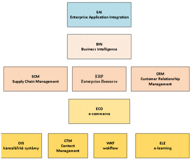

# 14. Metodiky a životní cyklus vývoje softwaru

### Proces vývoje SW

    Návrh softwarových produktů, je stejně jako návrh jiných složitých systémů, poměrně náročnou disciplínou, a to zejména při vývoji software (SW), na kterém pracují větší či menší týmy vývojářů, analytiků, apod. Činnosti je nutné koordinovat a každý člen týmu by měl přesně znát, co má dělat, jak bude jeho práce integrována s prací kolegů, termíny, do kterých je nutné práci dokončit a mnohodalších aspektů. K tomuto účelu slouží různé formy koordinace činností, jejichž nástrojem jsou právě metodiky. 

### Složení vývojového týmu

    Každou roli při vývoj procesu je možné zařadit do určité kategorie softwarové profese.
    - Manažer projektu
    - Vedoucí týmu
    - Procesní analytik
    - Softwarový architekt
    - Návrhář (GUI, API, atd.)
    - Vývojář
    - Tester
    - Dokumentarista
    - Správce (sítě, databáze, atd.)

### Fáze tvorby SW produktu

    Jedná se o posloupnost jednotlivých kroků, které vedou k úspěšnému vývoji software. Nejdůležitějšími fázemi jsou:
    - definování (stanovení a sběr) požadavků na systém s ohledem na jeho funkčnosti, design, návaznost na ostatní systémy a jeho integrace s nimi, atd)
    - vytvoření konceptuálního modelu
    - fáze vytvoření implementačního modelu (zde již jde o konkrétní návrh SW),
    - implementace a zavedení
    - testování
    - udržování systému a provoz
    - stažení systému z užívání (např. po jeho neaktuálnosti, případně převyšujících nákladech na užívání a udržování nad jeho přínosy, apod.)

    Jiným typem dělení fází může být například:
    - Akvizice SW
    - Vývoj SW
    - Provoz SW
    - Údržba SW
    - Vyřazení SW

### Rozdělení metodik pro modelování software

    Metodiky je možné klasifikovat podle různých kritérií a přístupů.

#### Kritérium zaměření metodiky:

    - Globální - metodiky vývoje SW v rámci celého podniku či organizace. Patří mezi ně tzv.enterprise metodiky, např. MMDIS, Enterprise Unified Process (EUP)
    - Projektové – v rámci vývoje daného SW se zabývají pouze určitou částí SW.

#### Kritérium rozsahu:

    Rozeznáváme metodiky, které se zabývají celým životním cyklem vývoje SW (např. MMDIS,atd.) a metodiky, zabývající se jen určitou částí (etapou) vývoje SW. Posledním uvedeným metodikám říkáme dílčí metodiky.

#### Kritérium váhy:

    Těžké metodiky – vyžadují podrobný popis a jsou tzv. rigorózní, tzn. přísné, precizní, přesné.
    - Lehké metodiky – jejich vlastností je, že musí být „barely sufficient“ (Cockburn), volně přeloženo jako „sotva (téměř) dostatečné“ anebo „a little less than just enough“ (Highsmith),což je možno volně přeložit jako „trochu méně než dostatečné“.
    - Mezi lehké metodiky patří tzv. agilní metodiky, o kterých bude řeč dále v této studijní opoře.

#### Kritérium přístupu k vývoji:

    - Podle kritéria přístupu k vývoji můžeme metodiky rozdělit na:
    - Strukturované metodiky – založené na principech strukturovaného programování
    - RAD (Rapid Application Development) – založený na iterativním přístupu
    - Objektově orientované metodiky – založené na principech objektově orientovaného programování 

#### Kritérium způsobu vývoje: 

    Toto kritérium dělení metodik zahrnuje zejména:
    - konvenční metodiky s životním cyklem typu vodopád (viz dále)
    - metodiky přírůstkového a iterativního vývoje

#### Kritérium domény:

### evoluční přístupy k tvorbě SW

### Životní cykly vývoje SW

