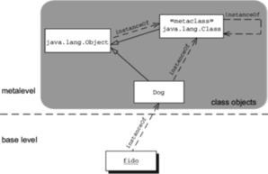
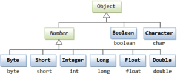

<style type="text/css">
  body{
    font-size: 10.5pt;
  }
</style>

# 15. Principy objektového programování, agregace a kompozice objektů

### Evoluce programování k OOP

#### 1. Strojový kód

    Jedná se program, jenž je souborem instrukcí, kde jsme nemáme žádnou možnost pojmenovávat proměnné nebo zadávat matematické výrazy.

#### 2. Nestrukturované paradigma

    Nestrukturovaný přístup je podobný assemblerům, jedná se o soubor instrukcí, který se vykonává odshora dolů. Zdrojový kód již nebyl závislý na hardwaru a byl lépe čitelný pro člověka, přístup na nějakou dobu umožnil vytvářet komplexnější programy. Bylo tu však stále mnoho úskalí: Jediná možnost, jak udělat něco vícekrát nebo jak se v kódu větvit, byl příkaz GOTO.

#### 3. Strukturované paradigma

    Strukturované programování je první paradigma, které se udrželo delší dobu a opravdu chvíli postačovalo pro vývoj nových programů. Programujeme pomocí cyklů a větvení. To je v podstatě to, kam jsme se doteď dostali.
    
    Program lze rozložit do funkcí (metod), tomu jsme se nevěnovali, protože to v C# (který je objektový) ani moc dobře nejde a raději jsem dal přednost tento mezikrok přeskočit a začít rovnou s OOP. U strukturovaného programování hovoříme o tzv. funkcionální dekompozici. Problém se rozloží na několik podproblémů a každý podproblém potom řeší určitá funkce s parametry. Nevýhodou je, že funkce umí jen jednu činnost, když chceme něco jiného, musíme napsat novou. Neexistuje totiž způsob, jak vzít starý kód a jen trochu ho modifikovat, musíme psát znovu a znovu - vznikají zbytečné náklady a chyby. Tuto nevýhodu lze částečně obejít pomocí parametrizace funkcí (počet parametrů poté ale rychle narůstá) nebo použitím globálních proměnných. S globálními daty vzniká však nové nebezpečí - funkce mají přístup k datům ostatních. To je začátek konce, nikdy totiž neuhlídáme, aby někde nedošlo k přepsání glob. dat mezi funkcemi a začne docházet k nekontrolovatelným problémům. Celý program se potom skládá z nezapouzdřených bloků kódu a špatně se udržuje.

### Objektově orientované programování

    Jedná se o filozofii a způsob myšlení, designu a implementace, kde klademe důraz na znovupoužitel­nost. Přístup nalézá inspiraci v průmyslové revoluci - vynález základních komponent, které budeme dále využívat (např. když stavíme dům, nebudeme si pálit cihly a soustružit šroubky, prostě je již máme hotové).
    
    Poskládání programu z komponent je výhodnější a levnější. Můžeme mu věřit, je otestovaný (o komponentách se ví, že fungují, jsou otestovány a udržovány). Pokud je někde chyba, stačí ji opravit na jednom místě. 

### Agregace

    Agregace reprezentuje vztah typu celek - část. Zakreslujeme ji jako plnou čáru, zakončenou na jedné straně prázdným kosočtvercem. Ten je umístěn u té entity, která reprezentuje celek (např. sekce s články). Z hlediska implementace je to tak entita, která drží kolekci prvků. Entita reprezentující část může existovat sama o sobě a být součástí i jiných kolekcí.


    Příkladem agregace může být již zmíněná sekce, obsahující články. Čísla na konci vazby znamenají tzv. multiplicitu, přesněji, že sekce obsahuje libovolný počet článků a článek patří alespoň do 1 sekce.

### Kompozice Objektů

    Kompozice je podobná agregaci, avšak reprezentuje silnější vztah. Entita části nemá bez celku smysl. Pokud zanikne celek, zanikají automaticky i jeho části.
    
    Kompozici zakreslujeme stejně jako agregaci, kosočtverec je ovšem plný. U entity reprezentující celek musí být multiplicita vždy 1. Tato vazba bývá matoucí a doporučil bych se jí spíše vyhýbat a nahradit ji agregací.


    Příkladem může být Objednávka a Položka objednávky. Zatímco minulý příklad dává bez sekce ještě nějaký smysl, položka objednávky bez objednávky smysl nedává. Proto je zde použita kompozice.
    
    Kdybychom to chtěli aplikovat na OOP tak to můžeme přirovnat k věku osoby nebo poznávací značce auta.

#### Příklady vytvoření a použití  

```java

    public class Osoba{
      public int vek;
      public String jmeno;
      public Osoba(int vek,String jmeno){
        this.vek= vek;
        this.jmeno = jmeno;
      }
    }
    public class Main{
      public static void main(String[]args){
        Osoba o1 = new Osoba(12,"Honza");
      }
    }
```

#### Inheritence

    Jedná se o ustanovení vztahu mezi objekty. V třídové dědičnosti, kde jsou objekty definované třídami, mohou třídy zdědit atributy a chování od předem existujících tříd, které se nazývají rodičovské třídy, základní třídy nebo super třídy. Výsledné třídy jsou nazývány odvozené třídy, podtřídy nebo potomek třídy
    Princip dědičnosti:

```java

public class A {
    public int cislo;
    public A(){

    }
}

public class B extends A{
    public String text;
    public B(){
        super();
    }

}


```

    Zde v kódu jsme vytvořily třídu A oddědily od ní třídu B, která získala další vlastnost text.
    Nyní můžeme vytvořit pole s objekty A a zároveň do něj uložit i objekt B, jelikož má vlastnosti a metody jako třída A.
    Je nyní možnost vytvářet třídy a dělat z nich mnohem propracovanější objekty a stále zachovat původní kód což je velká výhoda OOP.

#### Rozhraní

    Rozhraním objektu se myslí to, jak je objekt viditelný zvenku. Již víme, že objekt obsahuje nějaké metody, ty mohou být privátní nebo veřejné. Rozhraní objektu tvoří právě jeho veřejné metody, je to způsob, jakým s určitým typem objektu můžeme komunikovat.

```java
    public interface IConnection{
        public void handshake();
        public void close();
    }
    public class AcceptedConnection implements IConnection{
        public void handshake(){
            
        }
        public void close(){

        }
    }
```

    Můžeme tak udělat pomocí rozhraní třídu IConnection a od ní extendovat třídu AcceptedConnection a RefusedConnection a oboje třídy budou mít metodu handshake() a close().

#### Zapouzdření

    Zapouzdření může být vysvětleno jako zabalení dat a metod do jedné komponenty. Funkce zapouzdření jsou dostupné skrze třídy ve většině objektově orientovaných programovacích jazyků. Zapouzdření rovněž umožňuje ukrytí atributů a metod v objektu pomocí stavby nepropustné zdi, která brání kód proti nechtěným změnám.
    
    public - Určí viditelnost vlastnosti pro jakoukoliv třídu.
    protected - Viditelnost je jen pro objekty odděděné od této třídy.
    private - Vlastnost vidí jen objekt samotný.

#### Hierarchie rozdělení



    java.lang.Object je odděděn od třídy java.lang.Class a třída Dog je odděděna od třídy Object.Každý datový typ má je odděděn od nějaké třídy, která je odděděna od Objectu.
    Například Integer je odděden od třídy Number a ta je od Objectu.



### Agregace

    Agregace reprezentuje vztah typu celek - část. Zakreslujeme ji jako plnou čáru, zakončenou na jedné straně prázdným kosočtvercem. Ten je umístěn u té entity, která reprezentuje celek (např. sekce s články). Z hlediska implementace je to tak entita, která drží kolekci prvků. Entita reprezentující část může existovat sama o sobě a být součástí i jiných kolekcí.


    Příkladem agregace může být již zmíněná sekce, obsahující články. Čísla na konci vazby znamenají tzv. multiplicitu, přesněji, že sekce obsahuje libovolný počet článků a článek patří alespoň do 1 sekce.

### Kompozice Objektů

    Kompozice je podobná agregaci, avšak reprezentuje silnější vztah. Entita části nemá bez celku smysl. Pokud zanikne celek, zanikají automaticky i jeho části.
    
    Kompozici zakreslujeme stejně jako agregaci, kosočtverec je ovšem plný. U entity reprezentující celek musí být multiplicita vždy 1. Tato vazba bývá matoucí a doporučil bych se jí spíše vyhýbat a nahradit ji agregací.


    Příkladem může být Objednávka a Položka objednávky. Zatímco minulý příklad dává bez sekce ještě nějaký smysl, položka objednávky bez objednávky smysl nedává. Proto je zde použita kompozice.
    
    Kdybychom to chtěli aplikovat na OOP tak to můžeme přirovnat k věku osoby nebo poznávací značce auta.
    
    Kompozice objektů nám tedy udává vlastnosti třídy.


