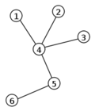

# 2. Algoritmizace - Grafy, Prohlédávání stavového prostoru, Řazení

### Teorie Grafů

#### Co je graf?

    Graf je matematická struktůra, definovaná množina vrcholů a množinou hran, kde každá hrana je určena povinně dvěma vrcholy a volitelně směrem.
    Používá se na modeloví vlastně čehokoliv v reálném světě.Není duležíté jak namalujete graf,ale jak ho propojíte

    Jak jde vidět, můžeme udělat i cykly a podgrafy v grafu.

### Strom

    Jedná se o graf který neobsahuje žádnou smyčku tzn. že se nemohu dostat na stejný vrchol bez toho abych se dostal na vchol na kterém jsem už byl.

### Binární strom

    Používá se na ukládání a vyhledávání dat.Jedná se o orientovaný graf s jedním vrcholem, z něhož existuje cesta do všech vrcholů grafu.

    Typy binárních stromů

    - Binární strom a ten obsahuje uzly, které mají nejvýš 2 syny
    - Plný binární strom každý vnitřní uzel má dva syny

### Matice sousednosti

    Tato matice nám uvadí pro každý vrchol spojené se sousedy čtvercovou matici kde každý soused nám vytvoří diagonálu grafem.

### Djikstrův algoritmus

    Používá se pro nalezení nejkratší cesty grafem.
    Je konečný (pro jakýkoliv konečný vstup algoritmus skončí), protože v každém průchodu cyklu se množiny navštívených uzlů přidá právě jeden uzel, průchodů cyklem je tedy nejvýše tolik, kolik má graf vrcholů.FUnguje nad hranově kladně ohodnoceným grafem.

## Prohledávání stavového prosturu

    Tři základní vlastnosti, podle kterých lze metody hodnotit.

    -Časová složitost => minimální/maximální/průměrný čas potřebný k vyřešení úlohy danou metodou.

    - Prostorová složitost => minimální/maximální/průměrné množství operační paměti potřebné k řešení úlohy.V zájmu nezávislosti na platformě se místo údaje o počtu megabytů používá např. počet stavů současně uchovaných v paměti.
  
    - Kvalita získaných výsledků => zahrnuje výpověď o tom, zda je daná metoda úplná (nalezne řešení vždy, když existuje)
  
### Neinformované metody

    Neinformované metody prohledávání nemají k dispozici žádné vhodné znalosti o stavovém prostoru, které by jim umožnily urychlit cestu k cíli.
    Jsou tak odsouzeny k systematickému procházení všech uzlů, dokud nenaleznou řešení.
    Jednotlivé algoritmy se od sebe liší jen způsobem, jakým toto systematické procházení provádějí.

    Druhy algoritmů:

#### Prohledávání do šířky(Breadth-First Search)

    Tento algoritmus jak název napovídá prohledá všechny sousedy od startovního vrchu, poté sousedy sousedů atd. až projde celou komponentu souvislosti.

#### Prohledávání do hloubky(Depth-First Search)

    Jedná se o procházení grafu metodou backtrackingu.Pracuje tak,že vždy expanduje prvního následníka každého vrcholu, pokud jej ještě nenavštívil.

    Pokud narazí na vrchol, z nějž už nelze dále pokračovat (nemá žádné následníky nebo byli všichni navštíveni), vrací se zpět backtrackingem.

#### Iterativní prohledávání do hloubky

    Liší se od prohledávání do hloubky svým limitem hloubky, který probíhá opakujíc se, s větším limitem hloubky dokud není cíl nalezen.

### Informované metody

    Informované metody prohledávání mají navíc znalosti o stavovém prostoru, které jim umožňují odhadnout, jak daleko se nachází řešení od aktuálního stavu.
    Tento odhad reprezentuje tzv. heuristická funkce h{n}. Čím nižší hodnoty h{n} nabývá, tím spíše povede cesta k řešení skrze stav n.

    uspořádané prohledávání (Best-first search) – Prohledávání do šířky upřednostňující „slibné“ stavy

    Lokální metody prohledávání

## Třídění

    Pojem třídění je možná maličko nepřesný, často se však používá. Nehodláme data (čísla, řetězce a jiné) rozdělovat do nějakých tříd, ale přerovnat je do správného pořadí, od nejmenšího po největší – ať už pro nás „větší“ znamená jakékoliv uspořádání.

### Bubble sort

    Bubble sort je poměrně hloupý algoritmus, který se vyskytuje v podstatě jen v akademickém světě. Nemá žádné dobré vlastnosti a je zajímavý pouze svým průběhem, který může připomínat fyzikální nebo přírodní jevy. Algoritmus probíhá ve vlnách, přičemž při každé vlně propadne "nejtěžší" prvek na konec (nebo nejlehčí vybublá nahoru, záleží na implementaci). 

### Merge Sort

    Merge sort je algoritmus, založený na tzv. principu rozděl a panuj (latinsky divide et impera, anglicky divide and conquer). To znamená, že pokud nějaký problém neumíme vyřešit v celku, rozložíme si ho na více menších a jednodušších problémů. Ten samý postup aplikujeme i na tyto problémy (opět je rozdělíme na ještě menší, mimochodem velmi se zde nabízí rekurzivní řešení) až se dostaneme na takovou úroveň, kterou jsme schopni bez problému řešit. V problému třídění se často chceme dostat až k poli velikosti 1, které považujeme automaticky za setříděné.

### Quick sort

    Jak již název napovídá, Quicksort je rychlý. On je dokonce nejrychlejší a je to algoritmus, který se skutečně používá v praxi k třídění prvků, proto bude tento článek o něco obsáhlejší, než ostatní. Chová se dobře jak na malých, tak na velkých polích a je paměťově nenáročný. Algoritmus je založen na principu rozděl a panuj, který jsme si již vysvětlili v algoritmu Merge sort.

