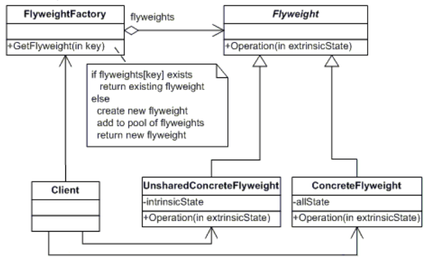

<style type="text/css">
  body{
    font-size: 10.5pt;
  }
</style>

# 20. Structural design patterns - Decorator, Proxy a Flyweight

    Usnadňují návrh identifikací jednoduchého způsobu realizace vztahu mezi entitami.
    Tento návrhový vzor je o složení třídy a objektu.
    Pro vytváření tříd používají k vytváření rozhraní dědičnost.
    popisují, jak lze objekty a třídy kombinovat a vytvářet větší struktury.

#### Kdy se používají

    V aplikacích v reálném čase někdy potřebujeme změnit strukturu třídy nebo vztah mezi třídami, ale nechceme, aby tato změna byla ovlivněna projektem. 
    Například dvě třídy uživatel a produkt. Třída produktu se používá uvnitř třídy uživatelů, to vytváří jeden z mnoha vztahů mezi uživatelem a produktem. Poté budeme chtít změnit strukturu nebo vztahy mezi těmito dvěma třídami. Třeba chcem používat uživatelskou a produktovou třídu samostatně. Toto je strukturální změna a nechceme, aby tato změna ovlivnila náš program. Při tom pomůže Structural design patern


### Decorator

    Návrhový vzor decorator se používá pro dynamické přidání či změnu funkčnosti nějakého objektu bez nutnosti jeho změny či použití dědičnosti. 
    Jako decorator se označuje třída, která obdrží nějakou instanci, kterou obohatí o novou funkcionalitu.
    Nemusí znát vnitřní implementaci třídy, od které odvozuje.

#### Definice

    Návrhový vzor dekorátoru nám umožňuje dynamicky přidávat nové funkce ke stávajícímu objektu, aniž by se měnila nebo upravovala jeho struktura, a tento návrhový vzor funguje jako obal existující třídy.

#### Použití

    Když potřebujeme třídě nebo skupině tříd přidat další funkcionalitu, ale zdědění není vhodné řešení.
    Situace, kdy nechceme použít dědičnost - dědičnost je považována za velmi těsné svázání tříd

#### Vlastnosti decoratoru

    - Dekorace jsou navzájem nezávislé 
    - Dekorace lze kombinovat 
    - Rozšiřuje konkrétní objekt, ne třídu 
    - Dynamický (dědičnost je statická)
    Dynamicky mění funkčnost objektu za běhu, aniž by to ovlivnilo existující funkčnost objektů. Stručně řečeno, tento návrhový vzor dekorátoru přidává objektu další funkce zabalením.


    Component - definuje rozhraní pro objekty, ke kterým se dynamicky přidávají další funkce
    ConcreteComponent - konkrétní rozšiřovaný objekt 
    Decorator - předek všech dekorujících tříd, definuje jejich rozhraní 
    - obsahuje referenci na objekt, který rozšiřuje 
    - všechna voláni deleguje na zapouzdřený objekt
    ConcreteDecoratorA a  ConcreteDecoratorB - přidává novou funkcionalitu

#### Příklad


    SimpleCoffe je rozšiřují, CoffeeDecorator nemůžeme vytvořit, protože je abstract class.

```java
interface ICoffee {
 public double getPrice();
 public String getIngredients();
}
class SimpleCoffee implements ICoffee {
 public SimpleCoffee() {
 }
 public double getPrice() {
  return 1;
 }
 public String getIngredients() {
  return "Coffee";
 }
}
abstract class CoffeeDecorator implements ICoffee {
 private ICoffee decoratedCoffee;
 public CoffeeDecorator(ICoffee c) {
  this.decoratedCoffee = c;
 }
 public double getPrice() {
  return decoratedCoffee.getPrice();
 }
 public String getIngredients() {
  return decoratedCoffee.getIngredients();
 }
}

class WithMilk extends CoffeeDecorator {
 public WithMilk(ICoffee c) {
  super(c);
 }
 public double getPrice() {
  return super.getPrice() + 0.5;
 }
 public String getIngredients() {
  return super.getIngredients() + ", Milk";
 }
}
public class Main {
public static void main(String[] args) {
 ICoffee c = new SimpleCoffee();
 System.out.println("Price: "+ c.getPrice() + "; Ingredients: "+c.getIngredients());
 c = new WithMilk(c);
 System.out.println("Price: "+ c.getPrice() + "; Ingredients: "+c.getIngredients());
 }
}

```

    Výhody
    Dynamičnost
    “chaining“ - není problém přidat více dekorátorů pro jeden objekt
    
    Nevýhody
    dekorátor není dekorovaný objekt - nelze volat „rozšířené“ metody z dekorovaného objektu

    mnoho podobných (malých) objektů - horší orientace v kódu
    rychlost - potřeba virtualních metod, postupné delegace volání
    
    Použítí v GUI (Graphical User Interface)
    Tradičně se používá v GUI aplikacích - například posuvníky na krajích obrazovky. Posouvat můžeme cokoliv - obrázek, text nebo webovou stránku. Kdybychom měli tuto funkcionalitu implementovat každému ovládacímu prvku, prakticky bychom tím porušovali princip objektově orientovaného programování, protože by byl naprosto stejný kód na různých místech aplikace. Místo toho vytvoříme dekorátor, který ovládací prvek obalí, vykreslí posuvníky a přiřadí jim funkcionalitu. Zbytek akcí delegujeme na původní třídu. Podobně můžeme k libovolnému elementu přidat rámeček. Dekorátor se postará pouze o vykreslení rámečku a zbytek funkcionality deleguje na původní třídu.

### Proxy

    Nejčastější použití je zapouzdření instance jiného objektu nebo přidání pomocné funkčnosti.
    Proxy nám tedy umožňuje řídit přístup, ať už k celému či částečnému rozhraní objektu, přes nějaký jiný zastupující objekt (proxy - zástupce, reprezentant)
    Můžeme také říci, že Proxy je objekt, který je klientem volán pro přístup ke skutečnému objektu za scénou. To znamená, že v Proxy Design Pattern představuje třídu funkčnost jiné třídy.


#### Použití

    Když chceme řídit přístup k nějakému objektu.
    Ať už čistě kvůli bezpečnosti nebo kvůli přidání další funkcionality, zefektivnění či zjednodušení ladění aplikace atd.
    Výhody
    zefektivnění, zrychlení aplikace

#### Remote Proxy

    Pro komunikaci s objektem na jiném počítači
    Je to zástupce vzdáleného objektu, ve kterém je skryta veškerá komunikace.
    zastupuje objekt umístěný někde jinde. Jeho úkolem je zprostředkovat komunikaci s tímto objektem tak, aby přes něj mohli uživatelé komunikovat se vzdáleným objektem aniž by se museli starat o serverovou komunikaci (tu musí zařídit Proxy objekt). Zároveň však nesmí zakrývat komunikaci (při selhání spojení musí vyhodit odpovídající výjimku, se kterou musí uživatel počítat a případně ji vhodně zpracovat). Uživatel tak může se vzdáleným zástupcem komunikovat skoro jako s normálním objektem.
    Samotná implementace se dá realizovat různě. Je poněkud náročnější, protože musíme zajistit už zmíněnou komunikaci mezi dvěma objekty. Vždy však musíme při implementaci počítat s možnými selháními komunikace se vzdáleným objektem.

#### Virtual Proxy

    Častější případ.Nejčastěji je použit jako virtuální zástupce.
    V naší aplikaci se může velmi často stát, že máme nějaký objekt, jehož vytváření nebo případná správa by byla náročná a bylo by neefektivní načítat ho celý, když pak použijeme jen jeho část. Virtuální zástupce se snaží vytvořit instanci spravované třídy, až když je to potřeba.
    Virtual Proxy se stará o jiný objekt (zastupuje ho). Vytvoření objektu ale přenechává až na poslední chvíli (pokud ho vůbec potřebujeme vytvořit) a chování objektu jen předstírá. (může mít stejné rozhraní, ale funkčnost jen deleguje na originální objekt, případně přidává nějakou další funkčnost a k zastoupenému objektu přistupuje či ho vytvoří jen tehdy, je-li to opravdu nutné) 

#### Příklad

```java
interface IMath {
 double Add(double x, double y);
 double Subtract(double x, double y);
 double Multiply(double x, double y);
 double Divide(double x, double y);
}

class Math implements IMath {
 @Override
 public double Add(double x, double y) {
  return x + y;
 }
 @Override
 public double Subtract(double x, double y) {
  return x - y;
 }
 @Override
 public double Multiply(double x, double y) {
  return x * y;
 }
 @Override
 public double Divide(double x, double y) {
  return x / y;
 }
}
class MathProxy implements IMath{
 
 private IMath math;
 @Override
 public double Add(double x, double y) {
  Check();
  return x + y;
 }
 @Override
 public double Subtract(double x, double y) {
  Check();
  return x - y;
 }
 @Override
 public double Multiply(double x, double y) {
  Check();
  return x * y;
 }
 @Override
 public double Divide(double x, double y) {
  Check();
  return x / y;
 }
 private void Check() {
  this.math = (math == null ? new Math() : math);
 }
}
public class ProxyTest {
 public static void main(String[] args) {
  MathProxy proxy = new MathProxy();
  double a =3.5;
  double b = 2.5;
  System.out.println(proxy.Add(a, b));
 }
}
```

#### Protection Proxy

    V návrhu aplikace se můžeme někdy setkat s případem, kdy by využití celého API (veřejného rozhraní) objektu mohlo mít fatální dopad. 

    Pro příklad to může být třeba situace, kdy každý objekt má k našemu klíčovému objektu jiná přístupová práva nebo prostě jen potřebujeme zjednodušit rozhraní objektu, aby ho někdo neznalý našeho systému nepoužil špatně. 
    Definujeme novou Proxy třídu, která si spravuje instanci objektu, ale navenek nabízí jen podmnožinu metod objektu, který zastupuje. Můžeme tak ovlivnit, ke kterým metodám cílového objektu bude mít uživatel přístup a ke kterým nikoli.
    V některých případech, kdy nám jde jen o omezení rozhraní, ho lze nahradit jednoduchým rozhraním, což je efektivnější, ale zároveň méně bezpečné. Uživatel má v tomto případě stále přístup k celému objektu pouze pod zjednodušeným rozhraním. Může si tak celkem jednoduše zjistit, o jaký objekt jde.

### Flyweight

    Je vhodný pro situace, kdy vzniká mnoho malých objektů, u kterých je možné podstatnou část jejich stavu sdílet nebo ho nahradit výpočtem
    Když potřebujeme vytvořit tisíce nebo více objektů, které sdílejí některé běžné informace.
    Vyčlenění 2 částí objektu

#### Vnější stav

    Tímto vnějším stavem se rozumí takové atributy, které je možno uchovávat vně objektu nebo je vypočítat. 
    Tento vnější stav je často označován jako kontext objektu. 
    Metody, které pro svou funkci potřebují hodnoty, které jsou součástí vnějšího stavu, je dostávají až v okamžiku svého volání jako parametr - kontext.
    - Je pro každý objekt jiný

#### Vnitřní stav

    Zredukovaný objekt (bez vnějšího stavu) je možné obvykle sdílet mezi jednotlivými užitími. 
    Tento objekt již pouze obsahuje atributy, které jsou označovány jako vnitřní stav. 
    Pro možnost sdílení těchto objektů je zapotřebí factory metoda, která zajistí jejich tvorbu (pokud doposud vhodný objekt neexistuje) nebo vrácení existujícího. 
    - Je společný pro více objektů
    - Instance objektu si ho pamatuje sama

#### Výhody

    Flyweight přináší úsporu paměťového prostoru, a to dvojím způsobem: redukcí velikosti jednotlivých objektů (nahrazením vnějšího stavu objektu výpočtem nebo efektivnější reprezentací) a sdílením jednotlivých instancí objektů reprezentujících vnitřní stav.

    Například musíme vytisknout vizitky pro všechny zaměstnance v organizaci. Takže máme dvě části dat: jedna je proměnná data (jméno zaměstnance) a druhý jsou statická data (adresa). Můžeme minimalizovat paměť pouhým uchováním jedné kopie statických dat a odkazováním na stejná data ve všech objektech proměnných dat. Takže vytváří různé kopie.

    proměnných dat, ale odkazujeme na stejnou kopii statických dat. Díky tomu můžeme optimálně využít paměť.



    Flyweight – deklaruje rozhraní, které pracuje s vnějším (extrinsic) stavem (metody mají jako parametr vnější stav).
    ConcreteFlyweight - implementuje rozhraní Flyweight a přidává vnitřní (intrinsic) stav 
    UnsharedConcreteFlyweight - (v ukázce není, ale mohly by to být např. řádek a sloupec) - všechny podtřídy Flyweight se sdílet nemusí, jedná se o jedinečné objekty, kterých není mnoho 
    FlyweightFactory - vytváří a spravuje objekty flyweight a zajišťuje jejich řádné sdílení 
    Client - udržuje referenci na flyweigth a počítá nebo ukládá vnější stav