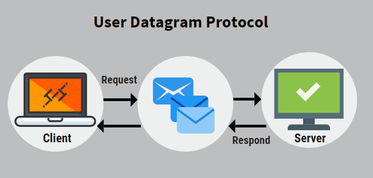
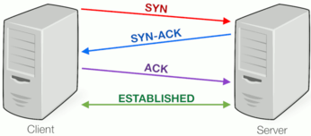

<style type="text/css">
  body{
    font-size: 10.5pt;
  }
</style>

# 21. Síťová komunikace

### Protokoly

#### UDP

    Jednoduchý protokol pro přenos dat.
    Je rychlejší než TPC, ale nemá záruku, že druhá strana obdrží přenášená data.
    Používá se když je upřednostněna rychlost oproti záruce, že data dojdou druhé straně
    Je to protokol, který nemá “Connection less“ – bez “pozdravu“ ihned přenos dat
    Nemá chybovou detekci, ani opravu chyb.
    Nezaručuje tok dat ve správném pořadí, jak byly odeslány.
    Např: Živé volání, většina živých přenosů



    Server nemá přijímání klientů.
    Server i Klient by měli napsány stylem cyklu a poslání zprávy a přečtení (nikdy se neví kdy očekávat data).

#### TCP

    Je velice spolehlivé, má v sobě zabudovanou detekci chyb a následnou opravu, což způsobuje pomalejší rychlost. Client nemůže odeslat data bez navázání připojení.
    Je více internetově náročné – server pošle data a očekává potvrzení přijetí dat od protistrany.
    Zaručuje doručení dat ve správném pořadí, ve kterém byly odeslány.
    Je Connection non less – s povinnými “pozdravy“ (handshake) (více pozdravů při připojení (3) a ještě víc při ukončení (4))



    Např: Dobré pro přenos souborů (záleží na místech bytů a když se část ztratí, tak je problém), webstránky, zprávy

```java

public class GreetServer {
    private ServerSocket serverSocket;
    private Socket clientSocket;
    private PrintWriter out;
    private BufferedReader in;

    public void start(int port) {
        serverSocket = new ServerSocket(port);
        clientSocket = serverSocket.accept();
        out = new PrintWriter(clientSocket.getOutputStream(), true);
        in = new BufferedReader(new InputStreamReader(clientSocket.getInputStream()));
        String greeting = in.readLine();
            if ("hello server".equals(greeting)) {
                out.println("hello client");
            }
            else {
                out.println("unrecognised greeting");
            }
    }

    public void stop() {
        in.close();
        out.close();
        clientSocket.close();
        serverSocket.close();
    }
    public void disconnectClient(){
      clientSocket.close();
      in.close();
      out.close();
    }
    public static void main(String[] args) {
        GreetServer server=new GreetServer();
        server.start(6666);
    }
}

```

### API (Application Programming Interface)

    Jedná se o rozhraní pro applikaci.Někdy také bývá označována za backend.Můžeme z toho brát data či posílat.Má na starost např. stahování dat ze serveru v applikaci počasí na vašem telefonu.

#### REST API


#### JSON,XML


#### HTTP

    Používá protokol TCP.
    Klient komunikuje se zdálených webserverem (třeba apache).
    V C# se client realizuje pomocí třídy WebClient. Ta používá hlavně 2 typy requestů
    POST – odesílá uživatelských dat na server, odesílání formuláře na web
    GET – získá data

#### FTP

    Slouží k přenosu souborů. Používá protokol TCP.
    Port 20 slouží k přenosu dat. (binárně)
    Port 21 slouží k řízení přenosu. (ASCII)
    V dnešní době není považován za nejlepší řešení, není bezpečný, omezen pouze na ASCII znaky.

#### SFTP

    Nahrazuje FPT.
    Jeho hlavní výhoda je SSH (Secure Shell) šifrování. To činí SFTP bezpečný

### Client-Server model(většinou TCP)

    Model klient-server je distribuovaná aplikační struktura, která rozděluje úlohy mezi servery a žadatele o službu zvané klienti. 
    Když klientský počítač v architektuře klient-server odešle požadavek na server přes internet, server přijme požadavek a doručí odpověď zpět klientovi.
    Klienti nesdílejí žádné ze svých zdrojů mezi ostatní klienty.
    Příkladem modelu klient-server jsou e-mail, síť WWW atd.
    Server – Poslouchá na portu a může i na IP, čeká na připojení klienta
    Client – většinou představuje uživatele, který se připojí na server
    Server může být: dedikovaný – pro speciální účely, nededikovaný – slouží jako normální počítač
    Client má 3 typy
    Thin – využívá prostředky hostitelského počítače, především CPU a paměť. Jeho úkolem je pouze serveru poslat data, server je zpracuje. Příkladem je webová aplikace.
    Thick – provádí zpracování dat sám, ukládá data na lokální uložiště. Nespoléhá se na server, často může pracovat bez připojení k serveru. Server slouží jako uložiště dat, k synchronizaci.
    Hybrid – Spojení Thick a Thin. Data zpracovává sám, ale neukládá je lokálně. K tomu slouží server jako jediné uložiště dat.

### P2P model

    Není klient ani server, místo nich jsou rovnocenné peery (žádný není na vyšším postavení).
    Lze je pouze těžko napadnout na rozdíl od client-server, kdy je server lehkým terčem
    Používají se na sdílení zdrojů a spolupráci více počítačů, třeba výpočetní výkon, nebo stahování dat z internetu (torrent, který by se “good guys“ mohli pokusit odstavit)
    Je decentralizovaná (nemá centrum)

### OSI model

    Programování se zabývá vyššími vrstvy OSI modelu.
    O nižší vrstvy OSI modelu se starají pomocné knihovny (TcpClient)
