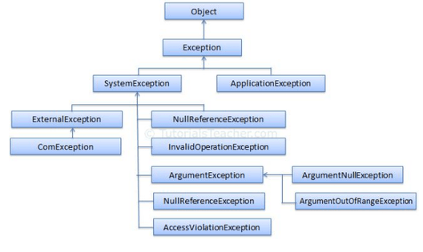

# 24. Výjimky a aserce, debugování a zpracování chyb

### Ošetření chyb

##### Aktivní

    Program se zmapuje na zranitelná místa. Ty se následně ošetří podmínkami, které budou umožňovat pouze hodnoty, které jsou pro pgrogram neškodlivé.

##### Pasivní

    Využito pokud by aktivní ošetření chyb bylo moc náročné a obsáhlé ošetřit všechny chybové stavy.
    Použíjí se výjimky.Kód, který by mohl být problémový a chybový se dá do "chráněného režimu".

    Tento se liší tím, že pokud dojde k chybě, máme možnost ji odchytit a zabránit pádu programu.
    Chyba se nazývá výjimka. A je zachycena pomocí bloku try-catch.
    Tento blok může být obohacen o typ chyby.

#### Typy chyb

##### Usage errors

    Chyba v logice programu, které vede k vyjímce. Tato chyba by neměla být řešena odchycením výjimky, místo toho úpravou kódu.
    Tyto errory často nastávají, když je použita funkce, bez přečtení jejich správného používání.
    Těmto chybám se dá vyhnout, přečtením dokumentace k dané funkci. 
    Např: NullReferenceException a DivideByZeroException, která spadá do ArithmeticException.   

##### Program errors

    Jsou to nevyhnutelné chyby za běhu programu, u kterých se nedá zabránit úpravou kódu.
    Mezi tyto výjimky patří IOException, SocketException nebo jakýkoliv vstup uživatele.
    Tyto výjimky se dají vyřešit pomocí přesunu kódu do chráněného režimu a odchytáváním výjimek pomocí blocku try-catch.

##### System errors

    Selhání systému za běhu programu. Po kterém se běh programu nemůže vrátit do normálního režimu.
    Například nedostatek paměti pro program, OutOfMemoryException, ta nastane, pokud runtime není schopen programu přidělit další paměť. Obvykle se tyto výjimky neodchytávají.
    Místo toho se pouze zaznamenají a po pádu programu se uživateli ukážou.
    Při chytání výjimek můžeme chytat více výjimek pomocí jejich společné rodičovské třídy. Například: IOException je rodičovská a spadají pod ní problémy se vstupy a výstupy 
    programu. Napříkad: FileNotFoundException a EndOfStreamException,…

##### Vlastní výjimky

    Při větším programu je výhodné si vytvořit vlastní sadu výjimek, pro zpracování chyb které mohou nastat. 
    Stačí vytvořit třídu a tu oddědit od třídy Exception. A poté jí v programu někde vyhazovat pomocí throw

#### Try-catch blok

    Catch – provede se pouze, pokud je odchycena výjimka, které má mateřskou třídu, kterou catch odchytává. Pokud catch nemá výjimku specifikovanou, tak odchytává všechny.

    Finally – provede se pokaždé, ať výjimka nastane nebo ne. Velmi často se používá k zavírání souborům a streamů.

    Exception má vlasnosti, které mohou být získány a následně vypsány: Message, StackTrace, TargetSize.
    Za catch lze přidat příkat when, který slouží jako podmínka chycené výjimky.

### Debug

    Umožňuje pozastavit program a podívat se do struktury instancí. Popřípadě instance upravit či změnit. Je často používaný když dojde k chybě programu a vývojář nemá tucha jak se to sakra stalo. A proto program pustí v debugu a vidí aktuální hodnoty instancí a může se v běhu programu pohybovat a pozorovat co se děje.
    Dá se použít pro snazší pochopení programu.
    Za “debug“ se dá považovat i System.out.println() v nějaké podmínce, za účelem jestli byla provedena nebo vypíše hodnotu instance do konzole.
    V debugu je možno jít po krocích v dané metodě, nebo se vnořit do nějakého řádku a debugovat i tam.

#### Assert

    Je ve statické třídě Debug. Je ve verzi Debug v Release není.
    Používá k identifikaci logických chyb během vývoje programu.
    Kontroluje podmínky zadaných hodnot. Pokud je podmínka splněna, tak jde dál. Pokud není, tak je program pozastaven na konkrétním nesplněném assertu a pošle se do kolekce zpráva o selhání Listeners kolekce, to je kolekce debugu o selhání
    Debug také umožňuje metodu WriteLine, ta ale nevypisuje do konzole, ale do outputu Debug
