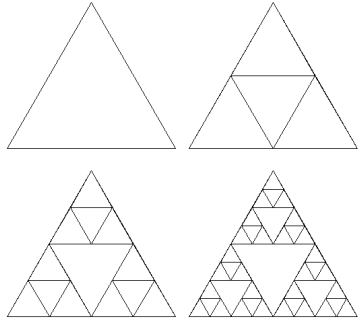
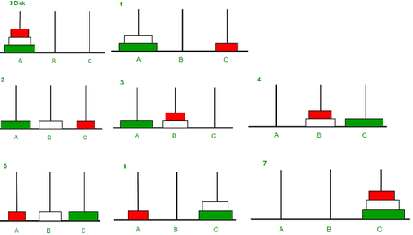
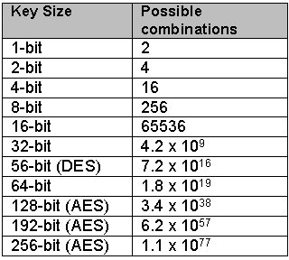

<style type="text/css">
  body{
    font-size: 10.5pt;
  }
</style>

# 3. Algoritmizace - Rekurze, Brute Force, Heuristiky, Nedeterministky


### Rekurze

    V oblasti matematiky rekurzi chápeme jako definování objektu pomocí sebe sama.
    Např. Sierpinského trojúhelník - je tvořen jen pomocí trojúhelníků



#### Rekurze v programování

    Metoda volá samu sebe.
    Hlavní věc v rekurzivní metodě je příkaz na zavolání samu sebe.
    Metoda, která volá sama na sebe je “rekurzivní“. 
    Všechny případy rekurzí lze převést na nerekurzivní algoritmus
    Rekurze musí obsahovat podmínku ukončení (konečnost algoritmu), jinak by byla nekonečná.To může být způsob zefektivnění rychlosti nějakých programů.
    Rekurze je spojená s vysokými nároky na využití paměti zásobníku.
    Příklady 
    - strom (z větve jdou větve) 
    - většina her - pravidla v každém tahu jsou stejná, princip řešení je tedy stejný i když se data mění.

#### Využití

    Rekurze se dá jednoduše použít při počítání faktoriálu.
    Rekurzivní chování může být různé v závislosti na tom, kolik podprogramů se jí účastní. 
    Metoda f1 je volána zatímco jedno z předchozích volání f1 ještě nebylo ukončeno návratem.Vzniká nám v paměti díky tomuto tzv. rozpracovanost metody a při každé další iteraci se nám ukládají proměnné průchodu, čímž vzniká velká náročnost na paměť.

#### Přímá rekurze

    Přímá rekurze nastává, když podprogram volá přímo sám sebe. = volá se přímo

#### Nepřímá rekurze

    Nepřímá rekurze je situace, kdy vzájemné volání podprogramů vytvoří „kruh“. Např. ve funkci A se volá funkce B a ve funkci B se volá opět funkce A. = volá se zprostředkovaně přes jinou funkci
    Podprogram může být volán jednou nebo vícekrát: 
    1. Lineární rekurze nastává, pokud podprogram při vykonávání svého úkolu volá sama sebe pouze jednou. Vytváří se takto lineární struktura postupně volaných podprogramů. 
    Třeba faktoriál, nebo hledání hodnoty v setříděném poli
    1. Stromová rekurze nastává, pokud se funkce nebo procedura v rámci jednoho vykonání svého úkolu vyvolá vícekrát. Strukturu volání je možné znázornit jako zakořeněný strom. Pro dvě volání v jednom průchodu vzniká binární strom, pro tři ternární strom, atd. (Počet rekurzivních volání nemusí být konstantní, např. při rekurzivním procházení grafu voláme zpracování na všechny sousedy vrcholu, a těch je obecně různý počet.)
    Třeba třídicí algoritmy 

#### Druhy

    Tail recursion – rekurzní volání je posledním příkazem -> return f(). Když je rekurze optimalizována, tak na stacku nevznikají buňky volání metody, tím se ušetří místo na stacku.

    Strukturální rekurze - volání funkce přes jinou funkci, nebo v jiném místě, než samostatně na konci

    Backtracking - zpětné vyčíslování rekurze (obecně funkce)

    Mutual (indirect) recursion - dva objekty, závisí na sobě 
    např. binární strom se skládá z uzlu a dvou stromů 

#### Příklady

    Nejlepší příklad faktoriál

```java
    public int Factorial(int number){
        return number !=1 ? number*Factorial(number-1) : number;
    }
```
    Jedná se o snazší použití než u cyklu
    Při porovnání Faktoriál Cyklus a Faktoriál Rekurze, je cyklus rychlejší (u 5000!) asi 8ms, ale Pokud se pokud dostaneme do k výpočtu 7000! Tak cyklus to vypočítá, ale rekurze dostane StackOverflow. (Faktoriál cyklus zvládne třeba i 500 000!) pro řešení faktoriálu je tedy lepší Cyklus (rychlejší a možnost počítač velká čísla)

    Další příklad je fibonaci

```java
public static int fibonaci(int n){
    if(n == 1 || n == 0)
        return n;
    return fibonaci(n-1) + fibonaci(n-2)
}
```
    Rychlost u rekurzivní verze je o(n^2) oproti cyklu s O(n)

    Hanojská věž
    1. Je-li n>1, pak rekurzívním voláním této procedury přesuneme n–1 kotoučů (tj. všechny kromě největšího) z počáteční věže na odkládací.
    2. Přesuneme největší kotouč z počáteční věže na cílovou.
    3. Je-li n>1, pak rekurzívním voláním této procedury přesuneme n–1 kotoučů z odkládací věže na cílovou.

    Z rekurzívního řešení lze dokázat matematickou indukcí, že pro n kotoučů potřebujeme 2^n–1 tahů

```java
    public static void MoveDisc(int n, int from, int to, int other){
    if(n > 0)
    {
        MoveDisc(n - 1, from, other, to);
        System.out.printf("Move disk %d from tower %d to tower %d",n,from,to);
        MoveDisc(n-1,other,to,from);
    }
    }
```



### Brute Force

    Brute force zkouší všechny myslitelné možnosti.Funguje jako permutace.
    Platí, že každý problém se dá vyřešit brute forcem.
    Většinou se nedá se použít, jelikož trvá dlouho. A ve většině případech existuje řešení problémů, které nám dá nejlepší nebo dobrý výsledek a je podstatně rychlejší než brute force. ( řešení nemusí být perfektní, ale můžeme se spokojit i s takovým výsledek třeba za výměnu hodin za minuty)
    Dá se použít na problémy, které se dají vyřešit rychle.
    Používá např jako prolomení hesla. Heslo určitě prolomí (pokud přihlašování nemá ochranu, třeba jako max počet pokusů, nebo blacklist IP).

#### Brute Force Útok

    Brute force útok neboli útok hrubou silou je druh kyberútoku, jehož cílem je nejčastěji prolomení hesla, či celých přihlašovacích údajů. Útočníci používají software (prolamovač hesel), který postupně zkouší různé kombinace znaků, dokud neuhádne skutečné heslo. Tímto způsobem se mohou útočníci dostat do internetových služeb, zamčených souborů nebo do jakéhokoli digitálního prostoru, který vyžaduje uživatelské jméno a heslo. Tento proces je automatizovaný a vzhledem k tomu, že uživatelé často volí velmi jednoduchá hesla, bývá ve velkém procentu případů úspěšný.

    Brute force útok je velmi snadný a může ho provést i nezkušený útočník. Jeho slabinou je časová náročnost, a proto jsou účinnou obranou silná hesla. Pokud vaše heslo kombinuje různé druhy znaků (písmena, čísla a další), velká a malá písmena a má alespoň 8 znaků, prolamovači hesel může trvat i stovky let, než přijde na správnou kombinaci. Čas potřebný k prolomení hesla roste exponenciálně s délkou klíče (délka klíče se uvádí v bitech), neboť se tím zvětšuje prostor klíče.

    Weby se mohou brute force útokům bránit omezeným počtem pokusů pro zadání přihlašovacích údajů a povinnými časovými intervaly mezi jednotlivými pokusy. Doplňující metodou je captcha nebo jiný způsob kontroly, zda pokus o přihlášení je prováděn člověkem.

    Čas potřebný k prolomení hesla roste exponenciálně s délkou klíče (délka klíče se uvádí v bitech), neboť se tím zvětšuje prostor klíče. Velký prostor klíčů je tak nutnou podmínkou pro bezpečnost šifry.

    Dnes se používají klíče o délce 128, či 256 bitů.

    K prolomení symetrického (používá k šifrování i dešifrování jeden klíč) klíče o délce 256 bitů je zapotřebí 2128 krát vyšší výkon, než k prolomení 128 bitového klíče. Za předpokladu, že bychom disponovali strojem se schopností ověřit trilion (1018) klíčů za sekundu (což je mnoho násobek výkonu nejvýkonnějších superpočítačů, stále by dešifrování trvalo 3x1051 let.



### Heurestiky

#### Úvod

    Heurestický algoritmus je obohacen o informaci pro zjednodušení hledání řešení
    Variantou herurestického brute force útoku je slovníkový útok, který nezkouší náhodné kombinace znaků jako brute force, ale pracuje s databází potenciálních hesel, například zkouší nejčastěji používaná hesla.

    Je potřeba si uvědomit, že heuristika nemusí uspět. Nemusí vydat správné řešení, optimální řešení, také nemusí podat řešení vůbec (viz. šachy). Lze kombinovat více heuristických metod najednou.

#### Definice

    Heuristické algoritmy jsou takové algoritmy, které používají ke svému výpočtu heuristiku. Heuristika je v podstatě zkusmé řešení problému (pomocí odhadu budoucích událostí) vhodné tehdy, pokud neznáme přesný postup, jak dojít k cíli, tak zkusíte alespoň nějaké podmínky, které se k cíli přiblíží. Toto řešení nemusí být příliš přesné, ani nijak zvlášť rychlé. Dobrým příkladem heuristické metody je ta, která se stará o rozhodnutí vašeho oponenta ve hře šachy proti umělé inteligenci.
    Jeho užitečnost ale tkví v tom, že výsledky jsou dostatečně přesné a dostatečně rychle získány i v situaci, kdy byla metoda pro přímý výpočet neúměrně složitá. Z toho důvodu by bylo možné umělou inteligenci porazit, ale jen pomocí druhé inteligence s lepší heuristickou funkcí, nebo připraveným programem pro veškeré situace, které by ve hře mohly nastat.

#### Nejčastější metody Heurestiky

    Generický algoritmus - algoritmus založený na principu přirozeného výběru. Na základě předem daných kritérií rozhoduje, jakou hodnotu upřednostní. Dokáže najít kvalitní řešení i složitého problému, v oblasti software je velmi rozsáhle používaný.

    Metoda lokálního hledání - tyto metody vyhodnocují jen své nejbližší okolí a vydají se při prohledávání některým směrem, který se v tu chvíli zdá metodě lokálně optimální na základě vyhodnocení funkce. Lokální metody ale zcela zapomínají předcházející uzly a postrádají tak možnost návratu.

    Iterativní metoda - využívá postupného hledání řešení ve stále se zužující oblasti řešení (postupně se z dobrého řešení dopracovává k ještě lepšímu řešení).

### Deterministické algoritmy

#### Příklad

### Nedeterministké algoritmy


#### Příklad
