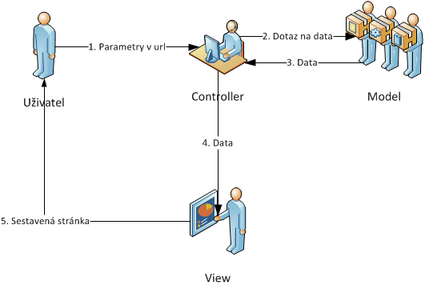
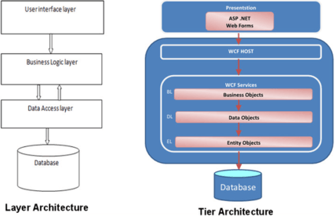
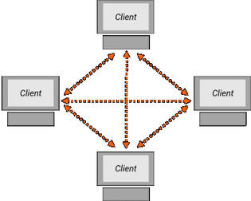

# 4. Architectural design patterns - MVC, Multitier, Monolithic,P2P, Client/Server

#### Úvod

    Jedná se o obecné, opakovaně použitelné řešení u běžně se vyskytujícího problému v softwarové architektuře v daném kontextu. Nespočet různých architektur může implementovat stejný vzor a sdílet související charakteristiky.Jsou podobné vzorům jiným návrhovým vzorům, ale jsou mnohem větší.Říká se mu architektský protože se patterny skládájí z více tříd nebo programů.Vzory jsou často definovány jako „přísně popsané a běžně dostupné“.

#### Layered Pattern

    Taky znán jako n-layer architecture pattern
    Je rozdělen do vrstev, každá vrstva má nějaké svoje komponenty a plní určitou funkci v aplikaci.Není určeno kolik vrstev musí aplikace mít. 
    Třeba aplikace pro zobrazení dat v databázi:
      1. Prezenční vrstva – obsahuje GUI a komponenty pro ovládání aplikace.
      2. Engine aplikace vrstva – obsahuje kolekci k zobrazení, třídy, se kterými aplikace pracuje
      3. Databáze vrstva – provádí akce s databází

### MVC (Model-View-Controller)

    Je pattern, který se prezentuje většinou na webu.Zpočátku navržen pro deskopy.Je součástí populárních webových frameworků, z C# ASP.NET.
    ASP je skriptovací platforma společnosti Microsoft, primárně určená pro dynamické zpracování webových stránek na straně serveru. Její nástupce, ASP.NET, lze chápat jako širší a komplexnější technologii, která se od ASP v mnoha ohledech fundamentálně liší.
    Základní myšlenkou MVC architektury je oddělení logiky od výstupu. Řeší tedy problém, kde v jedné třídě je logika programu (metody) a zároveň ostatní operace s databází, a vstup přes HTML tagy. Kód se špatně udržuje a je nepřehledný + IDE Visual Studia by v tomhle případě neumělo rozpoznat HTML.
    Proto se program rozdělí do 3 částí: Model, View a Controller:
    - Model reprezentuje data a business logiku aplikace.
    - View zobrazuje uživatelské rozhraní .
    - Controller má na starosti tok událostí v aplikaci a její logiku.

#### Model

    Obsahuje logiku programu, nějaká výpočty, operace s databází, atd...
    Standartní C# program, který provádí potřebné operace.Model neví o ostatních komponentech, jeho funkce spočívá v přijetí vstupních parametrů zvenku a vydání dat ven.

#### View

    Stará se o zobrazení výstupu programu uživateli. 
    Obsahuje HTML šablonu, která obsahuje HTML stránku a tagy, které umožňují do šablony vkládat proměnné.Pohledů je v programu více. Třeba Stránka pro registraci, stránka pro zobrazení zboží, stránka pro zobrazení košíku,..
    Šablony lze samozřejmě vkládat do sebe, aby se neopakovali, třeba menu stránky, footer atd..
    View k zobrazení obsahuje minimální množství logiky programu, která je pro výpis nutná, třeba kontrola zda jsou pole pro text vyplněná, nebo cyklus pro výpis vícero dat.
    View podobně jako Model neví, odkud mu data přišla, stará se jen o jejich zobrazení uživateli.

#### Controller

    Prostředník, se kterým komunikuje uživatel, model i view
    Drží celý program pohromadě a komponenty propojuje.
    Zpracovává data od uživatele a podle nich rozhoduje o dalších krocích.

#### Multi-tier

    Je rozdílná oproti Layered (taky zvané Multi-Layer).
    Multitier architektura má obvykle 3 logické části a každá z nich je umístěna na samostatném fyzickém serveru. MultiLayer aplikace je umístěna na jednom počítači.
    Každá úrovně plní jiné jiné funkce a je za ně zodpovědná.
    Komunikace mezi úrovněmi je většinou asynchronní. 
    Multi-tier je určena pro větší aplikace. Multi-Layer je pro menší aplikace.
    Multi-tier úrovně komunikují pouze pomocí hodnot, přes síť nebo přes sériový kabel.
    Multi-Layer vrstvy komunikují pomocí referencí nebo hodnot.
    Multi-Tier dosahuje lepšího výkonu, protože je na více servech.

### Monolithic Architecture

    Monolitická architektura je tradiční jednotný model pro návrh softwarového programu. 
    Monolitický znamená, že je program složený vše v jednom kuse. 
    Monolitický software je navržen tak, aby byl samostatný.
    Komponenty programu jsou vzájemně propojeny a vzájemně na sobě závislé, nikoli volně spojené. 
    V této propojené architektuře musí být každá komponenta a její přidružené komponenty přítomny, aby mohl být kód spuštěn nebo zkompilován. 
    Kromě toho, pokud je aktualizována jakákoli součást programu, musí být přepsána celá aplikace
    Monolitické architektury však mají také výhody. Monolitické programy mají obvykle lepší propustnost než ostatní architektury.
    Lze je snadněji testovat a ladit, protože s menším počtem prvků existuje méně proměnných

### Client - Server model

    Model klient-server je distribuovaná aplikační struktura, která rozděluje úlohy mezi servery a žadatele o službu zvané klienti. 
    Když klientský počítač v architektuře klient-server odešle požadavek na server přes internet, server přijme požadavek a doručí odpověď zpět klientovi.
    Klienti nesdílejí žádné ze svých zdrojů mezi ostatní klienty.
    Příkladem modelu klient-server jsou e-mail, síť WWW atd.
    Server – Poslouchá na portu a může i na IP, čeká na připojení klienta
    Client – většinou představuje uživatele, který se připojí na server
    Server může být: dedikovaný – pro speciální účely, nededikovaný – slouží jako normální počítač
    Client má 3 typy: 
    
    Thin – využívá prostředky hostitelského počítače, především CPU a paměť. Jeho úkolem je pouze serveru poslat data, server je zpracuje. Příkladem je webová aplikace.
    Thick – provádí zpracování dat sám, ukládá data na lokální uložiště. Nespoléhá se na server, často může pracovat bez připojení k serveru. Server slouží jako uložiště dat, k synchronizaci.
    Hybrid – Spojení Thick a Thin. Data zpracovává sám, ale neukládá je lokálně. K tomu slouží server jako jediné uložiště dat.

|  | Relies on local storage | Relies on local CPU |
|-|-|-|
| Fat client | Yes | Yes |
| Hybrid client | No | Yes |
| Thin client | No | No |

### P2P

    Není klient ani server, místo nich jsou rovnocenné peery (žádný není na vyšším postavení).
    Lze je pouze těžko napadnout na rozdíl od client-server, kdy je server lehkým terčem
    Používají se na sdílení zdrojů a spolupráci více počítačů, třeba výpočetní výkon, nebo stahování dat z internetu (torrent, který by se “good guys“ mohli pokusit odstavit)
    Pokud spadne jediný peer, tak spadne celá architektura.
    Je decentralizovaná (nemá centrum)

