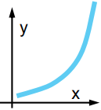
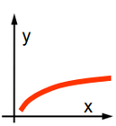
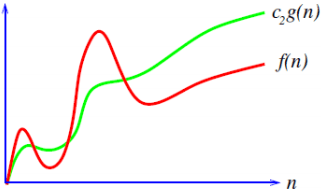
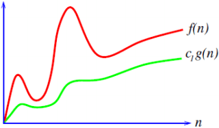
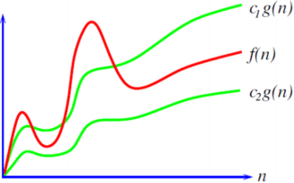
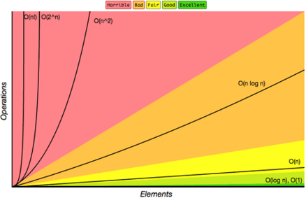
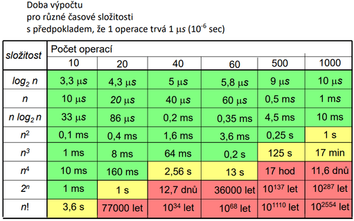
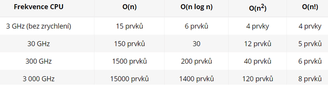

<style type="text/css">
  body{
    font-size: 10.5pt;
  }
</style>

# 5. Asymptotické paměťové a časové složitosti

### Algoritmus

    Musí být elementární = skládá se z konečného počtu jednoduchých a snadno srozumitelných příkazů.
    Musí být determinovaný = v každém kroku se musí dát určit, jestli skončil nebo bude pokračovat.
    Měl by dokázat pokrýt všechny vstupy a správně se provést.Algoritmy mají různou složitost.Musí být konečný, vždy musí skončit s konečným počtem kroků.
    2 nejčastější: seřadit prvky a vyhledat prvky, u nich chceme tu nejrychlejší optimalizaci

### Asymptotická

    Zabývá se výkoností programu, který může pracovat s neomezeným množstvím dat
    V praxi je důležité umět mezi sebou porovnat více algoritmů, které řeší stejný problém, abychom mohli rozhodnout, kdy který použít.
    asymptotická složitost -> asymptoticky se blíží k této hodnotě.
    2 typy porovnání: 
        - časová složitost - doba výpočtu podle daného algoritmu potřebná pro zpracování daného objemu dat
        - paměťová složitost - velikost paměti využívané při výpočtu

### Časová složitost

    Podle názvu souvisí s dobou, po kterou daný algoritmus běží. Doba závisí na velikosti vstupu (třídění 10ti čísel bude jistě rychlejší, než třídění milionu čísel). Nemůže se obecně prohlásit přesný čas, protože závisí na rychlosti počítače, kde program běží a také na programovacím jazyce.
    Odhady popisují růst složitosti vzhledem ke zvětšujícím se vstupům, ale neurčují konkrétní funkci.
    
    V Jednoduchých algoritmech určit složitost přesně, ve složitějších je to až  moc složité.
    Jeden algoritmus (program, postup, metoda…) je rychlejší než druhý.
    Každému algoritmu lze jednoznačně přiřadit neklesající funkci zvanou asymptotická (časová) složitost, která charakterizuje počet operací algoritmu v závislosti na rostoucím rozsahu vstupních dat.
    
    Čím pomaleji tato funkce roste, tím je algoritmus rychlejší.

|  |  |
| :--------------------------------: | :-----------------------------: |
|        Pomalý (rychle roste)        |        Rychlý (pomalu roste)        |

#### O

    Symbol velké O se nazývá "velké O notace" nebo "Omikron notace"
    Určuje nejhorší možný případ složitosti (Horní mez) (složitost daného algoritmu je asymptoticky menší nebo rovna výrazu v závorce) f(n)  cg(n)
    Udává tedy, jakou "třídu časové složitosti" algoritmus nikdy nepřekročí.
    Nejvíc používaná, protože chceme hlavně horní odhady, kdežto dolní odhady bývá obvykle těžší zjistit.
    Funkce f nepřesáhne v limitě hodnoty funkce g až na konstantu – g představuje horní mez, kam až f může dosáhnout – odhad složitosti v nejhorším případě)



#### Ω

    Určuje nejlepší možný případ složitosti (Dolní mez) (složitost daného algoritmu je asymptoticky větší výrazu v závorce) f(n) > cg(n).
    Funkce f nedosáhne v limitě hodnoty funkce g až na konstantu – g představuje dolní mez, kam už f nemůže dosáhnout – odhad složitosti v nejlepším případě



#### Velká Théta

    Jedná se o odhad složitosti v průměrném případě ve vymezených hranicích (nejlepší a nejhorší případ složitosti, takže meze O a Ω).
    Používáme pro vyjádření faktu, že 2 funkce, jsou asymptoticky stejné až na multiplikativní konstantu
    Asymptotická těsná mez – funkce f a g jsou až na konstantu stejné – odhad složitosti v průměrném případě



### Rozdělení Složitostí






#### Konstatní O(1)

     - označuje, že čas potřebný k provedení daného úkonu vůbec nesouvisí s počtem prvků n, se kterými pracujeme.
    Neznamená, že bude běžet právě 1. Jedna jen značí, že jde o konstantu
    kód, který se ukončí stejně rychle a nezáleží mu na velikosti dat.
    Příklad
    Získání prvku z Listu pomocí indexu (od báze 0. Index se odpočítá 3, takže vezme 4.prvek a ostatní vůbec neprojde) prostě jeden krok.
    LinkedList přidání (neobsahuje žádnou kapacitu, pouze adresy) takže na rozdíl od pole, má konstantní složitost při přidání dat AddLast a AddFirst.
    Metody: GetEnumerator, GetHashCode jsou konstatní

#### Logaritmická O(log2 n)

    Velmi omezeně se vyskytující
    Hlavně ji najdeme u setříděných posloupností, kde najít prvek v takové posloupnosti trvá O( n)
    Třeba přidání, odstranění nebo získání prvku v SortedSet a SortedDictionary (stromové struktury).
    Protože se řídí pravidlem na jedné straně Nody je menší hodnoty, na druhé větší. To platí pro všechny Nody, takže se neprojdou všechny prvky kolekce.
    Příklad jako cyklus s násobením.

#### Lineární O(n)

    Nachází se tam, kde je procházení datové struktury prvek po prvku
    Oproti Logaritmické, kde nějaké větve procházet nemusíme, zde musíme projít čas/paměť běží úměrně k tomu, jaké množství dat je využito. 
    Foreach, for (int = 0, i<něco, i++), získání hodnoty z LinkedListu pomocí ElementAt(index) (musí se projít přes věechny prvky na cestě k tomu našemu)
    Skoro u všech kolekcí v metodě Constains nebo IndexOf
    Také iterátor foreach je lineární

#### Kvazilineární O(n log2(n))

    Kombinace lineární a logaritmické chceme setřídit pole tak, že si z něj uděláme binární strom. Projdeme celé pole v O(n) a každý prvek přidáme do BST v čase O(log n). Dohromady nám to dá vzorec, že n-krát provedeme operaci, která je v logaritmickém čase.Quick Sort, Merge Sort

#### Kvadratická O(n^2)

    “Hloupější třídicí algoritmy“ – Bubble sort, Insertion sort, 2 for cykly v sobě při procházení třeba dvourozměrného pole

#### Polynomiální O(n^3), O(n^4)…

    Procházení trojrozměrného pole

#### Exponenciální O(2^n)

    Velmipomalé.Třeba Fibonacciho sekvence s rekurzí (ale není to úplně přesný výsledek).Nebo Hanojské věže s rekurzí.

#### Faktoriálová O(n!)

    Skoro nepoužitelný.BruteForce algoritmy

#### Srovnání výkonu u časové složitosti



    I když se počítač zrychlil 1000krát, tak na polovinu to mělo velmi malý vliv. Vliv to mělo na O(n).Zrychlení počítače není řešení, tím je vytvoření algoritmu s lepší časovou složitostí.

### Stabilita

    zachovává předchozí pořadí takových prvků, které si jsou podle porovnávacího kritéria rovny třeba pole setříděné lidí (jméno, věk) podle abecedy např Hubert(30) a Po(30).A chcem ho setřídit podle věku a algoritmus není stabilní tak se může stát, že dostaneme Po a Hubert.Když bude stabilní, tak zachová původní pořadí (takže budou podle abecedy a podle věku).

### Počítání složitosti

    Třeba hledání největšího číslo v poli

```java
    int[] x = {1,2,3,4,5,6};
    int max = Integer.MinValue;
    for(int i=0;i < x.lenght;i++)
        if(x[i] > max)
            max = x[i];
```


    - Int max je 1-krát
    - Int i je 1-krát
    - while se provádí tolikrát kolik je prvků v poli, takže je n-krát
    - If je kontroluje zda je true nebo false n-krát je v cyklu
    - Max = x se provádí minimálně 0-krát krát nebo maximálně n-krát
    - I++ se provádí n-krát  je v cyklu
    - Konec se provádí 1-krát
    - Výpis se provádí 1-krát
     
    Nejlepší případ, pokud už na začátku máme největší hodnotu a obsah ifu je nikdy neprovede
    1+1+n+n+0+n+1+1 = 3n + 4 = O(n)
    Nejhorší, pokud se obsah ifu provede n-krát (hodnoty 1,2,3,4,5,6)
    1+1+n+n+n+n+1+1 = 4n + 4 = O(n)
    
    Konstanty jsou zanedbatelné, hlavní je, že se jedná o lineární případ.
    Ale přesný výsledek je 3n a 4n
    Elementární operace- aritmetická operace, porovnání dvou čísel a přesun čísla v paměti


### Paměťová složitost

    Někdy také “prostorová složitost“.Měří paměťové nároky algoritmu.K tomu musíme spočítat, kolik nejvíce tzv. elementárních paměťových buněk bude v daném algoritmu v každém okamžiku použito.
    Prostorová (paměťová) složitost algoritmů. Pro konkrétní problém můžeme mít dva algoritmy takové, že jeden má menší prostorovou složitost a druhý zase časovou složitost.Je-li časová složitost algoritmu vO(f(n))je i prostorová vO(f(n)) (počet použitých paměťových buněk nemůže být větší než počet provedených operací, protože v každém kroku se použije jen nějaký omezený počet buněk.
    Prostorová složitost může být mnohdy o dost menší než časová složitost — například paměťová složitost algoritmu Insertion-Sortje Θ(n), zatímco časová Θ(n2).