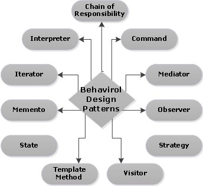

# 6. Behavioral design patterns - Iterátor, Command a Strategy

#### Úvod

    Jsou založeny na vzorech, které identifikují běžné komunikační vzory mezi objekty a tyto vzory realizují.
    Tímto způsobem tyto vzorce zvyšují flexibilitu při provádění této komunikace.
    jsou vzory, které se zabývají interakcí mezi objekty. 
    Interakce mezi objekty by měla probíhat takovým způsobem, aby spolu hovořily a stále byly volně spojené. 
    Volná vazba je klíčem k architektuře n-tier.
    vysvětlují, jak objekty interagují. Popisuje, jak si různé objekty a třídy navzájem posílají zprávy, aby se věci staly, a jak jsou kroky úkolu rozděleny mezi různé objekty.

#### Vzory

#### Použití

    V aplikacích v reálném čase někdy vyžadujeme změnit chování třídy a znovu nechceme, aby to ovlivnilo jiné třídy projektu. 
    Například máme třídu faktur, která aktuálně používá daně jako 18%. Zítra,  chceme přidat další daň navíc. To znamená, že měníme chování třídy. K vyřešení takového typu problémů s chováním se do obrazu dostane model chování.

### Iterátor

    Zavádí ho samostatný objekt.
    umožňuje jednoduché lineární procházení kolekcemi, aniž bychom museli znát vnitřní strukturu těchto kolekcí
    Objekt iterátoru bude udržovat stav iterace, bude sledovat aktuální položku a bude mít způsob, jak identifikovat, jaké prvky jsou vedle iterace. 
    To umožňuje standardní procházení seznamů, stromů a dalších struktur.
    Je to jeden z nejpoužívanějších vzorů, někdy se místo označení Iterator používá i Enumerator.
    Většina kolekcí implementuje IEnumarable, takže při procházení kolekce třeba foreach je použit, takže je read-only

