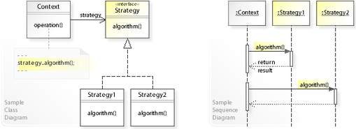

<style type="text/css">
  body{
    font-size: 10.5pt;
  }
</style>

# 6. Behavioral design patterns - Iterátor, Command a Strategy

#### Úvod

    Jsou založeny na vzorech, které identifikují běžné komunikační vzory mezi objekty a tyto vzory realizují.
    Tímto způsobem tyto vzorce zvyšují flexibilitu při provádění této komunikace.
    jsou vzory, které se zabývají interakcí mezi objekty. 
    Interakce mezi objekty by měla probíhat takovým způsobem, aby spolu hovořily a stále byly volně spojené. 
    Volná vazba je klíčem k architektuře n-tier.
    vysvětlují, jak objekty interagují. Popisuje, jak si různé objekty a třídy navzájem posílají zprávy, aby se věci staly, a jak jsou kroky úkolu rozděleny mezi různé objekty.

#### Vzory


#### Použití

    V aplikacích v reálném čase někdy vyžadujeme změnit chování třídy a znovu nechceme, aby to ovlivnilo jiné třídy projektu. 
    Například máme třídu faktur, která aktuálně používá daně jako 18%. Zítra,  chceme přidat další daň navíc. To znamená, že měníme chování třídy. K vyřešení takového typu problémů s chováním se do obrazu dostane model chování.

### Iterátor

    Zavádí ho samostatný objekt.
    Umožňuje jednoduché lineární procházení kolekcemi, aniž bychom museli znát vnitřní strukturu těchto kolekcí
    Objekt iterátoru bude udržovat stav iterace, bude sledovat aktuální položku a bude mít způsob, jak identifikovat, jaké prvky jsou vedle iterace. 
    To umožňuje standardní procházení seznamů, stromů a dalších struktur.
    Je to jeden z nejpoužívanějších vzorů, někdy se místo označení Iterator používá i Enumerator.

#### Metody

    Vzor Iterator tedy zavádí stejnojmenné rozhraní, které obvykle poskytuje následující metody GetCurrent() - Vrátí prvek na aktuální pozici. Reference na prvek na aktuální pozici v kolekci se často nazývá kurzor.
    Next() - Přesune kurzor na další prvek v kolekci a vrátí true. Pokud se v kolekci další prvek již nenachází, vrátí false.
    Reset() - Přesune kurzor zpět na první pozici.
    Také přesun mezi prvky bývá nazýván: HasNext() a GetNext().
    Vlastní iterátor:


```java
interface Iterator<E>{
  public T getCurrent();
  public boolean hasNext();
  public void Reset();
}

class Auto{
  private String znacka;
  private String model;

  public Auto(String znacka,String model){
    this.znacka = znacka;
    this.model = model;
  }
}
class Parkoviste<E> implements Iterator<E>{
  private ArrayList<E> auta;
  private int kurzor;
  public Parkoviste(){
    this.auta = new ArrayList<>();
  }
  public T getCurrent(){
    return auta.get(kurzor);
  }
  public boolean hasNext(){
    if(kurzor > auta.size() -2)
      return false;
    kurzor++;
    return true;
  }
  public void Reset(){
    kurzor = -1;
  }
  public void zaparkovat(T a){
    auta.add(a);
    Reset();
  }
}
```

    Iterator je generický typ E, takže parkoviště taky, metoda getCurrent vrátí auto na které ukazuje ukazatel, hasNext se zeptá jestli je na dalším místě taky auto (-2 je protože poslední index pole o velikosti 5 je 4, kurzor bude třeba 3 zeptá se a posune se na hodnotu 4, ta podmínkou neprojde a tak nevypadl z indexu pole), Reset nastaví kurzor na jedna, když je ve while cyklu procházení, tak se první zavolá Next a ukazatel se dostane na hodnotu 0, v metodě přidání auta musí být Reset, jinak by po přidání výpis šel dál odkud skončil (nemusí být public, když bude volám jen ve třídě)

### Command

    Převádí požadavky nebo jednoduché operace na objekty.
    Když jsou převedeny, tak je lze uložit do kolekcí a bude je možná později vyvolat
    Důležité je, aby převedený příkaz (objekt) obsahoval všechny potřebné informace ke svému vykonání
    Nejvíce slouží k řešení spouštění příkazů od uživatele, je přehledný dá se skladovat v kolekci commandů…

#### Příklad

    Máme klienta a ten má nějaké commandy, můžeme vytvořit třídy commands a do ní dát metody, poté jí v mainu vytvořit a pomocí if a else volat metody třídy
    
    Řešení pomocí Command vzoru
    Vytvořit interface s metodou Execute() (může jich být víc)
    Vytvořit třídy pro každý command, které implementují interface
    Main
    HashMap, které obsahuje string a ICommand, najde podle klíče objekt třídy, vrátí ho do ICommand a spustí metodu Exucute()

```java
interface ICommand{
  void Execute();
}
class Connect implements ICommand{
  public void Execute(){
    Console.WriteLine("Connecting");
  }
}
class Quit implements ICommand{
  public void Execute(){
    Console.WriteLine("Disconnecting");
  }
}
```
    V mainu poté vytvoříme HashMap<String,ICommand> a budeme volat příslušnou metodu Execute objektu, který byl přiřazen ke klíči v podobě textového řetězce.

### Strategy

    Def: Strategický vzor definuje rodinu algoritmů, každý z nich zapouzdřuje a umožňuje jejich zaměnitelnost.
    Tvořen abstraktní třídou, která definuje rozhraní pro celou rodinu algoritmů, které představují konkrétní strategie. 
    Jednotlivé algoritmy z ní poté dědí a toto rozhraní implementují svou logikou.
    umožňuje klientovi vybrat si, který algoritmus se použije s jednoduchostí.



#### Příklad

    Třeba hráč má jméno a zbraň, zbraně jsou pistol, puška atd… dát do jeho třídy instanci pistole, tak nebude moc získat pušku. Proto se použije Strategy. Vytvoří se interface zbraň, třída pistol a puška, které implementují interface zbraň, tím to jsou v rodině “zbraní“. Do třídy hráče se dá instance interface zbraň a bude moci měnit zbraně.


```java
interface IZbran{
  void Strilet();
  void Prebit();
}
class Pistol implements IZbran{
  public void Strilet(){
    System.out.println("Pistole stili");
  }
  public void Prebit(){
    System.out.println("Pistole prebiji");
  }
}
class Samopal implements IZbran{
  public void Strilet(){
    System.out.println("Samopal pali");
  }
  public void Prebit(){
    System.out.println("Samopal prebiji");
  }
}
```

    Poté může třída hráč mít instanci interfacu IZbran a stačí volat metodu Strilet.
    Strategy je podobný, jako vzor Bridge z rodiny Structural design patterns, nicméně je určený pro chování, nikoli strukturu.

