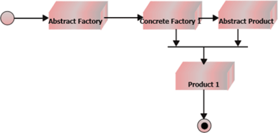
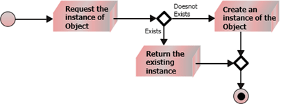

<style type="text/css">
  body{
    font-size: 10.5pt;
  }
</style>

# 7. Creational design patterns - Object pool, Singleton a Factory metoda

### Úvod

    Jedná se onávrhové vzory, které se zabývají mechanismy vytváření objektů.
    Snaží se vytvářet objekty způsobem, který je vhodný pro danou situaci. Kreativní návrhové vzory tento problém řeší tím, že nějakým způsobem řídí vytváření tohoto objektu.
    2 typy: 
    - Object-creational patterns
    Vzory pro vytváření objektů se zabývají vytvářením objektů. Zde odloží část svého vytvoření objektu na jiný objekt.

    - Class-creational patterns
    Vytváření vzorů třídy se zabývá instancí třídy. Zde odloží vytvoření objektu na podtřídy

#### Použití

    V aplikacích v reálném čase je projekt vytvořen s mnoha třídami. Mnoho tříd znamená, že se budeme zabývat spoustou předmětů. Pokud jsou tyto výtvory objektů rozptýleny v kódu klienta, vede to v kódu klienta ke spoustě nepřehledností.Tyto vzory pomáhají centralizovat logiku vytváření objektů.


### Factory method

    Poskytuje rozhraní pro vytváření objektů v nadtřídě, ale umožňuje podtřídám měnit typ vytvářených objektů.
    Tento vzor se používá k vytvoření konkrétních instancí třídy bez zadání přesného typu třídy.V zásadě se tedy tovární vzor používá všude tam, kde jsou podtřídám dány převažující instance metody, která může vytvořit objekt.


    Klíčové je oddělení konstrukce konkrétní instance do jiné třídy, čímž se původní třída neznečistí konstrukčním kódem.

```java
    class Auto{
        private String brand;
        private String model;

        public Auto(String brand,String model){
            this.brand = brand;
            this.model = model;
        }
    }
    class TovarnaNaAuta{
        public Auto VyrobMercedesC(){
            return new Auto("Mercedes Benz","C-Class");
        }
    }
    public class Main{
        public static void main(String[] args){
            TovarnaNaAuta factory = new TovarnaNaAuta();
            Auto a = factory.VyrobMErcedesC();
        }
    }
```

    Z třídy Auto se dají vytvářet instance, ale pokud by bylo zapotřebí více instancí konkrétního auta a nechceme zasahovat do třídy Auto, tak se použije TovarnaNaAuta a zavoláním její metody dostaneme objekt Auto
    Schéma složitějšího příkladu: 


    Výhoda je dělení složité inicializace od jiné třídy, což zpřehlední další logiku ve třídě, kde instanci potřebujeme.

#### Příklad z reality

    Představte si, že vytváříte aplikaci pro správu logistiky. První verze vaší aplikace zvládne pouze přepravu nákladními automobily, takže většina vašeho kódu žije uvnitř třídy Truck.
    Po chvíli se vaše aplikace stane velmi populární. Každý den obdržíte desítky žádostí od společností námořní dopravy o začlenění námořní logistiky do aplikace.
    Skvělé zprávy, že? Ale co kód? V současné době je většina vašeho kódu spojena s třídou Truck. Přidání lodí do aplikace by vyžadovalo provedení změn v celé základně kódů. Navíc, pokud se později rozhodnete přidat do aplikace jiný typ dopravy, budete pravděpodobně muset znovu provést všechny tyto změny.
    Ve výsledku skončíte s docela ošklivým kódem, který je plný podmínek, které mění chování aplikace v závislosti na třídě přepravních objektů.

    Vzor Factory Method navrhuje, abyste přímé volání konstrukce objektu (pomocí nového operátoru) nahradili voláním speciální tovární metody. Nedělejte si starosti: objekty se stále vytvářejí pomocí nového operátoru, ale volá se z tovární metody. Objekty vrácené tovární metodou se často označují jako produkty.

    Na první pohled může tato změna vypadat zbytečně: právě jsme přesunuli volání konstruktoru z jedné části programu do druhé. Zvažte však toto: nyní můžete přepsat tovární metodu v podtřídě a změnit třídu produktů vytvářených touto metodou.

    Existuje však mírné omezení: podtřídy mohou vracet různé typy produktů, pouze pokud mají tyto produkty společnou základní třídu nebo rozhraní. Také tovární metoda v základní třídě by měla mít svůj návratový typ deklarovaný jako toto rozhraní.

#### Abstract Factory

    Umožňuje vytvářet rodiny souvisejících objektů bez zadání jejich konkrétních tříd.


### Singleton

    Umožní zajistit, aby třída měla pouze jednu instanci a zároveň poskytovala globální přístupový bod k této instanci.
    Někdy v programu potřebujeme sdílet jednu instanci mezi několika bloky, objekty atd., aniž bychom ji museli stále předávat v konstruktoru.
    Třeba použitelný pro databázový connection string.
    Vzor je tvořen třídou, která se stará o to, aby její instance existovala jen jednou. 

    Podmínky:

    - Zajistit, aby třída měla pouze jednu instanci. Proč by někdo chtěl řídit, kolik instancí má třída? Nejběžnějším důvodem je řízení přístupu k nějakému sdílenému prostředku - například k databázi nebo souboru.
    Toto je nemožné implementovat s public konstruktorem, protože volání konstruktoru musí vždy vrátit nový objekt záměrně.
    - Globální proměnné jsou velmi užitečné,ale také velmi nebezpečné, protože jakýkoli kód může potenciálně přepsat obsah těchto proměnných a poškodit aplikaci.
    Stejně jako globální proměnná vám vzor Singleton umožňuje přístup k nějakému objektu odkudkoli v programu. Chrání však také tuto instanci před přepsáním jiným kódem.

    Všechny implementace Singletonu mají tyto dva společné kroky:
    Nastavit výchozí konstruktor jako soukromý, aby ostatní objekty nemohly používat nový operátor s třídou Singleton.
    Vytvořte metodu statického vytváření, která funguje jako konstruktor. Uvnitř tato metoda volá soukromý konstruktor k vytvoření objektu a uloží jej do statického pole. Všechna následující volání této metody vrátí objekt v mezipaměti.Pokud má váš kód přístup ke třídě Singleton, je schopen volat Singletonovu statickou metodu. Takže kdykoli se tato metoda volá, vždy se vrátí stejný objekt.

```java
class Singleton{
    private Singleton(){}
    public String database = "slovo";
    private static Singleton instance = new Singleton();

    public static Singleton vratInstanci()
    {
        return instance;
    }
}
```

    1. Musí se uživateli zakázat tvořit instanci, toho docílíme implementací prázdného privátního konstruktoru.
    2. Dále vytvoříme běžnou instanční proměnnou a do ní vložíme instanci, kterou chceme v programu sdílet.
    3. Nyní si třída vytvoří instanci sebe sama a tu uloží do statické proměnné. Instanci má takto ve správě třída a uživatel se k ní jinak než přes ni nedostane, protože ji nemůže vytvořit. Máme ji tedy zcela pod kontrolou. Instanci nastavíme samozřejmě jako privátní a také pouze pro čtení.
    4. Nakonec vytvoříme veřejnou metodu, přes kterou budeme zvenku k instanci přistupovat. Uvnitř instanci vrátíme.

    Inicializace instance až ve chvíli kdy jí potřebujeme 



### Object pool

    Slouží k uchovávání objektů pro pozdější použití. To se může hodit v situacích, kde je vytváření instance příliš složité nebo trvá příliš dlouho.

    Některé objekty nám mohou zabírat hodně místa v paměti. Použijeme-li je v Object poolu, může nám paměť rychle dojít.

    Pokud by chtělo vlákno další instanci, může metoda na získaní objektu například vyhodit výjimku, nebo vrátit null.

    Můžou být 2 typy získávací metody:

    Hned – kdyby nebyl žádný volný objekt, tak by se vytvořila nová instance, ale při vrácení všech objektů by jedna byla za hranicí počáteční velikosti, tak by byla smazána.

    Čekat – kdyby nebyl žádný volný objekt, tak by vlákno, které o něj žádá, počkalo, než mu metoda získání nějaké přidá (někdo musí objekt vrátit)

    Příklad použití:
    Mějme nějakou aplikaci, která využívá databázi pro ukládání dat. S tím souvisí připojení k samotné databázi, kdy si aplikace musí vytvořit spojení. Takové spojení může v extrémních případech trvat i několik sekund. 
    Pokud takových připojení vytváříme v aplikaci více (například kvůli více vláknům, nebo dokonce pro každý dotaz), je odezva aplikace vysoká. Z této situace nás zachrání Object pool. V našem případě bude udržovat připojení k databázi. Pokud se bude nějaká část aplikace chtít dotázat na něco databáze, požádá Object pool o připojení. Jakmile dotaz provede, vrátí připojení zpět Object poolu, který ho „zrecykluje“ a může poté předat další části programu, která o připojení požádá. Hlavní přínos tedy spočívá v eliminaci opětovného vytváření připojení, které na celé operaci trvá nejdéle. 

    Výhody:
    Vytvoření objektů předem.
    Nevýhody:
    Problém – objekty se musí vracet, aby měl object pool smysl. Dá se s objektem pracovat i když se vrátí nebo v horším případě se objekt nevrátí.

```java
class ObjectPool {
    private ArrayList<String> l = new ArrayList<>();
    private int max = 3;
    private int counter = 0;

    public String ziskatObject(){
        if(l.size() == 0 && counter < max){
            counter++;
            return new String("s");
        }
        else if (counter < max){
            String x = l.get(0);
            l.remove(0);
            counter++;
            return x;
        }
        return null;
        
    }
    public void vratitObject(String a){
        if(a!= null * l.size() < max){
            l.add(a);
            counter--;
        }
    }
}
```


