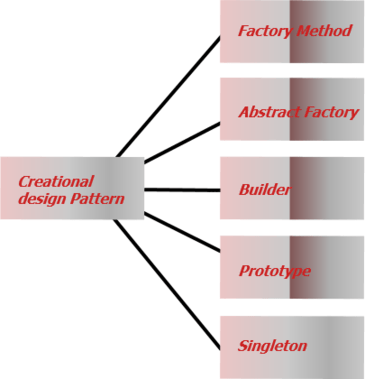
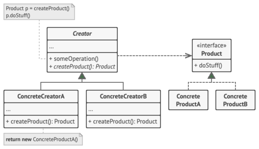

<style type="text/css">
  body{
    font-size: 10.5pt;
  }
</style>

# 7. Creational design patterns - Object pool, Singleton a Factory metoda

### Úvod

    Jsou to návrhové vzory, které se zabývají mechanismy vytváření objektů.
    Snaží se vytvářet objekty způsobem, který je vhodný pro danou situaci. (Základní forma vytváření objektu může vést k problémům s návrhem nebo ke zvýšení složitosti návrhu.)Kreativní návrhové vzory tento problém řeší tím, že nějakým způsobem řídí vytváření tohoto objektu.
    2 typy: 

    - Object-creational patterns
    Vzory pro vytváření objektů se zabývají vytvářením objektů. Zde odloží část svého vytvoření objektu na jiný objekt.

    - Class-creational patterns
    Vytváření vzorů třídy se zabývá instancí třídy. Zde odloží vytvoření objektu na podtřídy

#### Použití

    V aplikacích v reálném čase je projekt vytvořen s mnoha třídami. Mnoho tříd znamená, že se budeme zabývat spoustou předmětů. Pokud jsou tyto výtvory objektů rozptýleny v kódu klienta, vede to v kódu klienta ke spoustě komplikovaných logik. Creational Design Pattern nám pomáhá centralizovat logiku vytváření objektů.



### Factory method

    Poskytuje rozhraní pro vytváření objektů v nadtřídě, ale umožňuje podtřídám měnit typ vytvářených objektů.
    Tento vzor se používá k vytvoření konkrétních instancí třídy bez zadání přesného typu třídy. Zde jsou objekty vytvářeny bez znalosti třídy objektu. 
    V zásadě se tedy tovární vzor používá všude tam, kde jsou podtřídám dány převažující instance metody, která může vytvořit objekt.


    Klíčové je oddělení konstrukce konkrétní instance do jiné třídy, čímž se původní třída neznečistí konstrukčním kódem.

```java

    class Auto{
        private String brand;
        private String model;

        public Auto(String brand,String model){
            this.brand = brand;
            this.model = model;
        }
    }
    class TovarnaNaAuta{
        public Auto VyrobMercedesC(){
            return new Auto("Mercedes Benz","C-Class");
        }
    }

    public class Main{
        public static void main(String[] args){
            TovarnaNaAuta factory = new TovarnaNaAuta();
            Auto a = factory.VyrobMErcedesC();
        }
    }

```

    Z třídy Auto se dají vytvářet instance, ale pokud by bylo zapotřebí více instancí konkrétního auta a nechceme zasahovat do třídy Auto, tak se použije TovarnaNaAuta a zavoláním její metody dostaneme objekt Auto
    Schéma složitějšího příkladu: 



    Výhoda je dělení složité inicializace od jiné třídy, což zpřehlední další logiku ve třídě, kde instanci potřebujeme.

#### Další příklad

    Představte si, že vytváříte aplikaci pro správu logistiky. První verze vaší aplikace zvládne pouze přepravu nákladními automobily, takže většina vašeho kódu žije uvnitř třídy Truck.

    Po chvíli se vaše aplikace stane velmi populární. Každý den obdržíte desítky žádostí od společností námořní dopravy o začlenění námořní logistiky do aplikace.

    Skvělé zprávy, že? Ale co kód? V současné době je většina vašeho kódu spojena s třídou Truck. Přidání lodí do aplikace by vyžadovalo provedení změn v celé základně kódů. Navíc, pokud se později rozhodnete přidat do aplikace jiný typ dopravy, budete pravděpodobně muset znovu provést všechny tyto změny.

    Ve výsledku skončíte s docela ošklivým kódem, který je plný podmíněných podmínek, které mění chování aplikace v závislosti na třídě přepravních objektů.

    Vzor Factory Method navrhuje, abyste přímé volání konstrukce objektu (pomocí nového operátoru) nahradili voláním speciální tovární metody. Nedělejte si starosti: objekty se stále vytvářejí pomocí nového operátoru, ale volá se z tovární metody. Objekty vrácené tovární metodou se často označují jako produkty.

    Na první pohled může tato změna vypadat zbytečně: právě jsme přesunuli volání konstruktoru z jedné části programu do druhé. Zvažte však toto: nyní můžete přepsat tovární metodu v podtřídě a změnit třídu produktů vytvářených touto metodou.

    Existuje však mírné omezení: podtřídy mohou vracet různé typy produktů, pouze pokud mají tyto produkty společnou základní třídu nebo rozhraní. Také tovární metoda v základní třídě by měla mít svůj návratový typ deklarovaný jako toto rozhraní.

#### Abstract Factory

    Umožňuje vytvářet rodiny souvisejících objektů bez zadání jejich konkrétních tříd.