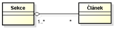

<style type="text/css">
body{
    font-size: 12pt;
}
</style>

# 15. Principy objektového programování, agregace a kompozice objektů

## Přechod od počátku progamování k objektově orientovanému programování

Mezi tím, jak se programovalo před 40ti lety a jak se programuje dnes, je velký rozdíl. První počítače neoplývaly velkým výkonem a i jejich software nebyl nijak složitý

1. ### Strojový kód
    
    Jedná se program, jenž je souborem instrukcí, kde jsme nemáme žádnou možnost pojmenovávat proměnné nebo zadávat matematické výrazy.

2. ### Nestrukturované paradigma

    Nestrukturovaný přístup je podobný assemblerům, jedná se o soubor instrukcí, který se vykonává odshora dolů. Zdrojový kód již nebyl závislý na hardwaru a byl lépe čitelný pro člověka, přístup na nějakou dobu umožnil vytvářet komplexnější programy. Bylo tu však stále mnoho úskalí: Jediná možnost, jak udělat něco vícekrát nebo jak se v kódu větvit, byl příkaz GOTO.

3. ### Strukturované paradigma


    Strukturované programování je první paradigma, které se udrželo delší dobu a opravdu chvíli postačovalo pro vývoj nových programů. Programujeme pomocí cyklů a větvení. To je v podstatě to, kam jsme se doteď dostali.

    Program lze rozložit do funkcí (metod), tomu jsme se nevěnovali, protože to v C# (který je objektový) ani moc dobře nejde a raději jsem dal přednost tento mezikrok přeskočit a začít rovnou s OOP. U strukturovaného programování hovoříme o tzv. funkcionální dekompozici. Problém se rozloží na několik podproblémů a každý podproblém potom řeší určitá funkce s parametry. Nevýhodou je, že funkce umí jen jednu činnost, když chceme něco jiného, musíme napsat novou. Neexistuje totiž způsob, jak vzít starý kód a jen trochu ho modifikovat, musíme psát znovu a znovu - vznikají zbytečné náklady a chyby. Tuto nevýhodu lze částečně obejít pomocí parametrizace funkcí (počet parametrů poté ale rychle narůstá) nebo použitím globálních proměnných. S globálními daty vzniká však nové nebezpečí - funkce mají přístup k datům ostatních. To je začátek konce, nikdy totiž neuhlídáme, aby někde nedošlo k přepsání glob. dat mezi funkcemi a začne docházet k nekontrolovatelným problémům. Celý program se potom skládá z nezapouzdřených bloků kódu a špatně se udržuje.

### Objektově orientované programování 

    Jedná se o filozofii a způsob myšlení, designu a implementace, kde klademe důraz na znovupoužitel­nost. Přístup nalézá inspiraci v průmyslové revoluci - vynález základních komponent, které budeme dále využívat (např. když stavíme dům, nebudeme si pálit cihly a soustružit šroubky, prostě je již máme hotové).

    Poskládání programu z komponent je výhodnější a levnější. Můžeme mu věřit, je otestovaný (o komponentách se ví, že fungují, jsou otestovány a udržovány). Pokud je někde chyba, stačí ji opravit na jednom místě. 


## Agregace

Agregace reprezentuje vztah typu celek - část. Zakreslujeme ji jako plnou čáru, zakončenou na jedné straně prázdným kosočtvercem. Ten je umístěn u té entity, která reprezentuje celek (např. sekce s články). Z hlediska implementace je to tak entita, která drží kolekci prvků. Entita reprezentující část může existovat sama o sobě a být součástí i jiných kolekcí.



Příkladem agregace může být již zmíněná sekce, obsahující články. Čísla na konci vazby znamenají tzv. multiplicitu, přesněji, že sekce obsahuje libovolný počet článků a článek patří alespoň do 1 sekce.

## Kompozice Objektů

Kompozice je podobná agregaci, avšak reprezentuje silnější vztah. Entita části nemá bez celku smysl. Pokud zanikne celek, zanikají automaticky i jeho části.

Kompozici zakreslujeme stejně jako agregaci, kosočtverec je ovšem plný. U entity reprezentující celek musí být multiplicita vždy 1. Tato vazba bývá matoucí a doporučil bych se jí spíše vyhýbat a nahradit ji agregací.


Příkladem může být Objednávka a Položka objednávky. Zatímco článek z minulého příkladu dává bez sekce ještě nějaký smysl, položka objednávky bez objednávky smysl nedává. Proto je zde použita kompozice.

# Soubory a serializace Stringy, regulární výrazy, parsování textu, kódování

## Soubory

### Soubory s kódem programovacího jazyka


### Obecně soubory JSON, CSV, Proudy...


## Serializace 

Serializace je uchování stavu objektu. Trochu odborněji by se to dalo popsat jako konvertování objektu na proud bytů a poté uložení někde do paměti, databáze nebo souboru. Deserializace je opak serializace. Dalo by se říci, že tedy převedete zpátky proud bytů na kopii objektu.

```java

public class A implements Serializable{
    
    
}
public static void main(String[]args){

}

```

## String

## Regularní výrazy

## Parsování textu

## Kódovaní textu

