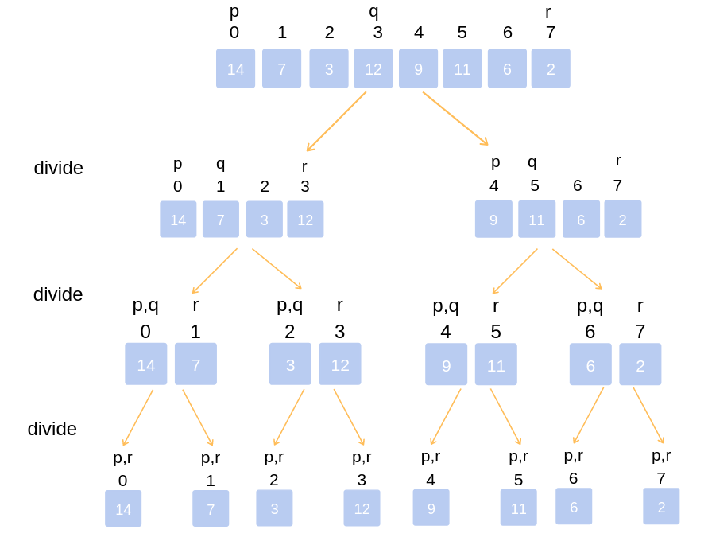

<style type="text/css">
body{
    font-size: 12pt;
}
</style>


# 1. Adresování a správa paměti, Garbage collector

[comment]: <Source> (https://www.baeldung.com/java-stack-heap)

> Tato otázka je vysvětlena v javě.

## Adresace a správa paměti v programovacím jazyce aneb kam nás program pustí

 Ze začátku je nutno říci, že Java byla navržena jako bezpečné a samo řízené
 prostředí, která je řízeno JVM,
a proto nás nepustí jen tak kam se nám zachce, abychom mohli jako v nějakém nižším jazyce
měnit adresové hodnoty a přepisovat si pamět programu a implementovat garbage collector, který java má. To znamená, že v Javě nemůžeme používat destruktory.

- Kód:

```java
    class Osoba {
    int vek;
    String jmeno;

    public Osoba(int vek, String jmeno) {
        this.vek = vek;
        this.jmeno = jmeno;
    }
}

public class OsobaBuilder {

    public static vovek main(String[] args) {
        int vek = 23;
        String jmeno = "John";
        String jmeon = new String("John");
        Osoba Osoba = null;
        Osoba = Osoba(vek, jmeno);
    }
}
```

Na tomto kódu vidíme deklaraci a inizializaci několika jiných typů odvozených od základní třídy Object.

Pojďme analyzovat tento kód


1. Při vstupu do main metody místo v zásobníku je vytvořeno aby uložilo primitivní datové typy a blok této metody pro ukládání

   1. Primitivní hodnoty integeru id se uloží přímo na zásobník
   2. Reference na proměnnou osoba bude také vytvořena na zásobník, která bude ukazovat na objekt na haldě

2. Volání parametrizovaného konstruktoru Osoba(int,String) z main() zabere další pamět na vrcholu předchozího zásobníku.Uloží se:
   1. this object reference na volaný ojekt na zásobníku
   2. primitivní hodnota id na zásobník
   3. reference na proměnnou name, která bude ukazovat na string ze string pool na haldě
3. Pro nově vytvořený objekt person typu Osoba všechny instance proměnné budou uloženy na haldu


## Garbage Collector a jeho implementace v javě

```java
    Integer i = new Integer(4);
    //Nějaký kód s proměnnou
    i = null;
    //System.gc(); Může zavolat Garbage Collector, ale navrhujeme
    // JVM aby recyklovalo nepoužívané objekty
```

Jak už bylo řečeno Garbage collector ničí objekty, které jsou podle něj unreachable.Nemůžeme předpokládat kdy bude gc čistit pamět nebo kdy se bude muset třeba v horším případě program i zastavit, kvůli čištění paměti. Je to určitě snažší pro programování bez myšlení na náročnost paměti či náročnosti výpočetní, ale jako programátor, který zodpovídá za svůj program by měl vědět kdy program bude využívat svůj čas pro svoji správu.

Výhody:

- Žádná nutnost obstarávání manuální alokace/delokace paměti kvůli nepoužitému místu 
- Nemusíme se starat o ukazal na místo kde už objekt neexistuje 
- Automatické starání se o přetečení paměti

Nevýhody:

- Kvůli tomu, že se JVM musí starta o objektovou referenci vytváření/ničení tato aktivita vyžaduje více výpočetní náročnosti místo originální aplikace

- Programátoři nemají kontrolu nad plánováním CPU času dedikovanému na uvolňování nepotřebných objektů

- Používání některých GC implementací může vyústit v nepředpokládanou zástavu aplikace
- Určitě to není tak efektivní jako manuální memory management

# 2. Algoritmizace - Grafy, Prohlédávání stavového prostoru, Řazení

## Teorie Grafů

### Co je graf? 

Graf je matematická struktůra, definovaná množina vrcholů a množinou hran, kde každá hrana je určena povinně dvěma vrcholy a volitelně směrem.
Používá se na modeloví vlastně čehokoliv v reálném světě.Není duležíté jak namalujete graf,ale jak ho propojíte


Jak jde vidět, můžeme udělat i cykly a podgrafy v grafu.

### Strom

Jedná se o graf který neobsahuje žádnou smyčku tzn. že se nemohu dostat na stejný vrchol bez toho abych se dostal na vchol na kterém jsem už byl.


### Binární strom

Binarní strom

Používá se na ukládání a vyhledávání dat.Jedná se o orientovaný graf s jedním vrcholem, z něhož existuje cesta do všech vrcholů grafu.

Typy binárních stromů

- Binární strom a ten obsahuje uzly, které mají nejvýš 2 syny
- Plný binární strom každý vnitřní uzel má dva syny

### Matice sousednosti

### Djikstrův algoritmus


## Prohledávání stavového prosturu

Tři základní vlastnosti, podle kterých lze metody hodnotit.

- Časová složitost => minimální/maximální/průměrný čas potřebný k vyřešení úlohy danou metodou.

- Prostorová složitost => minimální/maximální/průměrné množství operační paměti potřebné k řešení úlohy.
  V zájmu nezávislosti na platformě se místo údaje o počtu megabytů používá např. počet stavů současně uchovaných v paměti.
  
- Kvalita získaných výsledků => zahrnuje výpověď o tom, zda je daná metoda úplná (nalezne řešení vždy, když existuje)
  
### Neinformované metody

     Neinformované metody prohledávání nemají k dispozici žádné vhodné znalosti o stavovém prostoru, které by jim umožnily urychlit cestu k cíli.
    Jsou tak odsouzeny k systematickému procházení všech uzlů, dokud nenaleznou řešení.
    Jednotlivé algoritmy se od sebe liší jen způsobem, jakým toto systematické procházení provádějí.

- prohledávání do šířky
- prohledávání do hloubky
- iterativní prohledávání do hloubky


### Informované metody

     Informované metody prohledávání mají navíc znalosti o stavovém prostoru, které jim umožňují odhadnout, jak daleko se nachází řešení od aktuálního stavu.
    Tento odhad reprezentuje tzv. heuristická funkce h{n}. Čím nižší hodnoty h{n} nabývá, tím spíše povede cesta k řešení skrze stav n.

- uspořádané prohledávání (Best-first search) – Prohledávání do šířky upřednostňující „slibné“ stavy

- Lokální metody prohledávání


## Třídění

    Pojem třídění je možná maličko nepřesný, často se však používá. Nehodláme data (čísla, řetězce a jiné) rozdělovat do nějakých tříd, ale přerovnat je do správného pořadí, od nejmenšího po největší – ať už pro nás „větší“ znamená jakékoliv uspořádání.


### Bubble sort

Bubble sort je poměrně hloupý algoritmus, který se vyskytuje v podstatě jen v akademickém světě. Nemá žádné dobré vlastnosti a je zajímavý pouze svým průběhem, který může připomínat fyzikální nebo přírodní jevy. Algoritmus probíhá ve vlnách, přičemž při každé vlně propadne "nejtěžší" prvek na konec (nebo nejlehčí vybublá nahoru, záleží na implementaci). 


### Merge Sort

Merge sort je algoritmus, založený na tzv. principu rozděl a panuj (latinsky divide et impera, anglicky divide and conquer). To znamená, že pokud nějaký problém neumíme vyřešit v celku, rozložíme si ho na více menších a jednodušších problémů. Ten samý postup aplikujeme i na tyto problémy (opět je rozdělíme na ještě menší, mimochodem velmi se zde nabízí rekurzivní řešení) až se dostaneme na takovou úroveň, kterou jsme schopni bez problému řešit. V problému třídění se často chceme dostat až k poli velikosti 1, které považujeme automaticky za setříděné.



### Quick sort

Jak již název napovídá, Quicksort je rychlý. On je dokonce nejrychlejší a je to algoritmus, který se skutečně používá v praxi k třídění prvků, proto bude tento článek o něco obsáhlejší, než ostatní. Chová se dobře jak na malých, tak na velkých polích a je paměťově nenáročný. Algoritmus je založen na principu rozděl a panuj, který jsme si již vysvětlili v algoritmu Merge sort.


# 3. Algoritmizace - Rekurze, Brute Force, Heuristiky, Nedeterministické algoritmy

## Rekurze

### Přímá

```java
    public int faktorial(int n){
        int vysledek;
        if(n == 1)
            return 1;
        vysledek = faktorial(n-1) * n;
        return vysledek;
    }
```

>Metoda volá neustále sama sebe, jelikož v si program zapamutuje stav rozpracované funkce.V uvedeném případě odpočítáváme faktoriál dokud se nedostaneme k výsledku


### Nepřímá

Jedná se o cyklickou rekurzi mezi několika metodami.

## Brute Force

je většinou pokus o rozluštění šifry bez znalostí jejího klíče k dešifrování.V praxi se jedná o systematické testování všech možných kombinací.Útok hrubou silou se často používá pro uhádnutí dvojice uživatel a heslo. Je možné používat náhodná (resp. generická) přihlašovací jména a hesla při pokusech o autentizaci, případně možné varianty omezit. Například získat seznam uživatelských jmen a zkoušet prolomit pouze heslo.

> Čas potřebný pro útok hrubou silou roste exponenciálně s rostoucí délkou klíče, protože se tím zvětšuje i prostor klíče (anglicky key space).

## Heuristiky


    Heuristikou nazýváme postup, který, i když neprobere všechny možnosti, je schopný v některých případech podat výsledek. Výsledek je podáván zpravidla jedním ze dvou možných způsobů. Buď jako kladný výsledek (odpověď), nebo jako výrok neurčitosti.

Jsou vhodné zejména pro řešení složitých funkcí s mnoha parametry a složitým průběhem s mnoha extrémy.

Např. Problém obchodního cestujícího.

Existuje n měst, mezi nimi silnice o známých délkách. Úkolem je najít nejkratší možnou trasu procházející všemi městy a vracející se nazpět do výchozího města.


## Nedeterministké alogritmy

Absolutne nvm.

# 4. Architectural design patterns - MVC, Multitier, Monolithic, P2P, Client/Server

## MVC- Model view controller

MVC je velmi oblíbený architektonický vzor, který se uchytil zejména na webu, ačkoli původně vznikl na desktopech. Je součástí populárních webových frameworků, jakými jsou např. Zend nebo Nette pro PHP, Ruby On Rail pro Ruby nebo MVC pro ASP .NET.

Základní myšlenkou MVC architektury je oddělení logiky od výstupu. Řeší tedy problém tzv. "špagetového kódu", kdy máme v jednom souboru (třídě) logické operace a zároveň renderování výstupu. Soubor tedy obsahuje databázové dotazy, logiku (např. PHP operace) a různě poházené HTML tagy. 

Celá aplikace je rozdělena na komponenty 3 typů, hovoříme o Modelech, View (pohledech) a Controllerech (kontrolerech), od toho MVC. Neexistuje žádná striktní definice MVC architektury a tak se můžete setkat s více výklady. Je dost možné, že to, co zde popisuji, je architektura MVP (nebudu rozebírat) nebo dokonce něco mezi. Co člověk, to názor, co framework, to jiný přístup. Důležitý je však základní princip, tedy rozdělení hlavních rolí těchto 3 komponent.

## Model

Model obsahuje logiku a vše, co do ní spadá. Mohou to být výpočty, databázové dotazy, validace a podobně. Model vůbec neví o výstupu. Jeho funkce spočívá v přijetí parametrů zvenku a vydání dat ven. Zdůrazním, že parametry nemyslím URL adresu ani žádné jiné parametry od uživatele. Model neví, odkud data v parametrech přišla a ani jak budou výstupní data zformátována a vypsána.

## View

Pohled (View) se stárá o zobrazení výstupu uživateli. Nejčastěji se jedná o phtml šablonu, obsahující HTML stránku a tagy nějakého značkovacího jazyka, který umožňuje do šablony vkládat proměnné, případně provádět iterace (cykly) a podmínky. Opět zachováme maximální jednoduchost a stejně jako tomu bylo s ORM, i zde si vystačíme pouze s tím, co nám nabízí PHP. Pro šablony se často používají speciální značkovací jazyky (např. Smarty). Pro PHP nemá ale příliš velký smysl používat značkovací jazyk, jelikož je samo značkovacím jazykem a umožňuje takový styl zápisu kódu, aby struktura HTML stránky zůstala zachována.

## Controller

Kontroler je nyní onen chybějící prvek, který osvětlí funkčnost celého vzoru. Jedná se o jakéhosi prostředníka, se kterým komunikuje uživatel, model i pohled. Drží tedy celý systém pohromadě a komponenty propojuje. Jeho funkci pochopíme z ukázky životního cyklu stránky. Opět existuje mnoho různých přístupů, nejčastěji má každá entita jeden kontroler, máme tedy UzivatelKontroler, ClanekKontroler a tak podobně.

Komponenty jsou samozřejmě třídy, které mohou být odděděné z abstraktních předků, jen view je většinou jen jako HTML šablona. Pojďme si jednotlivé komponenty nejprve popsat.

## Multitier

## Monolithic

## P2P

## Client/Server

# 5. Konstanty, Statické metody a vlastnosti, Anonymní metody (Lambda), Ukazatel na metodu (delegát)  
 
## Konstanty

Konstanty Konstanta je v programování označení pro identifikátor, který je spojený s určitou hodnotou, kterou není možné během provádění programu měnit. Mnoho programovacích jazyků umožňuje explicitně syntakticky rozlišit proměnné a konstanty. Přestože je konstanta definována pouze jednou, může být v programu použita mnohokrát. Použití konstanty místo přímého použití její hodnoty nejenom usnadňuje údržbu programu, ale také umožňuje odvolávat se na hodnotu pomocí smysluplného jména a sjednotit použití stejných konstant se stejným významem a umístit přiřazení jmen konstant na jedno místo, například na začátek programu. Konstanty jsou deklarovány s modifikátorem const . Pouze předdefinované typy jazyka C# mohou být deklarovány jako const . Uživatelsky definované typy, včetně tříd, struktur a polí, nemůžou být const .Jazyk C# nepodporuje const metody, vlastnosti a události. 
 

## Staticke metody

Statické metody a vlastnosti Statická třída je v podstatě stejná jako nestatická třída, ale existuje jeden rozdíl: statickou třídu nelze vytvořit. Jinými slovy, operátor New nelze použít k vytvoření proměnné typu třídy. Vzhledem k tomu, že není k dispozici žádná proměnná instance, získáte přístup ke členům statické třídy pomocí samotného názvu třídy. Statickou metodu můžeme volat i bez vytvoření instance třídy. To samé statické atributy. Například třída Console a její metoda WriteLine, třída Console je statická a nemůžeme ji vytvořit. 
Anonymní metody V programu se občas může objevit kód, který je volán pouze prostřednictvím delegáta. Následný kód se umísťuje do pojmenovaných metod jako součást tříd nebo struktur, což se jeví jako zbytečné. Výhodnější je využít tzv. anonymních metod, které představují elegantnější řešení. Anonymní metody umožňují psát kód delegátů přímo "in-line" . Využít je lze v místech kódu, kde jsou očekáváni delegáti, případně delegáti s argumenty. Vytváří se klíčovým slovem delegate. 
 
## Anonymni metoda

## Delegát

Delegát Delegát je typ, který představuje odkazy na metody s konkrétním seznamem parametrů a návratovým typem. Pokud vytvoříte instanci delegátu, můžete příslušnou instanci přidružit s jakoukoli metodou s kompatibilním podpisem a návratovým typem. Metodu můžete vyvolat (nebo volat) prostřednictvím instance delegátu. 

Další ukázka delegát: 
 
Delegát vrací pole a jako parametr má pole 
 
Funkce filtr pole bere delegáta/funkci a pole jako parametr a vrací pole SudaCisla a LichaCisla vrací pole 
 
Můžeme využít k různým filtracím pole 

# Principy objektového programování, agregace a kompozice objektů

## Přechod od počátku progamování k objektově orientovanému programování

Mezi tím, jak se programovalo před 40ti lety a jak se programuje dnes, je velký rozdíl. První počítače neoplývaly velkým výkonem a i jejich software nebyl nijak složitý

1. ### Strojový kód
    
    Jedná se program, jenž je souborem instrukcí, kde jsme nemáme žádnou možnost pojmenovávat proměnné nebo zadávat matematické výrazy.

2. ### Nestrukturované paradigma

    Nestrukturovaný přístup je podobný assemblerům, jedná se o soubor instrukcí, který se vykonává odshora dolů. Zdrojový kód již nebyl závislý na hardwaru a byl lépe čitelný pro člověka, přístup na nějakou dobu umožnil vytvářet komplexnější programy. Bylo tu však stále mnoho úskalí: Jediná možnost, jak udělat něco vícekrát nebo jak se v kódu větvit, byl příkaz GOTO.

3. ### Strukturované paradigma


    Strukturované programování je první paradigma, které se udrželo delší dobu a opravdu chvíli postačovalo pro vývoj nových programů. Programujeme pomocí cyklů a větvení. To je v podstatě to, kam jsme se doteď dostali.

    Program lze rozložit do funkcí (metod), tomu jsme se nevěnovali, protože to v C# (který je objektový) ani moc dobře nejde a raději jsem dal přednost tento mezikrok přeskočit a začít rovnou s OOP. U strukturovaného programování hovoříme o tzv. funkcionální dekompozici. Problém se rozloží na několik podproblémů a každý podproblém potom řeší určitá funkce s parametry. Nevýhodou je, že funkce umí jen jednu činnost, když chceme něco jiného, musíme napsat novou. Neexistuje totiž způsob, jak vzít starý kód a jen trochu ho modifikovat, musíme psát znovu a znovu - vznikají zbytečné náklady a chyby. Tuto nevýhodu lze částečně obejít pomocí parametrizace funkcí (počet parametrů poté ale rychle narůstá) nebo použitím globálních proměnných. S globálními daty vzniká však nové nebezpečí - funkce mají přístup k datům ostatních. To je začátek konce, nikdy totiž neuhlídáme, aby někde nedošlo k přepsání glob. dat mezi funkcemi a začne docházet k nekontrolovatelným problémům. Celý program se potom skládá z nezapouzdřených bloků kódu a špatně se udržuje.

### Objektově orientované programování 

    Jedná se o filozofii a způsob myšlení, designu a implementace, kde klademe důraz na znovupoužitel­nost. Přístup nalézá inspiraci v průmyslové revoluci - vynález základních komponent, které budeme dále využívat (např. když stavíme dům, nebudeme si pálit cihly a soustružit šroubky, prostě je již máme hotové).

    Poskládání programu z komponent je výhodnější a levnější. Můžeme mu věřit, je otestovaný (o komponentách se ví, že fungují, jsou otestovány a udržovány). Pokud je někde chyba, stačí ji opravit na jednom místě. 


## Agregace

Agregace reprezentuje vztah typu celek - část. Zakreslujeme ji jako plnou čáru, zakončenou na jedné straně prázdným kosočtvercem. Ten je umístěn u té entity, která reprezentuje celek (např. sekce s články). Z hlediska implementace je to tak entita, která drží kolekci prvků. Entita reprezentující část může existovat sama o sobě a být součástí i jiných kolekcí.


Příkladem agregace může být již zmíněná sekce, obsahující články. Čísla na konci vazby znamenají tzv. multiplicitu, přesněji, že sekce obsahuje libovolný počet článků a článek patří alespoň do 1 sekce.

## Kompozice Objektů

Kompozice je podobná agregaci, avšak reprezentuje silnější vztah. Entita části nemá bez celku smysl. Pokud zanikne celek, zanikají automaticky i jeho části.

Kompozici zakreslujeme stejně jako agregaci, kosočtverec je ovšem plný. U entity reprezentující celek musí být multiplicita vždy 1. Tato vazba bývá matoucí a doporučil bych se jí spíše vyhýbat a nahradit ji agregací.


Příkladem může být Objednávka a Položka objednávky. Zatímco článek z minulého příkladu dává bez sekce ještě nějaký smysl, položka objednávky bez objednávky smysl nedává. Proto je zde použita kompozice.

# Soubory a serializace Stringy, regulární výrazy, parsování textu, kódování

## Soubory

### Soubory s kódem programovacího jazyka


### Obecně soubory JSON, CSV, Proudy...


## Serializace 

Serializace je uchování stavu objektu. Trochu odborněji by se to dalo popsat jako konvertování objektu na proud bytů a poté uložení někde do paměti, databáze nebo souboru. Deserializace je opak serializace. Dalo by se říci, že tedy převedete zpátky proud bytů na kopii objektu.

```java

public class A implements Serializable{
    
    
}
public static void main(String[]args){

}

```

## String

## Regularní výrazy

## Parsování textu

## Kódovaní textu

