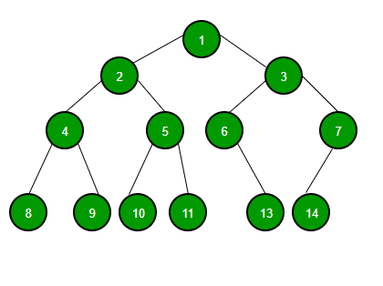

<style type="text/css">
body{
    font-size: 12pt;
}
</style>


# 1. Adresování a správa paměti, Garbage collector

[comment]: <Source> (https://www.baeldung.com/java-stack-heap)

> Tato otázka je vysvětlena v javě.

## Adresace a správa paměti v programovacím jazyce aneb kam nás program pustí

 Ze začátku je nutno říci, že Java byla navržena jako bezpečné a samo řízené
 prostředí, která je řízeno JVM,
a proto nás nepustí jen tak kam se nám zachce, abychom mohli jako v nějakém nižším jazyce
měnit adresové hodnoty a přepisovat si pamět programu a implementovat garbage collector, který java má. To znamená, že v Javě nemůžeme používat destruktory.

- Kód:

```java
    class Osoba {
    int vek;
    String jmeno;

    public Osoba(int vek, String jmeno) {
        this.vek = vek;
        this.jmeno = jmeno;
    }
}

public class OsobaBuilder {

    public static vovek main(String[] args) {
        int vek = 23;
        String jmeno = "John";
        String jmeon = new String("John");
        Osoba Osoba = null;
        Osoba = Osoba(vek, jmeno);
    }
}
```

Na tomto kódu vidíme deklaraci a inizializaci několika jiných typů odvozených od základní třídy Object.

Pojďme analyzovat tento kód


1. Při vstupu do main metody místo v zásobníku je vytvořeno aby uložilo primitivní datové typy a blok této metody pro ukládání

   1. Primitivní hodnoty integeru id se uloží přímo na zásobník
   2. Reference na proměnnou osoba bude také vytvořena na zásobník, která bude ukazovat na objekt na haldě

2. Volání parametrizovaného konstruktoru Osoba(int,String) z main() zabere další pamět na vrcholu předchozího zásobníku.Uloží se:
   1. this object reference na volaný ojekt na zásobníku
   2. primitivní hodnota id na zásobník
   3. reference na proměnnou name, která bude ukazovat na string ze string pool na haldě
3. Pro nově vytvořený objekt person typu Osoba všechny instance proměnné budou uloženy na haldu


## Garbage Collector a jeho implementace v javě

```java
    Integer i = new Integer(4);
    //Nějaký kód s proměnnou
    i = null;
    //System.gc(); Může zavolat Garbage Collector, ale navrhujeme
    // JVM aby recyklovalo nepoužívané objekty
```

Jak už bylo řečeno Garbage collector ničí objekty, které jsou podle něj unreachable.Nemůžeme předpokládat kdy bude gc čistit pamět nebo kdy se bude muset třeba v horším případě program i zastavit, kvůli čištění paměti. Je to určitě snažší pro programování bez myšlení na náročnost paměti či náročnosti výpočetní, ale jako programátor, který zodpovídá za svůj program by měl vědět kdy program bude využívat svůj čas pro svoji správu.

Výhody:

- Žádná nutnost obstarávání manuální alokace/delokace paměti kvůli nepoužitému místu 
- Nemusíme se starat o ukazal na místo kde už objekt neexistuje 
- Automatické starání se o přetečení paměti

Nevýhody:

- Kvůli tomu, že se JVM musí starta o objektovou referenci vytváření/ničení tato aktivita vyžaduje více výpočetní náročnosti místo originální aplikace

- Programátoři nemají kontrolu nad plánováním CPU času dedikovanému na uvolňování nepotřebných objektů

- Používání některých GC implementací může vyústit v nepředpokládanou zástavu aplikace
- Určitě to není tak efektivní jako manuální memory management

# 2. Algoritmizace - Grafy, Prohlédávání stavového prostoru, Řazení

## Teorie Grafů

### Co je graf? 

Graf je matematická struktůra, definovaná množina vrcholů a množinou hran, kde každá hrana je určena povinně dvěma vrcholy a volitelně směrem.
Používá se na modeloví vlastně čehokoliv v reálném světě.Není duležíté jak namalujete graf,ale jak ho propojíte


Jak jde vidět, můžeme udělat i cykly a podgrafy v grafu.

### Strom

Jedná se o graf který neobsahuje žádnou smyčku tzn. že se nemohu dostat na stejný vrchol bez toho abych se dostal na vchol na kterém jsem už byl.


### Binární strom

Binarní strom

Používá se na ukládání a vyhledávání dat.Jedná se o orientovaný graf s jedním vrcholem, z něhož existuje cesta do všech vrcholů grafu.

Typy binárních stromů

- Binární strom a ten obsahuje uzly, které mají nejvýš 2 syny
- Plný binární strom každý vnitřní uzel má dva syny

### Matice sousednosti

### Djikstrův algoritmus





## Prohledávání stavového prosturu

Tři základní vlastnosti, podle kterých lze metody hodnotit.

- Časová složitost => minimální/maximální/průměrný čas potřebný k vyřešení úlohy danou metodou.

- Prostorová složitost => minimální/maximální/průměrné množství operační paměti potřebné k řešení úlohy.
  V zájmu nezávislosti na platformě se místo údaje o počtu megabytů používá např. počet stavů současně uchovaných v paměti.
  
- Kvalita získaných výsledků => zahrnuje výpověď o tom, zda je daná metoda úplná (nalezne řešení vždy, když existuje)
  
### Neinformované metody

     Neinformované metody prohledávání nemají k dispozici žádné vhodné znalosti o stavovém prostoru, které by jim umožnily urychlit cestu k cíli.
    Jsou tak odsouzeny k systematickému procházení všech uzlů, dokud nenaleznou řešení.
    Jednotlivé algoritmy se od sebe liší jen způsobem, jakým toto systematické procházení provádějí.

- prohledávání do šířky
- prohledávání do hloubky
- iterativní prohledávání do hloubky


### Informované metody

     Informované metody prohledávání mají navíc znalosti o stavovém prostoru, které jim umožňují odhadnout, jak daleko se nachází řešení od aktuálního stavu.
    Tento odhad reprezentuje tzv. heuristická funkce h{n}. Čím nižší hodnoty h{n} nabývá, tím spíše povede cesta k řešení skrze stav n.

- uspořádané prohledávání (Best-first search) – Prohledávání do šířky upřednostňující „slibné“ stavy

- Lokální metody prohledávání


## Třídění


### Bubble sort

### Quick sort

### Merge Sort

