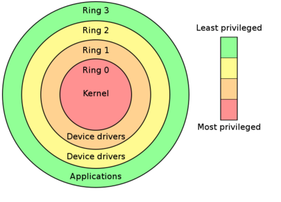

# 10. Chráněný režim operační paměti, adresování LA a FA

### Definice

    Od moderních systému se požaduje, aby zajistily:
    - spolehlivý běh počítače
    - podporu multitaskingu
    - spuštěné procesy se nemohou navzájem ovlivňovat
    - jádro operačního systému má plnou kontrolu nad činností počítače

    Chráněný režim přináší ve schopnostech mikroprocesorů několik nových vlastností, které umožňují naprogramovat moderní operační systém.

### Důvod a principy ochrany OP

    V chráněném režimu chráníme OP před poškozením obsahu (data,kód) neoprávněným spuštěním a při spuštění 2 a více programů.
    Ochrana operační paměti lépe hospodaří s pamětovým prostorem.
    Máme také virtualizaci paměti což nám přináší pokročilou správu operační paměti, která spočívá v podpoře virtuální paměti pomocí stránkování, což usnadňuje provozování multitaskingu.

### Přidělené úrovně oprávnění přístupu k OP

    Privilegovaný režim umožňuje zajistit, aby neprivilegované procesy nemohly měnit nastavení, která byla provedena v privilegovaném režimu. Jádro operačního systému běží v privilegovaném režimu a všechny ostatní procesy v neprivilegovaném. Tak jádro neztratí nad počítačem kontrolu a jen jádro může procesům přidělovat a odebírat systémové prostředky.

    Chráněný režim vlastně hlídá:
    - hranice procesu
    - hranice mezi procesy
    - hranice mezi úrovněmi
    - hranice mezi segmenty v jednotlivých úrovních

    Máme čtyři bity privilegované úrovně:
    MAX | Kernel     | 00
        | Supervizor | 01
        | Knihovny   | 10
    MIN | Aplikace   | 11

### Virtualizace paměti

    Ve víceúlohovém systému, který využívá multitasking, je nutné umístit do paměti více procesů najednou. Pokud jsou k dispozici nástroje na virtualizaci paměti, lze vytvořit každému z procesů jeho vlastní adresní prostor, který bude začínat od nuly. 

    Každý proces pak bude pracovat s virtuálními adresami, které budou vyjadřovat vzdálenost od začátku tohoto vlastního vyhrazeného adresního prostoru (tj. logická adresa bude pro každý proces začínat od nuly).

    Logické adresy používané strojovými instrukcemi jsou pak v případě přístupů do paměti automaticky překládány pomocí MMU procesoru na fyzické adresy a zpět.

    Segmentace používá pro vytvoření logické (virtuální) adresy dva speciální registry – segment a offset, přičemž jejich součet vyjadřuje fyzickou adresu. Segment se nastaví předem (tzv. bázová adresa). Strojové instrukce pak pracují pouze s offsetem (logickou adresou), která vyjadřuje vzdálenost od bázové adresy (segmentu). Segmentový registr je typicky procesu nepřístupný, nastavuje ho operační systém v privilegovaném režimu.Každý proces má k dispozici typicky více segmentů, které odpovídají logickému členění adresního prostoru procesu.

### Selektor segmentu

    Virtuální adresa se skládá ze dvou částí: selektor segmentu a offset.

    Selektor se používá k indexování deskriptoru z deskriptorové tabulky
    Skládá se z :
    
    | PL | T | Index |
    | 2b | 1b| 13b   |
    PL - Privilegovaná úroveň
    T - určuje jestli se jedná o LDT (Local Descriptor Table)nebo GDT (Global Descriptor Table)
    Index - Indexuje v deskriptorové tabulce

    Když se segmentový registr naplní selektorem nahraje se do jeho neviditelné části deskriptor na který daný selektor v tabulce ukazoval.

### Deskriptor segmentu

    Deskriptor definuje velikost a umístění datového nebo kódového segmentu v paměti.

    | PP | BÁZE | LIMIT | R |
    | 8b | 24b  | 16b   |   |
    - PP bity pro přístup a hodnotu
    - BÁZE počáteční adresa v OP 24b
    - LIMIT velikost offsetu 16b
    - R rezerva 

### Tabulky deskriptorů

    Tabulek deskriptorů může být více. Kromě IDT, která se používá pro interrupty a se segmentací nesouvisí, existuje však pouze jedna kořenová nazvána GDT. Její přímá adresa a limit (limit velikosti tabulky) je v registru GDTR. Je to jediná přímo viditelná přímá adresa v celém systému. Jinak se adresuje jedině přes selektory a deskriptory. V GDT se nachází globální segmety kódové (.code) i datové (.data) a rovněž deskriptor popisující tabulky LDT. Například každý proces může mít svou vlastní tabulku LDT.

    V tabulce LDT příslušného procesu jsou uložené deskriptory daného procesu, který tabulku vlastní. Je to jednoduché, pokud chcete přeložit logickou adresu na lineární, je třeba nahrát do segmentového registru příslušný selektor, kterým se budeme odkazovat v tabulce (LDT/GDT) najdeme si příslušnou 32bitovou bázovou adresu segmentu, který se snažíme zaadresovat. Naše bázová adresa se sečte s adresou efektivní (představte si jako offset v poli) a tím vzniká adresa lineární. 

### Druhy tabulek deskriptorů

#### segmentové  deskriptory

    Tyto  deskriptory definují velikost a umístění datového nebo kódového segmentu v paměti. Existují dva druhy:
    - Code Segment Descriptor 
    - -Data Segment Descriptor.

#### deskriptory  systémových  datových  segmentů

    Tyto  deskriptory definují  velikost a  umístění   systémových   datových  struktur používaných pro řízení multitaskingu. Existují dva druhy:
    - Task State Segment Descriptor 
    - Local Descriptor Table Descriptor

#### deskriptory předávání řízení

    Tyto deskriptory definují mechanismy předávání  řízení  mezi  code  segmenty  a  úlohami  a  vstupní  body procedur. Existují čtyři druhy: 
    - Call Gate
    - Task Gate 
    - Interrupt Gate
    - Trap Gate

### Speciální instrukce

    Máme speciální instrukce např. na změnu mezního registru a segment registru je privilegovaná instrukce, takže ji může provést pouze jádro operačního systému.

### zpracování LA a výpočet FA v jednotce AU 

