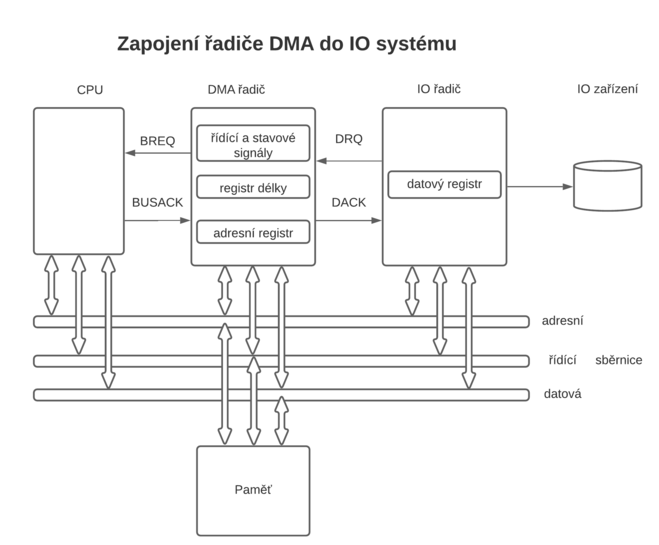

# 11. Stránkování OP, Virtuální pamět, princip přenosu DMA

### Zavedení

    Virtuální pamět je způsob správy operační paměti počítače, který umožňuje předložit běžícímu procesu adresní prostor paměti, který je uspořádán jinak nebo je dokonce větší, než fyzicky připojená operační paměť RAM.

    Ke klasické fyzické OP se přidá část vnější paměti.Vnější paměť je např. pevný disk, část vnější paměti a fyzická OP je organizovaná po blocích, kterým se říká stránky.
    OP a vnější paměť mají název Virtuální pamět umožní spustit víc velkých procesů.

    velký proces P_A má ve fyzické OP - právě aktuální kód (řídící mikroProc.)
                                      - právě aktuální data (mikroProc zpracovává)
    
    Zbylé větší část velkého procesu P_A:
        - nyní nepotřebné jsou ve virtuální pam.
        - čekají na přenos do fyzické OP
    
    Přenosy tasků mezi vnější pam. a mezi fyzickou OP při multitaskingu nutně potřebují mít dobu přenosu každého tasku stejně dlouhou.
    To se dá zařídit, že se ve virtuální paměti zavede takzv. stránkování paměti.
    Stránka má konstant. velikost 4KB (pro kód, pro data), segmenty jsou různě velké. 

### Kapacita

    Např. 16b hw systém:

    velikost segmentu 1 až 64 KB (MAX.) pro kód a pro data
                      offset(ukazatel do segm.) má 16b
    maximální počet segmentů je určený počtem deskript.
    protože deskriptor je vybíraný selektrorem Z LDT/GDT určí počet segmentů(deskriptorů) složení bitů v selekt.

    13b index ze selekt.  V selekt. 1bit TI   (Dohromady 14b)
    Index - Vybere z LDT až 8192 deskriptorů.
    TI - určí momentálně tabulku buď LDT nebo GDT
    
    2x8192 (2x8k = 16K) = max počet deskriptorů - segmentů
    To vše se nemůže vejít do fyzické OP, ale do virtuální paměti
    2^14 * 2^16 = 2^30 = 1GB

    Např. 32 hw systém:

    velikost segmentu 4KB až 4GB (MAX.) pro kód a pro data
                      offset má 32b
    počet deskriptorů (a segmentů) je 16K - 14b v selektoru
    virtuální pamět 2^14 * 2^32 = 2^46 = 64TB

    64b hw systém:

    máme k dispozici 64 b procesory, šířka 64b platí pro zpracovávaná data, neplatí pro adresy!
    Offset v segm. je 32b

### Adresování

    Je založeno na systému stránek 4KB, stránky pokrývají vir. pamět v kroku adres 4K, tozn. že počátek v jakékoliv stránky má adresu např. 00010000 HEX
    ...000 HEX =                                                   12345000 HEX
    Posledních 12b                                                 FFFFD000 HEX
    počáteční adresy je nulových!                      Krok představuje 4K adres

    Od 32b HW systému se u paměti zavádí pojem "zrno" kde fyzická OP má 4GB
    a při "zrnu" 4KB je po4et zrn 1M = 2^20
    (4GB = 1M * 4KB), "zrno" je jednotka velikosti OP
    zrno má význam při určování hranice segmentu
    Deskriptor   PP | BÁZE | LIMIT       (pro 32b hw)
                12b |  32b |  20b
    max. velikost segmentu = "stránka" * MAX "limit"

### Princip stránkování paměti

    Stránkování paměti je metoda správy virtuální paměti, kdy strojové instrukce procesu pracují s logickými adresami, které jednotka MMU(Memory Management Unit) převádí na fyzické adresy(skutečné umístění v paměti RAM). 
    Vzniká tak virtuální adresní prostor, který pro každý proces začíná od nuly, takže odpadá potřeba relokace použitého strojového kódu.

    Při převodu je adresní prostor rozdělen na stránky (rámce) stejné velikosti (typicky 4 KB).
    Stránkování paměti je používáno všemi současnými běžnými operačními systémy a je základem pro stránkování na disk.

    Ve víceúlohovém systému, který využívá multitasking, je nutné umístit do paměti více procesů najednou. Pokud jsou k dispozici nástroje na virtualizaci paměti, lze vytvořit každému z procesů jeho vlastní virtuální adresní prostor, který bude začínat od adresy nula. Každý proces (resp. jeho strojové instrukce) pak bude pracovat s logickými adresami, které jsou při přístupu do paměti RAM automaticky převáděny jednotkou MMU na fyzické adresy. MMU je dnes typicky umístěna v procesoru, ale může být i nezávislým obvodem.

    Virtuální adresní prostor je tedy složen ze stránek, které odpovídají stejně velkým oblastem ve fyzické paměti RAM. Zatímco logické stránky vytvářejí souvislý lineární adresní prostor, umístění fyzických stránek je díky převodu zcela nahodilé. Pro běžící proces se tak vytváří iluze, že jeho adresní prostor v operační paměti je souvislý, zatímco ve skutečnosti jsou fyzické stránky fragmentovány. Fragmentace je však procesu (resp. jeho strojovým instrukcím) skryta a není ji nutné nijak řešit (na rozdíl od segmentace paměti , kde je nutné fragmentaci odstraňovat přesunem segmentů).

### specifikátor a systémové stránky

### výpočet FA z LiA

### Význam přímého přístupu do paměti

    Jedná se o přímý přenos dat mezi operační pamětí a vstupně/výstupními zařízeními.
    Data neprocházejí skrze procesor a lze tak dosáhnout vyššího výkonu.Dma se používá pro přenost větších objemů dat například řadič pevných disků, grafická karta,síťová karta,zvuková karta.

    DMA je řízené speciálním řadičem, který je součástí základní desky počítače. Přenášení velkých objemů dat mezi vstupně-výstupními zařízeními a operační pamětí je pak řízeno DMA řadičem a procesor je brzděn těmito přenosy jen částečně (při blokování sběrnice konfliktem přístupů do paměti) a může vykonávat jinou činnost. Počítač tak má z hlediska uživatele větší výkon díky paralelizaci (současnému vykonávání) přenosů dat a činnosti procesoru. 
    
    Program nejprve řadič DMA naprogramuje (pomocí několika instrukcí IN a OUT) a o další přenosy se již nemusí programátor starat. Dokončení přenosu může být signalizováno přerušením, které aktivuje obsluhu přerušení, která může naprogramovat řadič DMA na další přenosy.

### struktura řadiče DMA

    Má dvě části, část řídící a část se 4 kanály pro propojení I/O obvod - OP.

#### Řídící část

    Řídící část obsahuje bloky připojené k systémové sběrnici.
    Mezi nimi jsou tyto:

    1. Vyrovnávací datový obousměrný registr
      Tudy do obvodu DMA vstupuje řídící slovo(CW) celkově asi 8 slov.

        CW inicializační se nahraje po zapnutí napájení. 
        CW operační se reaguje na potřeby přenosu.
        CW povelové upřesní mód řadiče

      Tudy do bvodu DMA vstupuje první adresa bloku dat, veliksot bloku, atd.
      Odsud se čtou stavová slova SW

    2. Adresový obousměrný registr
      Příjímá adresu posílanou mikroProcesorem, aby se data(CW,SW,atd.) dostaly do správných částí DMA
      Přijímá adresu, která ho vybere ke komunikaci s mikroprocesorem v systému více řadičů DMA

      Vysílá adresy na OP a I/O při převzetí řízení sběrnice od mikroproc.
    
    3.  Blok řízení/ ovládání
      Přijímá signály, kterými ho řídí uPr, když je v modu Slave / podřízený
      
      Vysílá signály pro sběrnici, když je v modu Master / nadřízený pro blok OP a blok I/O (např. MemRD, IOWR, IORD, MemWR), vysílá informační signály pro ostatní obvody

      CW uložené do Bloku řízení nastaví řadič DMA do určitého módu
      Např.
      přenos bloku dat OP ->  I/O obv ->  (PZ) nebo přenos bloku dat (PZ) -> I/O obv -> OP nebo cyklická priorita nebo kontrola přenosu …

#### Část řadiče s obsluhou kanálů

    1. 4 kanály (kanál je zvláštní název pro způsob komunikace), 
    2. řešení priority kanálů, 
    3. řešení rotační priority kanálů, 
    4. znásobení velikosti bloku dat spojením dvou kanálů do jednoho přenosu, atd.

    jeden kanál obsahuje: 
    1. signály komunikace od přidělené PZ pro žádost a pro potvrzení (REQ od PZ a ACK od kanálu)
    2. stav kanálu – sledování průběhu přenosu
    3. generátor min. 16b adresy, který zajistí naadresování aktuální buňky v OP (adresa bloku se nastavuje v modu  Slave) 
    4. min. 14b čítač velikosti bloku (velikost se nastavuje v modu Slave, pak  se v modu Master provádí odpočet / -1)

### Činnost DMA

    