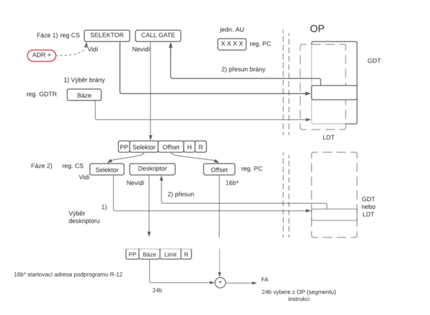

# 12. Multitasking a jeho průběh, popis obvodu řadiče přerušení

### Předání řízení

    Nejlépe se vysvětluje na příkladu:
    Máme program P_B o velikost 140 KB rozdělený na 3 kódové segmenty:
    - B-I (40KB,PL = 3)
    - B-II (64KB,PL = 3)
    - B-III(36KB, PL  = 3) 
    PL = Privilige Level

#### Přechod ze segmentu B-II do segmentu B-III pomocí skoku typ FAR

    Mikroprocesor načte JMP Far adresa*
    Adresa vede ke změně obsahu v reg.CS -> zajistí selektor pro výběr z LDT.
    -> přesun vybraného deskriptoru do reg.CS nevidí -> zpracování deskriptoru
    (Kontrola PP, Báze segm.B-III, Limit), adr* se zapíše do reg PC/IP počáteční adresa - offset v segm. B-III, mikroproc. je řízený novým segmentem.

#### Volání podprogramu M-E(PL=3) uvnitř segmentu B-I (PL=3)

    Mikroprocesor načte instr. CALL adresa** vede ke změně v reg. PC/IP, ten ukáže na offset v segmentu, kde je počáteční adresa podprogramu M-E, předání řízení bez brány

#### Ze segmentu B-II (PL=3) volání podprogr. R-12 (PL=2)

    pomocí načtené instr. CALL ADR+. ADR+ vede ke změně obsahu reg. CS vidi- uloží se do něho selektor pro výběr brány CALLGATE z tabulky GDT
    CALLGATE obsahuje: 1Byte Příst.Práva       2Byte nový selektor 2Byte Offset
                       1Byte Hloubka zásobníku 2Byte Rezerva
    Brána CALLGATE a deskriptor zajistí 2 stupně kontroly z přechodu PL3 do 2

#### Ze segmentu B-I(B-II,B-III) volání služby OS S-30(PL=0) pomocí

    sychronního volání přerušení programu INT 1E hex (instrukce)
    asynchronního volání přerušení programu hw signál na vstupu INTR
    Brány při přerušení :
    1) INTERRUPTGATE
    2) TRAPGATE
    1Byte PP 2Byte SELEKTOR 2Byte Offset 3Byte Rezerva
    Předání řízení neřídí SW, ale je zabudovaných do HW mikroprocesoru

#### Výpočet FA 

### Princip přepínání úloh

    probíhá jen při Privilige Level 0.Multitasking se realizuje jako kooperativní a preemptivní.příkl.1:
    Dva procesy P_A, P_B ve dvou oknech mezi nimi přepínám klikáním myší

    Příkl. 2: V řízení mikroproc. se střídají 3 procesy P_A, P_K, P_X jejich střídání je řízeno stavem OS.
    
#### Preemptivní

#### Kooperativní

#### inicializace instrukcí CALL/RET a INT/IRET + příkl. brány TASKGATE

#### segment TSS

### průběh volání