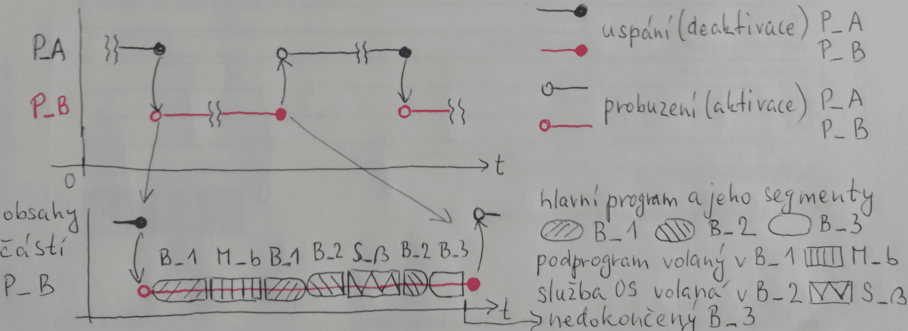
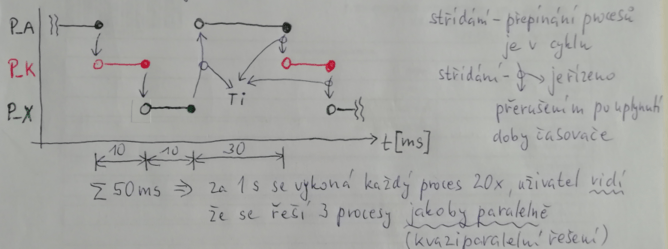

# 12. Multitasking a jeho průběh, předání řízení, průběh instrukce volání

### Předání řízení

    Nejlépe se vysvětluje na příkladu:
    Máme program P_B o velikost 140 KB rozdělený na 3 kódové segmenty:
    - B-I (40KB,PL = 3)
    - B-II (64KB,PL = 3)
    - B-III(36KB, PL  = 3) 
    PL = Privilige Level

#### Přechod ze segmentu B-II do segmentu B-III pomocí skoku typ FAR

    Mikroprocesor načte JMP Far adresa*
    Adresa vede ke změně obsahu v reg.CS -> zajistí selektor pro výběr z LDT.-> přesun vybraného deskriptoru do reg.CS nevidí -> zpracování deskriptoru
    (Kontrola PP, Báze segm.B-III, Limit), adr* se zapíše do reg PC/IP počáteční adresa - offset v segm.B-III,mikpr. je řízený novým segmentem.

#### Volání podprogramu M-E(PL=3) uvnitř segmentu B-I (PL=3)

    Mikroprocesor načte instr. CALL adresa** vede ke změně v reg. PC/IP, ten ukáže na offset v segmentu, kde je počáteční adresa podprogramu M-E, předání řízení bez brány

#### Ze segmentu B-II (PL=3) volání podprogr. R-12 (PL=2)

    pomocí načtené instr. CALL ADR+. ADR+ vede ke změně obsahu reg. CS vidi- uloží se do něho selektor pro výběr brány CALLGATE z tabulky GDT
    CALLGATE obsahuje: 1Byte Příst.Práva       2Byte nový selektor 2Byte Offset
                       1Byte Hloubka zásobníku 2Byte Rezerva
    Brána CALLGATE a deskriptor zajistí 2 stupně kontroly z přechodu PL3 do 2

#### Ze segmentu B-I(B-II,B-III) volání služby OS S-30(PL=0) pomocí

    sychronního volání přerušení programu INT 1E hex (instrukce)
    asynchronního volání přerušení programu hw signál na vstupu INTR
    Brány při přerušení :
    1) INTERRUPTGATE
    2) TRAPGATE
    1Byte PP 2Byte SELEKTOR 2Byte Offset 3Byte Rezerva
    Předání řízení neřídí SW, ale je zabudovaných do HW mikroprocesoru

#### Výpočet FA

### Princip přepínání úloh a průběh přepínání

    probíhá jen při Privilige Level 0.Multitasking se realizuje jako kooperativní a preemptivní.příkl.1:
    Dva procesy P_A, P_B ve dvou oknech mezi nimi přepínám klikáním myší

    Příkl. 2: V řízení mikroproc. se střídají 3 procesy P_A, P_K, P_X jejich střídání je řízeno stavem OS.

    Kdy dojde k přepnutí? 
    Způsobí ho jedna z instrukcí INTčíslo,CALLADR nebo hw signál přerušení čislo.
    číslo nebo adresa zajistí výběr brány TASKGATE z tabulky LDT 
    TASKGATE
    | PP | SELEKTOR | O | REZ |

#### Preemptivní multitasking

    V preemptivním multitaskingu o přidělování a odebírání procesoru jednotlivým úlohám plně rozhoduje operační systém. V pravidelných intervalech (typicky zhruba 100× až 1000× za sekundu) za pomoci časovače dojde k vyvolání přerušení aktuálně běžícího programu (procesu), vyhodnotí se aktuální situace (které úlohy žádají o přidělení procesoru, jejich priority atd.) a nechá běžet buď opět úlohu, kterou přerušil, nebo jinou úlohu, která má zájem o přidělení procesoru (to která úloha bude následně běžet, určuje prioritní fronta). I v preemptivním multitaskingu však může úloha dobrovolně požádat o přepnutí kontextu a vzdát se zbytku svého kvanta (úloha takzvaně „usne“ - proces přejde do stavu sleep nebo se zablokuje provedením pomalé vstupně-výstupní operace, jako je například čtení dat z pevného disku).

#### Kooperativní multitasking

    Kooperativní multitasking vyžaduje aktivní spoluúčast běžících úloh. Každá úloha je povinna dostatečně často systémovým voláním předat řízení zpět operačnímu systému, který díky tomu může spustit jinou úlohu, která se po chvíli opět dobrovolně vzdá procesoru atd. Výhodou řešení je jednodušší implementace operačního systému. Podstatnou nevýhodou je skutečnost, že chybně naprogramovaná úloha, která nevrátí řízení zpět operačnímu systému, způsobí úplné zastavení systému i ostatních úloh.

#### Segment TSS 

    Ze stávajícího procesu P_A bude řízení mikroproc. přepnuto na proces P_B.
    - proces P_A se uspí, deaktivuje, přitom se jeho aktuální stav uloží do systémového segmentu TSSa(registry mikroproc. do TSSA zkopírují)
    - proces P_B se probudí, aktivuje, jeho poslední stav se vybere ze systémového segmentu TSSb (z položek TSSb se obsah nakopíruje do registrů mikroproc.).
    - proces P_B pak může rozeběhnout jako kdyby nidky nebyl deaktivovaný.
    
    Každý proces při multitaskingu má svůj segment TSS, jeho báze v OP je uložená v reg. TR (v jedn. AU)
    velikost TSS - 16b HW systém = 50Byte - 32b HW systém = 110 Byte
                 - současné HW systémy mikroproc. mají "několik" stovek Byte
    Obsah TSS (16bHW): - dvojice CS:PC/IP, DS:SI(DI), ES:BP(BX), SS:SP!
                       - datové registry AX, BS, CX,DX,freg,MSW 4xzásobníky PL=0-3
                       - bázové registry LDTR, GDTR, TR
                       - ukazatel na minulý proces, atd 
     
    Všechny činnosti spojené s uspáním procesu P_A (uložení do TSSa)
                             s probuzením procesu P_B (výběr z TSSb do registrů mikroproc.) 
    jsou řízené hw mikkroprocesu (jednotka AU a další mají automatickou činnost)
    nepoužívá se žádný SW, hw řízení je 40 až 50x rychlejší přepnutí než SW.