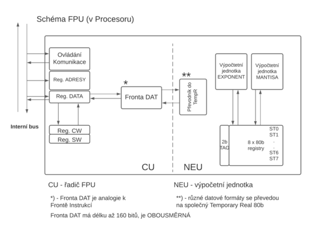

# 14. Matematický koprocesor / FPU, kódování čísel v FPU

### Pojem koprocesor

    Univerzální procesor v počítači umožňuje tvořit programy pro škálu různorodých úkolů, ale ne všechny úkoly jsou řešeny optimálně.
    Jako příklad lze uvést: 
    - výpočty matematických funkcí (goniometrické, exponenciální, v pohyblivé řádové čárce atd.) 
    - přenosy dat mezi pamětí a periferiemi pomocí datových kanálů (cyklus DMA se zabezpečením přenosu proti chybám vč. opakování přenosu při výskytu chyby). 
    
    Toto je prostor pro realizaci speciálních obvodů procesorového typu, které pak tvoří s hlavním, univerzálním procesorem víceprocesorový systém.
    
    Z tohoto pak vychází název koprocesor, jelikož se nejedná o hlavní procesor na který by přicházela všechna data, nýbrž spíše jako úsek, který je potřeba spravovat a neústalé přerušování výpočetních cyklů by dosti zpomalovalo práci s počítačem.

### Vazba a spolupráce s hlavním procesorem

    Komunikační procesor je příkladem volně vázaného koprocesoru, který pracuje podle vlastního programu, uloženého v samostatné části paměti systému.
    - Komunikační I/O koprocesor  může pracovat úplně samostatně, je vybaven vlastní operační pamětí, proto si své instrukce čte sám. Má vlastní programovací jazyk(asi 50 instrukcí), s hlavním procesorem  komunikuje přes operační paměť.
    Numerický koprocesor je příkladem závislého koprocesoru 
    - Numerický koprocesor je těsně vázaný procesor, který má své instrukce jako součást programu hlavního procesoru. Má asi 70 instrukcí, které z paměti, z kódového segmentu čte hlavní procesor do své fronty instrukcí (reg. RI) a koprocesor frontu sleduje a své instrukce přebírá k řešení.
    Koprocesory jsou členěné stejně jako hlavní procesor na 2 jednotky (jednotka řadiče a jednotka realizující úkol - výpočet), což umožňuje i v nich proudově zpracovávat instrukce. Procesory spolu komunikují po lokální sběrnici a obvodům, které budí sběrnici, předávají své požadavky pomocí vlastních stavových signálů.
    | Koproc |           | Proc |
    | ------ | --------- | ---- |
    | ->     | dotaz     |      |
    |        | přidělení | <-   |
    | ->     | hotovo    |      |

### Porovnání instrukcí pro FPU a procesor

    Hlavní procesor rozpoznává instrukce koprocesoru jako ESCinstrukce (v horní slabice OZ je 11011xxx), rozpozná odkaz na OP (vypočte adresu operandu) a odešle vypočtenou adresu koprocesoru.
    
    Odlišují se instrukce pro FPU předponou F, která představuje 5b konstantu.Takže místo ADD máme FADD atd.
    
    Koprocesor převezme sběrnici a při operandech až 10B dlouhých dokončí jejich načtení. Pokud nejsou potřeba výsledky z „koprocesorovské“ instrukce, může procesor pracovat na dalších svých instrukcích. 
    
    Když je potřeba získat výsledek z koprocesoru, testuje se signál BUSY z koprocesoru, který signalizuje dokončení výpočtu (a nebo způsobí generování „zpožďovací“ instrukce WAIT).

### Formáty dat v matematickém koprocesoru

    Matematický koprocesor zpracovává celá čísla se znaménkem.Zpracovává čísla v binárním kódu jako 32b short integer nebo 64b long integer. Je také schopen pracovat s BCD kodém jako 80 b.U každého formátu je nejvyšší bit znaménkový.
    Tedy + = 0.
    Všechny formáty se pro práci v koprocesoru převedou na Temp.Real s šířkou 80b.Z toho jsme pak schopni odvézt shortReal a Long Real.Kde se jedná o číslo kde máme 1b signum 8b exponent a 23 mantisu u ShortRealu

### Blokové schéma FPU, registry

 

    Registry koprocesoru 8087:
    
    a) 8 * 80b. datové registry s libovolným přístupem k registrům  nebo s přístupem k 8 úrovňovému zásobníku (3b ukazatel na zásobník, reg. SW)
    
    b) 8 * 2b. značky (TAG) ke každému registru s významem  00 – platný obsah, 01 – nulový obsah 01 -  „divná“ hodnota a 11 – prázdný
    
    c) 2 * 16b. registry stavového slova a řídícího slova  (SW a CW)
    
    d) 2 * 32b. ukazatelé výjimek – registr Adresa IP je ukazatel instrukce v OP (20b. FA a 11b. části oper. znaku) 

### Řízení módu pomocí CW a SW a průběh výpočtu

#### Registr CW

| 15 | 14 |   |    |     |     |     | 8   | 7   |   |    |    |    |    | 1  | 0  |
|----|----|---|----|-----|-----|-----|-----|-----|---|----|----|----|----|----|----|
| x  | x  | x | IC | RC1 | RC0 | PC1 | PC0 | IEM | x | PM | UM | OM | ZM | DM | IM |

    IC vyjadřuje 2 způsoby nekonečna
    
    RC řídí zaokrouhlování:  00 k nejbližší hodnotě,  01 k -∞,  10 k +∞  a  11 uříznutí
    
    PC řídí přesnost:  00 short real, 10 long real a 11 temporary real
    
    zbylé bity jsou masky přerušení – celkové Interrupt Enable a jednotlivých přerušení

#### Registr SW

| 15 | 14 |     |     |     |    |    | 8  | 7  |   |    |    |    |    | 1  | 0  |
|----|----|-----|-----|-----|----|----|----|----|---|----|----|----|----|----|----|
| B  | C3 | ST2 | ST1 | ST0 | C2 | C1 | C0 | IR | x | PE | UE | OE | ZE | DE | IE |

    BUSY se připojuje na vstup TEST u 8086
    
    C3, C2, C1 a C0 jsou podmínkové kódy (analogie s příznakovými bity u F reg.)
    
    ST (3 bity) je ukazatel zásobníku
    
    IR je žádost o přerušení (chápe se jako exception - výjimka)
    
    příznaky chyb – P (přesnosti), U (podtečení), O (přetečení), Z (dělení 0), D (denormalizovaný výsledek) a I (neplatná operace)

### Spolupráce FPU s Cache pamětí

    FPU potřebuje na náročné výpočty ukládat mezi výpočty do mezipaměti aby docházelo k efektivním výpočtům a koprocesor mohl úlohu rozkouskouvat na malé kousky.V materiálech jsem nenašel k tomuto bodu dostatek materiálů

### Příklad převodu reálného čísla do ShortRealu (reálné desítkové – reálné dvojkové – ShortReal 32b)

    Máme po převodu z 10 -> 2 sosutavy znaménkové číslo racionální
    
    +110100,11001

#### 1. normalize ke 2  ( tj. 1,xxxx)

    +1,1010011001*2^5
    nám určí hodnotu exponentu +5
    protože jsme pohnulli o 5 míst vlevo

#### 2. určení kódu exponentu

    | .. | -1 | 0  | +1 | +2 | +3 | +4 | +5 | +6 | Dec |
    |----|----|----|----|----|----|----|----|----|-----|
    | .. | 7E | 7F | 80 | 81 | 82 | 83 | 84 | 85 | Hex |
    
    +5 je 84 hex a to je 1000100 bin v kódu s posunutou nulou

#### 3. přepis do ShortRealu formátu

    | S   | 8b EXPONENT | (1+23)b MANTISA |
    |-----|-------------|-----------------|
    | +=0 | 10000100    | 10100110010...0 |
    ​																 1,
    
    Tato 1 je "skrytý bit, který vygeneruje NEU!!!

​    