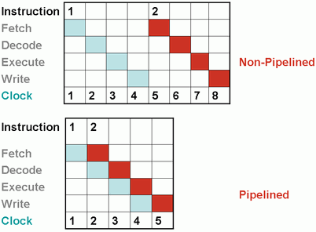

# 15. Vývoj procesorů od Pentia do současnosti

### Procesor skalární architektury

    Procesor skalární architektury je složen z více funkčních bloků, které pracují samostatně. Je umožněn  tzv. pipelining.
    Pipelining, zřetězené zpracování či překrývání strojových instrukcí je způsob zvýšení výkonu procesoru současným prováděním různých částí několika strojových instrukcí. 
    Základní myšlenkou je rozdělení zpracování jedné instrukce mezi různé části procesoru a tím i dosažení možnosti zpracovávat více instrukcí najednou. To je řešeno, tak že když jedna instrukce opustí třeba EU, tak se nahraje do EU další, které je za ní.

    1. Výpočet adresy místa v operační paměti
    2. Načtení instrukce z dané adresy v operační paměti
    3. Dekódování instrukce (nalezení mikrokódu reprezentující instrukci v paměti ROM)
    4. Provedení výpočtů v ALU / FPU
    5. Zápis výsledku do registrů.

    Čím více má pipeline stupňů, tím je efektivnější zpracování instrukcí
    V případě, že dojde v programu ke skoku, musí se celá pipeline (fronta instrukcí) vyprázdnit a načíst s dlouhým zdržením instrukce nové.
    Tyto procesory obsahovaly cache pamět, ale pouze L1.

### Superskalární

    Umožňují zpracování několika instrukcí v jednom instrukčním řetězci (pipeline) zároveň. 

#### Paralelní ALU

    Obsahují více prováděcích jednotek (především ALU) v jednom jádru procesoru, které jsou schopné paralelního zřetězení. V jednom taktu může být dokončeno více instrukcí, tato funkce se nazývá superpipelining. ALU jsou na sobě nezávislé, jedna nečeká na výsledek ostatních.

    První superskalární architektura byla použita u Pentia, který měl 2 pipeline (U-pipe a V-pipe).U superskalární architektury rozhoduje o paralelním provádění operací řadič procesoru. 

    Oproti skalární architektuře je tedy konstrukce řadiče procesoru složitější, neboť kromě své běžné činnosti (tj. řízení pipeline a jednotlivých funkčních jednotek procesoru) musí ještě rozhodovat o tom, které instrukce je možné párovat a zpracovávat současně. 

    Aby se zabránilo vyprazdňování pipeline z důvodu skoku v programu, začala se používat technologie predikce (předvídání, odhadování) skoků v programu.
    Do novějších procesorů této architektury byla přidána cache L2
    Obsahovala několik nových funkcí:

#### Predikce skoků

    Tato technologie umožňuje dopředu odhadnout, zda se skok v programu provede či nikoli a na základě toho se začne do instrukční pipeline vkládat (a postupně zpracovávat) buď instrukce, které se nachází ihned za skokem či naopak v cíli skoku. 

    Algoritmus je založen na následujícím faktu: vždy po provedení těla cyklu se podmíněnou skokovou instrukcí rozhoduje o jeho opětném provedení. S významně větší pravděpodobností nastává situace, že při zopakování téže podmíněné skokové instrukce bude její výsledek stejný.

    Příklad činnosti prediktoru skoku: Jednoduchý 1 bitový prediktor skoků pracuje tak, že si procesor u každého skoku uloží do 1 bitového registru informaci, zda byl skok proveden či nikoli. Když se v instrukční pipeline znovu skok objeví (souhlasí jeho adresa), tak se procesor na základě předešlého běhu programu rozhodne, které další instrukce se pravděpodobně budou zpracovávat. Při prvním volání skoku má prediktor pouze padesátiprocentní úspěšnost, ta se potom zvyšuje.

    Kolize: pokud dojde k tomu, že bude ve dvou pipelinách instrukce, které vyžadují stejnou adresu pro svoji operaci ve stejný okamžik, tak dojde k dočasnému přerušení provádění.
    Také pokud se použije operace jump na instrukci, které je v tu dobu v druhé pipeline, tak obě budou vymazány a instrukce se nahrají znova. K tomu je důležitá predikce skoků.

#### Technologie MMX (MultiMedia eXtensions)

    Jelikož jako upgrade teté architektury přinesl nové instrukce, které pracovali pouze s celými čísly, tak bylo pro zrychlení procesoru přidáno 8 nových 64 bitových registrů, jsou označovány mm0-mm7. 
    Pro tyto registry byly vytvořeny nové instrukce, které využívali techniku SIMD (Single Instruction Multiple Data), která dovoluje zpracovat více operandů (dat, čísel) během jedné instrukce.

    Tyto registry reprezentují 
    • 8 bajtů (označení B)
    • 4 slova (words) (označení W) – 1 word je unsigned int (16bit, 0 a víš hodnoty) - ushort
    • 2 dvoj slova (dwords) (označení W) – 1 dword = double word je unsigned int (32bit, 0 a výš hodnoty) - uint
    • 1 čtyř slova (qword) (označení Q) – 1 qword je unsigned int (64bit, 0 a víš hodnoty) - ulong

    Instrukční sada se skládá z
    • Package všech MMX instukcí
    • Přidané instrukce
    • Signed nebo unsigned (singed -+, unsigned +)
    • Obsah registru (bajt nebo slova)
    • Cíl - číslo označení MMX registru
    • Odkud – 64bit adresa v paměti nebo číslo označení MMX registru

##### Instrukce MMX

    MOV – přesun dat mezi registry nebo pamětí
    Písmeno za MOV: B, W, D, Q 
    Příklad zapsání MOVW odkud, kam
    Aritmetické operace
    Logické
    Min, Max, Average

#### Dynamické spouštění instrukcí (Byl až od Pentia PRO a poté až v hyperskalárních)

    Jedná se o vylepšený bez pořádní mechanismus pro vykonávání instrukcí. 
    Je to mechanismus, při níž se instrukce vykonávají v jiném pořadí, než jak uvádí program uložený v operační paměti. 
    Procesor (resp. řadič procesoru) provede tzv. analýzu toku dat (analýzu dekódovaných instrukcí) a zjišťuje, zda jsou závislé na dokončení jiných instrukcí. Následně seřadí instrukce do optimálního pořadí a provádí je tak, aby byly zpracovány v co nejkratším čase (na sobě nezávislé instrukce souběžně, tedy paralelně). Příklad využití: Pokud nemůže být některá instrukce provedena, protože nemá k dispozici data, provede se jiná instrukce. Tímto způsobem lze odstranit možná zpoždění, která vzniknou v důsledku nedostupnosti dat.
    Je založen na 3 principech.
    • Branch prediction
        ◦ umožňuje dekódovat instrukce mezi větvením - plné využití sběrnice
        ◦ Pentium Pro procesor využívá vysoce optimalizovaný algoritmus pro predikci větvení, pro směrování toku instrukcí přes několik úrovní
    • Dynamic data flow analysis
        ◦ analýza toku dat procesorem v reálném čase pro určení závislostí mezi daty a registry
        ◦ detekce příležitostí pro zpracování instrukcí (zpracování instrukcí mimo pořadí)
    • Speculative execution
        ◦ dává zprávu procesoru o přednostně vykonávaných instrukcích, ale jejich výsledky předává do původního programu, zajišťuje maximální využití procesoru

#### Mikrokód

    Mikrokód je jako Firmware pro procesor. Mikrokód přenáší instrukce, které CPU přijme, do fyzických operací na úrovni obvodu, které se dějí uvnitř procesoru.
    U starších byl mikrokód dodáván BIOSem při startu počítače, u novějších si ho procesor při startu přečte z flash paměti. Mikrokód může být upravován, proto je pamět flash.
    ** Aktualizace mikrokódů mohou také opravit chyby a další chyby bez nutnosti úplné výměny hardwaru CPU

### Hyperskalární

    Je rozdělen na různé architektury
    Umožňuje rozpracování až 20 instrukcí v jedné pipeline
    zdokonalená predikce skoku v programu: zpracovávají se obě varianty kódu pro případ, kdy je podmínka skoku splněna i nesplněna. Teprve až je výsledek podmíněného skoku znám, nevhodnou větev vyprázdní.
    Procesorová sběrnice FSB s technologií QPB- až 4 přenosy na sběrnici během 1 hodinového taktu.

#### RISC (Reduced Instruction Set Computer)

### dynamické spouštění instrukcí

### flashování mikrokódu procesoru

### vývoj procesoru s 64b architekturou 

### HyperThreading

### Core

### Cache