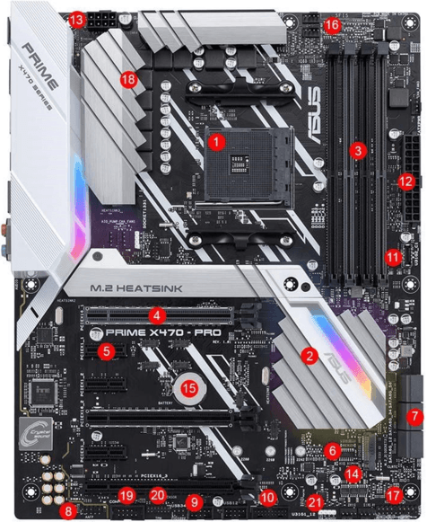

# 16. Struktura osobního počítače (stolní, přenosný), popis základní desky

### Srovnání stolního a přenosného počítače

|  | Stolní | Přenosný |
|-|-|-|
| Hmotnost | těžký cca 10 kg | váhově od cca 0.75kg (ultra  lehkých) do 4kg (herních) |
| Chlazení | Stolní – u Midi tower a  Big tower spousta místa pro ventilátory (nejčastěji 120 a 140 mm), při dobrém AirFlow je dobré chlazení komponentů | Přenosný – malé  ventilátory, často při kvůli vyšším teplotám omezuje výkon komponentů, z tohoto důvodu se do notebooku dávají upravené verze komponentů (CPU a GPU), které spotřebovávají méně elektřiny a vytvářejí menší teplo |
| Přenosnost | Stolní – velmi těžko se  přenáší | Přenosný – jeho hlavní  výhoda, možnost lehko přenést plně funkční počítač z místa na místo, možnost pracování počítače bez připojení k síti díky baterii. |
| Příslušenství a zařízení | Stolní – bez příslušenství  se s ním nedá pracovat. Musí mít všechny periferie externě | Přenosný – obsahuje  monitor, klávesnici a touchpad, reproduktory, mikrofon |
| Upgrade | Stolní – možné vyměnit jakoukoliv část | Přenosný – možné vyměnit  nebo přidat RAM a Hard Disk,CPU,Síťová karta |
| Kompatabilita | Stolní – přední i zadní  strana počítače obsahuje větší počet portů, možnost rozšíření pomocí PCI | Přenosný – porty pouze od  výrobce |

  

### Parametry osobního počítače

    Pokud bychom chtěli parametrizovat osobní počítač bude nás zajímat:
    - Velikost skříně a základní desky
    - Chlazení a AirFlow
    - Spotřeba zdroje
    - Procesor, Operační paměti, Grafická karta, Disky

### Skříň

    Skříň počítače je plechová kostra, která slouží jako jeho konstrukce.
    Přední nebo horní stěna skříně obsahuje tlačítka vypínání a restartu a často i porty USB a jack.Zadní stěna skříně obsahuje konektory základní desky, PCI karet a konektor pro připojení zdroje do sítě.Jednotlivé skříně se mohou lišit tvarem, barvou, velikostí a dalšími parametry.
    Skříň se vybírá podle velikosti, vzhledu, chlazení.

#### Typy skříňí

##### Desktop

    U těchto skříní se monitor často pokládal na skříň, ale nynější monitory jsou příliš těžké, tak se jich přestalo využívat. Základní deska je položena vodorovně.Má docela málo místa pro rozšiřování

##### Tower

    Towery jsou dnes nejpoužívanějšími skříněmi. 
    Do těchto skříní je základní deska položena svisle a rozšiřovací karty jsou do ní uloženy vodorovně (některé grafiky svisle).

##### Mini ITX

    Velmi malé, pouze motherboardy typu mini ITX, cca 20x20x30 cm .

##### Mini Tower

    nejmenší z ATX, velmi používaná v kancelářích.

##### Midi Tower

    nejpopulárnější, dostatek místa pro rozšiřování, dostatečný airflow.

##### Big Tower

    největší, používá se hlavně pro servery nebo počítače s vodním chlazením. Velký prostor pro další komponenty a proudění chladícího vzduchu.

### Chlazení

    Důvod chlazení: Prochází-li elektrický proud obvodem, dochází k zahřívání jeho částí. Podle Joule-Lenzova zákona vzniká elektrické teplo. Q = R ⋅ I ⋅ t [J]

    Při vysokých teplotách (nad 100 °C až 120 °C) ztrácejí polovodiče své původní vlastnosti. Přehřátí může součástku trvale poškodit nebo zničit.

    Proto je nutné toto nadměrné ztrátové teplo v dostatečném množství odvést z povrchu polovodičového čipu, tedy zajistit vhodné chlazení příslušných počítačových komponent.
    Chladí se 
      - CPU (pasivně, vzduch a voda)
      - GPU (vzduch (blower a fan) a voda)
      - Zdroj (vzduch)
      - Chipset (pasivně)
      - Operační paměť (pasivně, někdy i vzduch a voda)
      - HDD

#### Typy chlazení 

##### Pasivní

    Je to kovová nepohyblivá součástka, která má na sobě navařená žebra pro zajištění co největší plochy z důvodu lepšího předávání tepla okolnímu vzduchu.

    Pasivní chladiče jsou zpravidla vyrobeny buď z mědi (dražší) nebo z hliníku (levnější) nebo jejich kombinací.Často se kombinuje měď jako základna a hliník na žebra, pro dosažení dobrého poměru cena/chladicí efekt.

    Pro zvýšení účinnosti přenosu tepla z povrchu polovodičové součástky na chladič je ve styčných bodech nanesena teplovodivá pasta nebo páska. Důvodem použití teplovodivé pasty je vyplnění malé povrchové nerovnosti styčných ploch mezi součástkou, čímž se zvětší kontaktní plocha mezi nimi.
    Výhody: nulová hlučnost, nízká cena, nevyžadují dodatečné napájení 
    Nevýhody: nejméně účinná metoda chlazení
    Nejčastěji se používá na: chipsetu, MOSFET na motherboard, M.2 SSD, obal HDD

##### Aktivní

    Aktivní chlazení je prováděno proudícím vzduchem. Rotující ventilátor vhání pomocí vhodně tvarovaných lopatek vzduch na pasivní část chladiče, která je v přímém kontaktu s chlazenou komponentou a odvádí od ní teplo. Naháněný vzduch proudí do pasivu a odvádí teplo pryč do okolního vzduchu proudícího v prostoru kolem žeber. 
    Pomocí aktivních chladičů se vytváří airflow tunely, které vedou k lepším teplotám komponentů.
    Parametry: otáčky ventilátoru [RPM], nápajení [V], hlučnost [dB], rozměry, způsob uchycení
    Výhody: Lepší chladící efekt něž pasivní
    Nevýhody: Hlučné a konektorově a prostorově náročné řešení

#### Heatpipe

    Heatpipe (tepelná trubice) slouží k přenosu tepla z jednoho místa na druhé za pomoci par pracovní látky (chladícího média).

    Jedná se o měděnou, která je na obou koncích uzavřena. Uvnitř se nachází malé množství kapalné pracovní látky (např. čpavek, freon, voda a jiné.), přičemž zbytek prostoru je vyplněn jejími parami. 
    Výhody: vysoká tepelná vodivost vzhledem k malým rozměrům
    Použítí: s kombinací aktivního chlazení na CPU a GPU

#### Vodní

    Vodní chlazení tvoří uzavřený okruh, ve kterém voda obíhá. Na jedné straně se přenáší teplo z chlazené komponenty do kapaliny a na druhé straně tuto kapalinu ochlazujeme. Voda dokáže přijmout a odvést více tepla za jednotku času než vzduch.
    
    Vodní chlazení se skládá z: 
    vodní blok – v přímém styku s komponentem
    vodní čerpadlo – zajišťuje oběh vody v chladícím okruhu 
    radiátor – obsahuje žebra, kterými protéká voda a tu ochlazuje pomocí ventilátorů
    expanzní nádoba - slouží ke kontrole množství vody v chladícím okruhu.
    propojovací hadičky - propojují všechny prvky chladícího okruhu (silikon, PVC, Tygon) 

### zdroj PC

    Počítačový zdroj je jednoduše měnič napětí. 
    Má za úkol přeměnit střídavé napětí ze sítě (230 V / 50 Hz) na napětí stejnosměrné, a to do několika větví (3,3V, 5V, 12V). 
    Komponenty v PC využívají tyto napětí přímo, nebo si je dále mění, (základní deska pro procesor na napětí nižší (1,4 V–1,5 V)). 
    Porucha zdroje může způsobit zničení dalších komponent. Pro konkrétní počítačovou sestavu nevhodný (slabý, nekvalitní) zdroj zase může způsobit nestabilitu celého systému. 
    
    AT - napětí 5 V a 12 V, nepodporoval softwarové zapínání.
    ATX – přidal další větev 3,3V, podporoval softwarové zapínání. Má 3 stavy: ON – běží všechny napěťové okruhy, OFF – pomocí vypínače nebo vypnutí přívodu ze sítě, STAND-BY – běží okruh 5V pomocí kterého se přepne do stavu ON (zapnutí provede základní deska)
    ATX 12V (současné) -  přidaný 4 pin 12V, 24pin pro motherboard, SATA napájení
    Konektory: 24pin, Molex, FloppyDrive, AUX, +12V 4,6,8 pin
    Parametry
    Vstupní napětí, výstupní napětí, maximální výkon zdroje, energetická účinnost zdroje (poměr mezi výstupním výkonem a příkonem zdroje: bronze, silver, gold, platinum, titanium), konektory kabelů, schopnost odpojit nepoužité kabely

### Základní deska

    Hlavním účelem základní desky je propojit jednotlivé součástky počítače do fungujícího celku a integrovaným součástem na základní desce poskytnout elektrické napájení.
    Základní desky mají integrovány obvody (grafika, zvuk, internet…), ty byly u starších počítačů pouze jako rozšiřující karty.
    
    Klasická základní deska umožňuje zapojení procesoru a operační paměti, další komponenty jako grafické karty, pevné disky, mechaniky optických pamětí,… se připojují pomocí rozšiřujících slotů nebo kabelů, které se zapojují do příslušných normovaných konektorů. 
    Nejdůležitějším logickým obvodem základní desky je chipset, který umožňuje procesoru komunikovat s ostatními částmi počítače. V obvodech chipsetu jsou integrovány řadiče, které na základě zpracování instrukcí generují řídící signály pro tato zařízení. Je zde umístěn řadič operační paměti, řadiče disků, řadiče rozhraní (např. USB), řadiče sběrnice,…

    Na základní desce je umístěna polovodičová paměť FlashROM, ve které je uložen BIOS.
    Ten zprostředkovává komunikaci mezi softwarem a hardwarem.

    Konektory – PS/2 pro myš a klávesnici, konektory integrované zvukové karty, konektory USB (2.0, 3.1 gen1, 3.1 gen2), ethernet konektor síťové karty, konektor integrované grafické karty (VGA, HDMI, DisplayPort) nebo starší (sériový COM port, paralelní p LPT port)

#### Části základní desky   

  
  

    1 – Socket pro procesor, různé řady procesorů mají jiný socket
    2 – Chipset (jižní most)
    4, 5, 6 - Řadiče a normované sloty sběrnice PCI, AGP, PCIe
    7, 8, 9, 10, 11 - řadiče disků (SATA), řadiče univerzálních rozhraní (PS/2, USB)
    12 – připojení zdroje pro desku
    13 - připojení zdroje pro CPU
    14 –FlashROM obsahující BIOS
    15 – Baterie (uchování navolených parametrů v BIOSu, třeba čas)
    18 – VRM (Voltage Regulator Module)
    Přeměňuje napětí (12V), které jde do základní desky na napětí, které vyžaduje procesor (třeba 1,15V)

    Této části se říká napájecí kaskáda, která se skládá z: vstupní kondenzátory, MOSFETy, cívky a výstupní kondenzátory.
    Velikost kaskády se zjišťuje podle počtu cívek (4,8,16), čím víc tím lepší pro přetaktování procesorů, které vyžadují větší napájení.
    Je jí potřeba chladit, protože vysoké teploty snižují její účinnost. Chladí se většinou pasivně.

#### Formáty základní desky

| PC/XT | První deska pro domácí počítače vytvořen IBM |
|-|-|
| AT | Následovník PC/XT a předchůdce ATX |
| ATX | Vytvořen firmou Intel.Bylo zde dostupné softwarové zapínání.Síťové karty s funkcí Wake-up. Obsahuje méně rozšiřujících slotů. Dnes patří k nejpoužívanějším zejména v kancelářských počítačích. |
| BTX | Vytvořen firmou Intel. Měl nahradit ATX. Rozmístění prvků na základní desce a v počítačové skříni mělo umožnit lepší chlazení, napájení a také snížit hlučnost. Příliš se neujal. |
| MicroATX | zmenšená verze ATX o 25%. |
| MiniITX | menší než microATX, někdy má integrované CPU a pouze jeden PCI slot |
| Extended ATX | Širší verze ATX, více slotů RAM (8) a PCI (4+) a SATA konektorů, více napájecích konektorů, Socket pro procesory s vyšším napětí |

#### Čipset

    Chipset je hlavní logický integrovaný obvod základní desky. 
    Jeho úkolem je řídit komunikaci mezi procesorem a ostatními zařízeními. 
    V obvodech čipové sady jsou integrovány řadiče těchto zařízení, které řídí jejich činnost pomocí řídících signálů, jež se přenášejí po sběrnici.
    Obvody chipsetuřídí činnost operační paměti, činnost a komunikaci jednotlivých sběrnic, rozhraní, atd.
    Chipset má v maximální míře podporovat výkon procesoru a dalších komponent počítače, proto pro každou novou generaci procesorů vzniká nová základní deska s novou čipovou sadou. 
    Chipset se dělí na dva integrované obvody: severní a jižní most. Od čipové sady se odvíjí také další parametry základní desky.
    Je určujícím faktorem, jaké technologie a rozhraní deska podporuje (max počet USB, max počet SATA, podpora více grafických karet, možnost přetaktování CPU a RAM)

#### Sběrnice 

#### Rozhraní 

### Zásadní vývojové etapy

### Průměrné parametry osobního počítače dnešní doby

