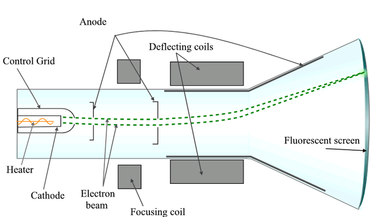
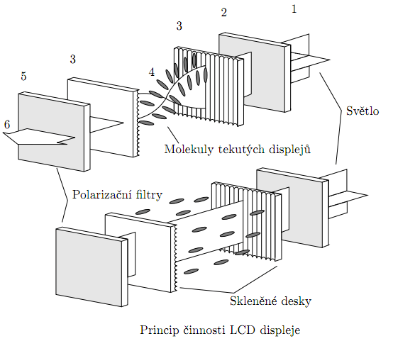
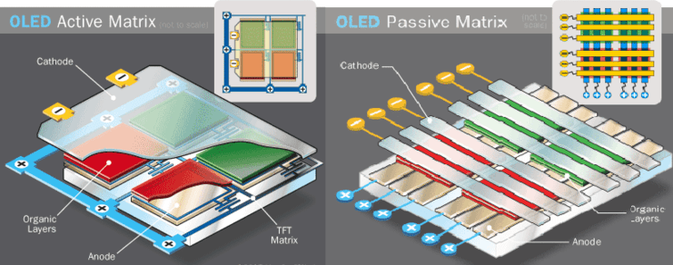
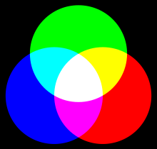
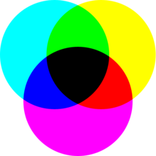

# 17. Princip monitoru, typy grafických adapterů, kódování souborů

### Princip zobrazení u displejů

    Zobrazujeme informace pomocí displeje/monitoru, což je vstupně/výstupní zařízení k zobrazování textových a grafických informací, případně celého grafického uživatelského rozhraní.Monitor je připojen k počítači přes grafickou kartu, ale může být do některých zařízení přímo integrován(telefon,tablet).V současné době je používat typicky LCD,OLED a technologie podobné.

    Máme spoustu typů displejů:
    - LCD (založený na tekutých krystalech, které ovlivňují průchod světla)
    - E-ink(Natiskuté mikrokapsule natisknuté na fólii obsahující černo/bíle kuličky)
    - OLED(organické materiály po přivedení napětí vydávají světlo)

### CRT (Cathode Ray Tube)

    Vyznačují se vysokou spotřebou, velkými rozměry a hmotností s neustálým blikáním dle nastavené obnovovací frekvence.Používané kolem 75-85 Hz.
    Typickým průvodním znakem dlouhého sezení před CRT monitorem byla únava a až pálení očí.Nebylo také jednoduché vyrobit CRT obrazovku bez geometrických vad a s perfektní konvergencí barev.
    Výhodou byl ale vysoký kontrastní poměr, kterého dnešní LCD panely dosahují jen stěží, rychlá odezva, věrné zobrazení barev a vynikající pozorovací úhly.

    Obraz na monitoru vzniká pomocí vysílání tří elektronových paprsků ze tří elektronových děl,které jsou usměrňovány pomocí elektromagnetického pole vychylovacích cívek. Paprsky pak dopadají na stínítko (což je vlastně součást vzduchoprázdné obrazovky) potažené fosforem. Elektrony díky usměrnění dopadají přesně na určené místo, které se na určitou chvíli rozzáří. Ve své době se uplatňovaly tři typy stínítek (masek) – delta, štěrbinová a trinitron, přičemž nejkvalitnější obraz poskytovaly monitory typu trinitron.

    Daní za obraz (Sony Trinitron/Mitsubishi Diamondtron/ LG Flatron) takřka bez zakřivení byly dva nenápadné vodorovné korekční proužky zhruba ve třetinách obrazovky.

### LCD (Liquid Crystal Display)

    Základy této technologie sahají až na na konec 19. století, ale první experimentální obrazovka vznikla až v roce 1968. Zpočátku se tyto displeje používaly hlavně v malých zařízeních, jako jsou kalkulačky, ale s razantním nástupem notebooků se začala jejich pozice vylepšovat.
    Další, ještě razatnější vzestup LCD přišel s rozmachem různých druhů spotřební elektroniky. LCD obrazovky se tak dnes kromě monitorů používají u LCD televizí, mobilních telefonů a bezpočtu dalších zařízení.

    U klasických LCD panelů je na zadní stěně monitoru zdroj světla, nejčastěji studené katody CCFL, jež jsou dnes nahrazovány pásy LED diod. Odsud světlo putuje do speciální rozptylovací vrstvy, která se pokusí světlo co nejrovnoměrněji rozvést po celé ploše monitoru. Dále světlo prochází přes první polarizační filtr do vrstvy s tekutými krystaly, které jsou řízeny elektronikou monitoru dle vstupního signálu. Zde se určuje intenzita jasu jednotlivých pixelů. Nyní stále ještě bílé světlo zamíří do vrstvy s barevným RGB filtrem, odkud se dále již v barvě přenáší na druhý polarizační filtr. Jako ochranná vrstva slouží tenké sklo, na němž jsou dále ještě nasazeny tři vrstvy, jež se snaží o co nejlepší rozptýlení světla a další vylepšení promítaného obrazu.

### OLED (Organic Ligh-Emitting Diode)

    OLED byl vyvinut už v roce 1987 firmou KODAK.Jedná se o typ LED, kde se jako elektroluminisceční látka využívají organické materiály.Ty jsou uloženy mezi dvě elektrody, z nichž alespoň jedna je průhledná. Využívají se při konstrukci displejů, např. v televizních obrazovkách a mobilních telefonech.

    Z pohledu elektronického ovládání "svícení" jednotlivých pixelů  jsou pak na tom OLED panely obdobně jako  LCD displeje. Tedy využívají buď pasivní, nebo aktivní řízení matice. Jednodušší strukturu představuje samozřejmě pasivní ovládání, kdy celá matice pixelů je rozdělena na řádky a sloupce a rozsvítí se vždy ten pixel, který "leží" na spojnici aktuálně elektrickým proudem napájeného řádku a sloupce. Z toho je patrné, že ovládacích drátů je méně, ale zase se jednotlivé pixelů navzájem ovlivňují a musí se dobře regulovat množství a časování proudu. Jinak pokud při svítícím pixelu např. na řádku rozsvítíme dalším sloupcovým vodičem sousední pixel, může se při nevhodné regulaci proudu doposud svítící vedlejší pixel změnit svůj jas. Proto se tato koncepce více hodí pro zobrazení graficky méně náročného obsahu a spíše statického než dynamického obrazu, protože rychlé rozsvěcení a zhasínání jednotlivých pixelů zde zrovna není ideální.

### E-Ink

    Jedná se o zobrazovací jednotku, která odráží světlo jako normální papír, je schopna uchovat text i obrázky natrvalo bez spořeby elektřiny, s možností změny obsahu a často je také ohýbatelný. Z důvodu nízké energetické náročnosti a tenkosti se stále více prosazuje ve čtečkách elektronických knih.

### Vykreslování barev

    Pro vykreslování barev používáme jeden z barevných modelů, což je matematický model popisující barvy na základě podíku jednotlivých složek, kterými mohou být vybrané základní barvy nebo jiné parametry.
    Máme dva typy míchaní barev:

#### Aditivní míchání barev

    Jednotlivé složky barev se sčítají a výsledek je světlo větší intenzity.
    Aditivní skládání barev pracuje se třemi základními barvami: červenou, zelenou a modrou.

#### Subtraktivní míchaní barev

    S každou přidanou barvou se ubírá část původního světla - světlo prochází jednotlivými barevnými vrstvami a je stále více pohlcováno. Výslednou barvu pak tvoří zbylé vlnové délky. Odpovídá míchání pigmentových barev. Základní barvy jsou azurová, purpurová a žlutá; smícháním všech těchto barev vznikne černá. Subtraktivní způsob míchání barev používají například tiskárny (např. různé druhy tiskových technik, viz tiskárna - CMYK).

#### RGB (Red Green Blue)

    RGB je aditivní barevný model založený na faktu, že lidské oko je citlivé na tři barvy - červenou, zelenou a modrou. Ostatní barvy jsou dány micháním.
    Variantou RGB je RGBA (Red, Green, Blue, Alpha), kde je navíc přidán alfa kanál, který nese informaci o průhlednosti.

#### CMYK 

    Založený na subtraktivním míchání barev. Používá se hlavně u reprodukčních zařízení, která barvy tvoří mícháním pigmentů. Model CMY obsahuje tři základní barvy - azurovou (Cyan), purpurovou (Magenta) a žlutou (Yellow).

#### HSV a HSB (Hue Saturation Value, Hue Saturation Balance)

    Barevný model odpovídající lidskému intuitivnímu popisu barev. Má tři základní parametry: tón (odstín), sytost (saturace) a jas.
    Tento model se nepoužívá pro ukládání fotografií, ale má dobré uplatnění při jejich editaci. Podle HSV se zadávají barvy, ovládá se saturace a přebarvuje obraz.

### Rozhraní monitorů

#### Kompozitní video

    Jedná se o analogový přenos videa, který nese video se standardním rozlišením v rozlišení 480.Všechny složky obrazu jsou zakódovány do jednoho kanálu, na rozdíl od kvalitnějšího videa či komponentního videa.V žádném z těchto druhů přenosu obrazu není zahrnut zvuk.

    Barevný obrazový signál je lineární kombinace jasu obrazu a modulované podvrstvy, která nese chrominanci, kombinaci odstínu a sytosti. Průběh kódování se liší v závislosti na standardu (NTSC, PAL a SECAM).

#### VGA (Video Graphics Array)

    VGA je standard pro zobrazovací jednotku.VGA má několik zobrazovacích režimů:
    - Pro grafiku 640x480 pixelů 16 barev, 320x200 pixelů a 16 nebo 256 barev. 
    - Textový režim 80x25 znaků, resp. 40x25 znaků.
    
    VGA se používá i pro označení konektoru, který nalezneme v monitorech a počítačích.Jedná se o 15-pinový konektor s piny ve třech řadách. VGA konektor slouží k přenosu analogového signálu. 

#### DVI (Digital Visual Interface)

    Standard byl vytvořen za účelem bezproblémové komunikace mezi zobrazovacími zařízeními jako např. LCD nebo datovým projektorem a grafickou kartou počítače.
    Primárně je určen k přenosu nekomprimovaných digitálních video dat. Je částečně kompatibilní s rozhraním HDMI.

    Rozhraní s jedním spojem obsahuje 6 vodičů pro přenos informací o barvě ve formátu RGB (2 vodiče pro každou barvu). Informace o barvě je přenášena diferenčně (rozdílově) technikou TMDS (nikoli oproti zemi) – to zvyšuje odolnost vůči elektromagnetickému rušení z okolí. 

#### HDMI (High Definition Multimedia Interface)

    Označení nekomprimovaného obrazového a zvukového signálu v digitálním formátu.
    HDMI podporuje přenos videa ve standardní, rozšířené nebo high-definition kvalitě, a až 8kanálový digitální zvuk. Rozhraní nezávisí na různých televizních a satelitních standardech, protože přenáší nekomprimovaná video data.
    Kabely bývají drahé, bez možnosti vést vstup a výstup zároveň.

#### Display Port

     Rozhraní primárně slouží k přenosu obrazu pro displeje např. počítačové monitory, ale může být použito i pro přenos zvuku, USB a jiných forem dat.

     Je navržen tak, aby nahradil digitální (DVI) i analogové (VGA) konektory v monitorech počítačů stejně jako v grafických kartách. Má všechny funkce HDMI, ale nepředpokládá se, že by měl HDMI nahradit v oblasti domácí spotřební elektroniky, protože je určen spíše pro kancelářské a IT využití.

### Parametry zobrazovacích jednotek

#### Rozlišení

    Rozlišení je udáváno v bodech neboli pixelech (px) – u LCD se jedná o skutečný počet bodů, pokus o použití jiného než tohoto rozlišení vede k různým deformacím obrazu.

#### Uhlopříčka

    Velikost monitoru se obvykle udává délkou úhlopříčky (vzdálenost mezi protilehlými rohy obrazovky). Velikost úhlopříčky ale nezachycuje poměr stran monitoru a tudíž při zachování stejné úhlopříčky, ale jiného poměru stran, se dostaneme k odlišné velikosti zobrazované plochy

#### Obnovovací frekvence

    Obnovovací frekvence je udávána v jednotkách Hertz (Hz). Pro LCD je obvyklá základní frekvence 60 Hz. U větších CRT monitorů bylo pro zamezení blikání potřeba 85–120 Hz. Pro hraní her jsou obvykle využívány vyšší obnovovací frekvence.

#### Vstupy

    Jedná se o počet vstupů a jaké: HDMI,Display Port atd.

#### Doba odezvy

    Doba odezvy se udává v jednotkách milisekund (ms) – doba, za kterou se bod na LCD monitoru rozsvítí a zhasne. Pro pracovní využití je vyhovující doba 8 ms (obvykle výrobci udávají parametr podobný, ze šedé do šedé barvy, tudíž skutečná odezva je horší). Herní monitory mají kratší dobu odezvy (jsou rychlejší, obraz se v rychlých scénách nerozmaže).

### Textový režim

    Textový režim je způsob fungování zobrazovací jednotky počítače nebo terminálu, při němž je obrazovka pevně rozdělena na řádky a pozice tvaru obdélníku, z nichž v každém může být zobrazen jeden znak vybraný z určité sady o velikosti nejčastěji 256 znaků.
    
    K výhodám textového režimu patří malý rozsah paměti potřebné pro uchovávání obsahu obrazovky, snadné ovládání a malé nároky na výkon počítače. Proto bylo používání textového režimu velmi rozšířené od nástupu prvních obrazovkových displejů v šedesátých letech 20. století až do převládnutí operačních systémů používajících grafické uživatelské rozhraní v devadesátých letech 20. století.

### Grafický režim

    

### Virtuální realita

    Technologie schopná simulovat reálné prostředí a ideálně doprovázet jeho interakci s ním za pomocí vhodných technických prvků.
    Jde o vytvoření vizuálního,sluchového,hmatového zážitku budící dojem skutečnosti za pomocí virtuálních brýlí, rukavic-ovladačů a dalších prvků připojených k výpočetní jednotce.

    Máme také alternativní realitu ve které do reality přidáváme grafické prvky a obohacujeme uživatele o informace díky brýlím atd.

### Grafická karta
  

### popis grafické karty

### součástky

### parametry