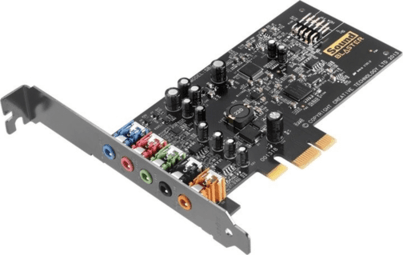

# 18. Digitalizace zvuku, zvukové adaptery a soustavy, kódování soubor

### Princip digitalizace zvuku

    Fyzikální podstatou zvuku jsou zvukové vlny, které vznikají nepravidelným i pravidelným kmitáním částic vzduchu nebo nějakého kontinuálního prostředí.
    
    Lidský sluchový orgán je schopen vnímat mechanické vlnové rozruchy v přibližných frekvenčních mezích 16 Hz – 16 kHz, pokud je jejich intenzita dostatečně veliká. Tuto výseč slyšitelných vlnových dějů označujeme jako zvuky.
    Pro zvuk jsou charakteristické dva druhy parametrů: Statické prvky, mezi které patří například výška, barva, hlasitost a prostorové rozložení zvuku a dynamické prvky, které určují změny statických prvků v čase.
    
    Provádíme-li digitalizaci zvuku za pomoci počítače, převod z analogové do digitální podoby nám zajistí zvuková karta, přičemž na kvalitě této karty závisí i kvalita výsledného záznamu. jelikož výsledný digitální záznam obsahuje objemná data, velmi často se používá nějaký kompresní formát ke zmenšení objemu dat.

### zvukový rozsah

    Převod zvuku do digitální soustavy vyžaduje rychlé měření definovaných hodnot vždy po určitém konstantním časovém intervalu. Měření probíhá velkou rychlostí a nazývá se vzorkováním.
    Při vzorkování se měří hodnota analogového signálu a v pravidelných intervalech se zapisuje. Kvalita uloženého digitálního obrazu zvuku závisí na frekvenci vzorkování a množství informací uložených pro jeden vzorek.
    Platí, že čím menší jsou časové intervaly mezi měřením statických a dynamických hodnot při převádění analogového zvuku do digitální soustavy, tím je výsledný zvuk kvalitnější.

### formáty a komprese zvuku

    Snahou komprese zvuku je zmenšit datový tok při jeho přenosu nebo zmenšit potřebu zdrojů při ukládání informací.
    Kódováním, které je dané zvoleným kompresním algoritmem, se ze souboru odstraňují redundantní informace, zvyšuje se entropie dat.
    Kompresi dat lze rozdělit do:
    - Bezztrátové
    - Ztrátové
    Kompresní poměr je podíl velikosti nekomprimovaných a komprimovaných.

#### Bezztrátová komprese

    Bezztrátová komprese snižuje nároky na velikost bez ztráty kvality. Formáty bez komprese použijí při zakódování sekundy absolutního ticha stejně dat, jako při kódování sekundy zvuku. Hudba zakódovaná bezztrátovou kompresí zabere méně místa (obvykle 50% oproti formátům bez komprese), ticho pak nezabírá téměř žádné místo. Typickými typy souborů pro bezztrátové kódování zvuku jsou FLAC, WavPack nebo ALAC.

#### Ztrátová komprese

    Ztrátová komprimace dosahuje vyšší úspory dat oproti bezztrátové odstraněním některých dat. To má za následek ztrátu kvality. Při kódování je snaha odstranit taková data, aby výsledná ztráta člověkem vnímané kvality byla co nejnižší. Ztráta kvality je tak často při poslechu člověkem těžko rozpoznatelná.
    
    Nejznámějším zástupcem ztrátových formátů je formát MP3. Mezi často používané patří také formáty AAC. Obvykle je možné nastavit požadovanou kvalitu, která určuje míru komprese a tím i výslednou kvalitu. Obvykle se takto stanoví tzv. bitrate - tj. počet bitů za sekundu. Typickým případem je 128 kbps MP3 stereo, kde oba audio kanály využívají 16 kB za sekundu .
    
    Pro dosažení lepšího kompresního poměru se občas využívá variabilní bitrate, kdy encodér  ohodnotí složitost na zakódování každého krátkého úseku nahrávky a na základě toho pak pro každý úsek použije jinou bitrate. Standard MP3 je relativně flexibilní a existuje značné množství různých encodérů. Ty se liší jak náročností na procesor při kódování, tak výslednou zvukovou kvalitou. Oblíbeným open-source MP3 encodérem je například LAME.

### Zvuková karta

    Zvuková karta je rozšiřující karta počítače pro vstup a výstup zvukového signálu, ovládaná softwarově.

    Typická zvuková karta obsahuje zvukový čip, který provádí digitálně-analogový převod nahraného nebo vygenerovaného digitálního záznamu. Tento signál je přiveden na výstup zvukové karty.

### varianty zvukových karet

#### Zvuková karta integrovaná do základní desky

    Používáte počítač výhradně ke kancelářské činnosti, a ačkoliv si sem tam pustíte film nebo video, nejste zatíženi na kvalitu zvuku? Potom si plně vystačíte s nejlevnějším řešením v podobě zvukové karty integrované do základní desky. V současné době již prakticky nelze nalézt sestavu, která by tento systém postrádala.

    Velká výhoda integrovaných „zvukáren“ spočívá kromě ceny také v tom, že zbytečně nezaplňují žádný slot, jenž může posloužit pro umístění jiného zařízení. Bohužel se připravte na slabé zesílení zvuku a mohutné rušení způsobené nevhodným uložením karty.

#### Dedikovaná interní zvuková karta

    Jakousi zlatou střední cestu představuje pořízení dedikované zvukové karty umístěné v jednom ze slotů základní desky. Nabízí poměrně silné zesílení zvuku a větší počet výstupů podporuje jeho prostorové šíření. Výsledný dojem ještě vylepšuje možnost využití sluchátek s impedancí a vysoká frekvence.

    Vzhledem k tomu, že se jedná o interní komponentu, podléhá rušení ze strany ostatního vybavení počítače. Z toho důvodu nedoporučujeme její použití, komponujete-li vlastní hudbu. Počítejte též se zabráním jednoho portu na základní desce.

#### Dedikovaná externí zvuková karta

    Vyžadujete za všech okolností ten nejkvalitnější a nejčistší zvuk? Pořiďte si externí zvukovou kartu a propojte ji prostřednictvím USB nebo FireWire se svým počítačem. Výsledkem bude dokonalý prostorový zvuk bez jakéhokoliv nepříjemného rušení.

    Počítejte však s tím, že externí zařízení zabere jeden z volných vstupů počítače a neopomeňte mu vyhradit místo na stole.

### srovnání zvukových karet

### popis samostatné zvuk. karty

### součástky

### rozhraní

### parametry

#### Sběrnice

#### Frekvence

#### Konektivita

    Zvuková karta také má „line in“ konektor, do kterého je možné připojit kazetový přehrávač nebo podobný zdroj zvukového signálu. Zvuková karta tento signál digitalizuje a uloží (pomocí příslušného počítačového programu) na úložiště dat. Digitalizace se provádí pomocí vzorkování.

    Třetí konektor, který většina zvukových karet má, se používá k přímému připojení mikrofonu. Signál z něj je možné také nahrávat na úložiště dat nebo ho jinak zpracovat.

    Většina zvukových karet má také MIDI a GamePort konektor. Konektor MIDI slouží k připojení např. elektronického klávesového nástroje nebo jiného zdroje digitálního MIDI signálu. Pokud nahráváme z MIDI, tak nemusíme provádět vzorkování. Do počítače se uloží informace o tom, který nástroj hraje, výška tónu, délka tónu, dynamika úhozu na klávesu, atd. Rozhraní GamePort slouží k připojení joysticku nebo jiného herního zařízení.

### zvukové soustavy pro PC

### parametry ozvučení

### stručně princip reproduktoru a mikrofonu

https://www.arecenze.cz/zvukove-karty/

https://cs.wikipedia.org/wiki/Zvukov%C3%A1_karta