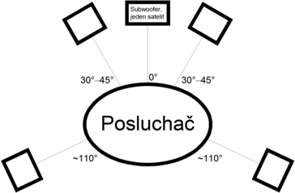

# 18. Digitalizace zvuku, zvukové adaptery a soustavy, kódování soubor

### Princip digitalizace zvuku

    Fyzikální podstatou zvuku jsou zvukové vlny, které vznikají nepravidelným i pravidelným kmitáním částic vzduchu nebo nějakého kontinuálního prostředí.
    
    Lidský sluchový orgán je schopen vnímat mechanické vlnové rozruchy v přibližných frekvenčních mezích 16 Hz – 16 kHz, pokud je jejich intenzita dostatečně veliká. Tuto výseč slyšitelných vlnových dějů označujeme jako zvuky.
    Pro zvuk jsou charakteristické dva druhy parametrů: Statické prvky, mezi které patří například výška, barva, hlasitost a prostorové rozložení zvuku a dynamické prvky, které určují změny statických prvků v čase.
    
    Provádíme-li digitalizaci zvuku za pomoci počítače, převod z analogové do digitální podoby nám zajistí zvuková karta, přičemž na kvalitě této karty závisí i kvalita výsledného záznamu. jelikož výsledný digitální záznam obsahuje objemná data, velmi často se používá nějaký kompresní formát ke zmenšení objemu dat.

### Zvukový rozsah

    Převod zvuku do digitální soustavy vyžaduje rychlé měření definovaných hodnot vždy po určitém konstantním časovém intervalu. Měření probíhá velkou rychlostí a nazývá se vzorkováním.
    Při vzorkování se měří hodnota analogového signálu a v pravidelných intervalech se zapisuje. Kvalita uloženého digitálního obrazu zvuku závisí na frekvenci vzorkování a množství informací uložených pro jeden vzorek.
    Platí, že čím menší jsou časové intervaly mezi měřením statických a dynamických hodnot při převádění analogového zvuku do digitální soustavy, tím je výsledný zvuk kvalitnější.

### Formáty a komprese zvuku

    Snahou komprese zvuku je zmenšit datový tok při jeho přenosu nebo zmenšit potřebu zdrojů při ukládání informací.
    Kódováním, které je dané zvoleným kompresním algoritmem, se ze souboru odstraňují redundantní informace, zvyšuje se entropie dat.
    Kompresi dat lze rozdělit do:
    - Bezztrátové
    - Ztrátové
    Kompresní poměr je podíl velikosti nekomprimovaných a komprimovaných.

#### Bezztrátová komprese

    Bezztrátová komprese snižuje nároky na velikost bez ztráty kvality. Formáty bez komprese použijí při zakódování sekundy absolutního ticha stejně dat, jako při kódování sekundy zvuku. Hudba zakódovaná bezztrátovou kompresí zabere méně místa (obvykle 50% oproti formátům bez komprese), ticho pak nezabírá téměř žádné místo. Typickými typy souborů pro bezztrátové kódování zvuku jsou FLAC, WavPack nebo ALAC.

#### Ztrátová komprese

    Ztrátová komprimace dosahuje vyšší úspory dat oproti bezztrátové odstraněním některých dat. To má za následek ztrátu kvality. Při kódování je snaha odstranit taková data, aby výsledná ztráta člověkem vnímané kvality byla co nejnižší. Ztráta kvality je tak často při poslechu člověkem těžko rozpoznatelná.
    
    Nejznámějším zástupcem ztrátových formátů je formát MP3. Mezi často používané patří také formáty AAC. Obvykle je možné nastavit požadovanou kvalitu, která určuje míru komprese a tím i výslednou kvalitu. Obvykle se takto stanoví tzv. bitrate - tj. počet bitů za sekundu. Typickým případem je 128 kbps MP3 stereo, kde oba audio kanály využívají 16 kB za sekundu .
    
    Pro dosažení lepšího kompresního poměru se občas využívá variabilní bitrate, kdy encodér  ohodnotí složitost na zakódování každého krátkého úseku nahrávky a na základě toho pak pro každý úsek použije jinou bitrate. Standard MP3 je relativně flexibilní a existuje značné množství různých encodérů. Ty se liší jak náročností na procesor při kódování, tak výslednou zvukovou kvalitou. Oblíbeným open-source MP3 encodérem je například LAME.

### Zvuková karta

    Zvuková karta je rozšiřující karta počítače pro vstup a výstup zvukového signálu, ovládaná softwarově.
    
    Typická zvuková karta obsahuje zvukový čip, který provádí digitálně-analogový převod nahraného nebo vygenerovaného digitálního záznamu. Tento signál je přiveden na výstup zvukové karty.

### varianty zvukových karet

#### Zvuková karta integrovaná do základní desky

    Používáte počítač výhradně ke kancelářské činnosti, a ačkoliv si sem tam pustíte film nebo video, nejste zatíženi na kvalitu zvuku? Potom si plně vystačíte s nejlevnějším řešením v podobě zvukové karty integrované do základní desky. V současné době již prakticky nelze nalézt sestavu, která by tento systém postrádala.
    
    Velká výhoda integrovaných „zvukáren“ spočívá kromě ceny také v tom, že zbytečně nezaplňují žádný slot, jenž může posloužit pro umístění jiného zařízení. Bohužel se připravte na slabé zesílení zvuku a mohutné rušení způsobené nevhodným uložením karty.

#### Dedikovaná interní zvuková karta

    Jakousi zlatou střední cestu představuje pořízení dedikované zvukové karty umístěné v jednom ze slotů základní desky. Nabízí poměrně silné zesílení zvuku a větší počet výstupů podporuje jeho prostorové šíření. Výsledný dojem ještě vylepšuje možnost využití sluchátek s impedancí a vysoká frekvence.
    
    Vzhledem k tomu, že se jedná o interní komponentu, podléhá rušení ze strany ostatního vybavení počítače. Z toho důvodu nedoporučujeme její použití, komponujete-li vlastní hudbu. Počítejte též se zabráním jednoho portu na základní desce.

#### Dedikovaná externí zvuková karta

    Vyžadujete za všech okolností ten nejkvalitnější a nejčistší zvuk? Pořiďte si externí zvukovou kartu a propojte ji prostřednictvím USB nebo FireWire se svým počítačem. Výsledkem bude dokonalý prostorový zvuk bez jakéhokoliv nepříjemného rušení.
    
    Počítejte však s tím, že externí zařízení zabere jeden z volných vstupů počítače a neopomeňte mu vyhradit místo na stole.

### Popis samostatné zvukové karty

        A zapojení zvukové karty

### Součástky

    Pro většinu standartních interních karet je používán 3,5 jack.
    Na vstup jako Mikrofón, výstup na zesílení nebo na reproduktory přímo, případně koaxiální kabel.
    Máme zde také A/D převodník, jenž nám převádí analogový zvuk na digitální a jedná o výkonný čip s vícero funkcemi jako zesílení či potlačení šumu.
    Také se používají na zvukové karty audio-kvalitostní tranzistory a komponenty jako kondenzátory atd.

### Rozhraní

#### MIDI

    Jedná se o volně přístupný standard, který obsahuje specifikace hardware i software pro digitální komunikaci mezi hudebními nástroji navzájem a dalšími zařízeními jako jsou sequencery, počítače, mixery nebo i jevištní technika, třeba ovládání reflektorů.
    
    Komunikace MIDI nepřenáší mezi hudebními nástroji audio signál (zvuk), ale informace o událostech. Typicky informace, co hudebník se svým nástrojem dělá. Například u keyboardu o stisku nebo puštění klávesy či použití jiného kontroleru, jako je třeba pedál nebo potenciometr.
    
    Události se přenáší v tzv. kanálech, kde každý kanál představuje jeden hudební nástroj, ať reálný (fyzický) nebo virtuální (zvuková banka v klávesách). MIDI specifikace definuje 16 kanálů jako maximální počet. Tento limit umožňuje použít spolu max. 16 reálných hudebních nástrojů.

#### Jack

    Jedná se snad o nejznámější konektor pro přenos elektroakustického signálu a užívá se běžně u spotřební elektroniky.
    
    Nejpoužívanější velikosti:
    - 6,3 mm
     - 3,5 mm
    Provedení je jak monofonní, tak stereofonní. Je to nejrozšířenější konektor pro připojení přenosných sluchátek a domácích reproduktorů. Nejběžnější je provedení o velikosti 3,5 mm používané u sluchátek a mikrofonů. Poprvé byla tato miniaturizovaná verze vyrobena a použita v padesátých letech dvacátého století pro monofonní připojení sluchátka k tranzistorovému přijímači.

 

 

#### XLR

    XLR konektor je audio konektor pro profesionální využití.
    Mívá tři a více kontaktů. Používá se k vedení audiosignálu (nejčastěji 3 pinový), pro speciální napájecí zdroje (např. mixážních pultů), ovládání profesionálních světelných systémů (standard DMX512 - 5 pinový konektor, často i třípinový), dálková ovládání (studiová technika, hudební nástroje) a podobné aplikace.
    
    Nejrozšířenější typ má tři vývody, pak se používá hlavně v symetrickém zapojení:
    1 Zem (Stínění)
    2 Normální polarita signálu („hot“)
    3 Invertovaná polarita signálu („cold“)
    Hlavní výhodou XLR je mechanická odolnost než jack a možnost symetrického zapojení.

### Parametry

#### Sběrnice

    Jestliže jste se rozhodli pořídit dedikovanou interní zvukovou kartu, nevyhnete se volbě odpovídající sběrnice. Jejím prostřednictvím je možné jakýkoliv kus hardwaru připojit k mateřské desce, s níž může následně komunikovat. Zejména majitelé starších počítačů by si tak měli ověřit, jaký typ sběrnice se v jejich zařízení nachází.
    V současné době se lze setkat hned se třemi typy:
    
    PCIe – moderní standard, poskytuje dostatečnou kvalitu zvuku pro poslech hudby, hraní her nebo sledování filmů
    PCI – předcházející verze sběrnice PCI, typická pro počítače vyrobené do roku 2008
    ISA – stařičký typ, dnes minimálně užívaný, nízká cena, horší kvalita, pomáhá ušetřit PCIe sloty pro jiný hardware.

#### Frekvence

    Během nákupu rozhodně berte v potaz také frekvenci karty. Určuje, kolik zvukových signálů je karta schopna zpracovat za jednu sekundu. Standardně se pohybuje v rozmezí od 96 do 192 kHz. Každý kilohertz navíc je znát, neboť pojme-li karta více podnětů, je schopná je rovnou lépe a rychleji vykreslit.
    
    Frekvenci mnohdy doplňuje ještě hloubka udávaná v bitech. I zde platí, čím více tím lépe, přičemž za jakýsi vrchol považujeme 24bitové systémy.

#### Konektivita

    Zvuková karta také má „line in“ konektor, do kterého je možné připojit kazetový přehrávač nebo podobný zdroj zvukového signálu. Zvuková karta tento signál digitalizuje a uloží (pomocí příslušného počítačového programu) na úložiště dat. Digitalizace se provádí pomocí vzorkování.
    
    Třetí konektor, který většina zvukových karet má, se používá k přímému připojení mikrofonu. Signál z něj je možné také nahrávat na úložiště dat nebo ho jinak zpracovat.
    
    Většina zvukových karet má také MIDI a GamePort konektor. Konektor MIDI slouží k připojení např. elektronického klávesového nástroje nebo jiného zdroje digitálního MIDI signálu. Pokud nahráváme z MIDI, tak nemusíme provádět vzorkování. Do počítače se uloží informace o tom, který nástroj hraje, výška tónu, délka tónu, dynamika úhozu na klávesu, atd.

### Zvukové soustavy pro PC

#### 2.0

    Jedná se o úplný základ stereo zapojení zvukové soustavy.Máme levý a pravý reproduktor každý může hrát něco trochu jiného, ale hlavní myšlenkou je nehrát jen z jednoho místa, ale pouštět zvuk na uživatele z jedné dlouhé strany.

#### 2.1

    Stejný princip jak u 2.0, ale obohacen subwooferem, jenž dělá basy a proto má zvuk díky tomu lepší hloubku a hlavně ho uživatel lépe cítí.

#### 5.1

    Tato soustava se k počítači moc nepoužívá jelikož se skládá ze pěti reproduktorů a jednoho subwooferu v následujicí kompozici:

### Parametry ozvučení

#### Výkon

    Výkon se u reproduktorů měří dle standardu RMS, který udává, jaký výkon do nich může být přiváděn, aniž by se i při delším hraní poškodily. RMS výkon je většinou polovinou nejvyššího možného výkonu daného zařízení. Výkon standardních reproduktorů je 20 W až 200 W. Náročnější zájemci však mohou nalézt reproduktory s ještě větším výkonem. Neměl by ale být ani výrazně nižší, v takovém případě totiž reproduktory nemusí hrát dostatečně hlasitě.

#### Impedance

    Impedance označuje, kolik elektřiny musí reproduktorem proudit, aby podal plný výkon. Čím je nižší, tím lépe elektřina skrze reproduktor proudí. Platí tedy, že by ji reprosoustava měla mít vyšší, než jaká se uvádí jako minimální u zesilovače. V domácích podmínkách ale není tato podmínka zcela klíčová a 6 Ω můžete klidně připojit na 8Ω zesilovač. 

#### Frekvenční rozsah

    Důležitým parametrem je frekvenční rozsah, který udává, jaké rozmezí frekvence dokáže zařízení reprodukovat. Je zde ale potřeba počítat s tolerancí, běžně se pohybuje mezi 6–10 dB.

#### Citlivost

    Citlivost udává, jak hlasitě reproduktor dokáže hrát na 1 W výkonu. U výškových reproduktorů bývá vyšší než u basových, na druhou stranu do nich ale lze posílat nižší výkon.

#### Princip reproduktoru

    Hlavním úkolem reproduktoru je přenést co nejvěrnější zvuk posluchači. Reproduktor pracuje na principu vzájemného působení sil magnetického pole trvalého magnetu s magnetickým polem cívky, kterou protéká střídavý proud. Síla je tím větší, čím silnější je pole magnetu, čím větší proud teče vodičem a čím delší je vodič (více závitů cívky) v magnetickém poli.
    Podle způsobu vyzařování dělíme reproduktory na přímovyzařující a nepřímovyzařující - tlakové.

#### Princip mikrofonu

    U mikrofonu tlakového je mikrofon proveden tak, aby akustická vlna dopadala na membránu pouze z jedné strany a zbytek systému je akusticky uzavřen, jedná se o tlakový mikrofon. U tohoto uspořádání je výstupní elektrický signál přímo úměrný intenzitě zvuku a mikrofon má obyčejně kulovou směrovou charakteristiku. Používá se hlavně v nahrávacích studiích, pokud jsou jmenované vlastnosti potřebné.

