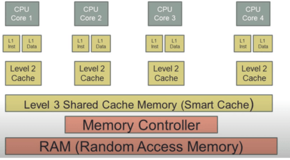

# 19. Vnitřní paměti osobního počítače a jejich provedení, vyrovnávací paměti v procesor

#### Úvod

    Polovodičové paměti se skládají z paměťových buněk. 
    Paměťová buňka je realizována pomocí integrované obvodu, umožňující trvale nebo dočasně vyvolat dva logické stavy 1 nebo 0. Každá základní paměťová buňka má kapacitu 1 bit. Podle toho, čím je paměťová buňka tvořena se mění vlastnosti polovodičové paměti.

#### Struktura

    Paměťové buňky jsou na polovodičovém čipu uspořádány maticově (tvoří jakousi mřížku). 
    Poloha každé paměťové buňky je určena řádkovým a sloupcovým vodičem. 
    O adresování příslušné buňky v paměti se stará paměťový řadič, jehož úkolem je také řídit proces čtení, zápisu dat a zabezpečení přenosu dat.

### RWM (Read / Write Memory)

    Umožňují libovolné čtení i zápis dat.Jedná se o volatilní paměti (závislé na napájení).
    Paměti s přímým přístupem se označují jako paměti RAM.Paměti RAM rozdělujeme podle obvodu, který tvoří paměťovou buňku.

#### Statická paměť RAM (Static Random Access Memory)

    Tato buňka je velice rychlá, vyžaduje menší proud než paměť dynamická, ale fyzicky zabírá na polovodičovém čipu paměti poměrně velký prostor. Jedná se tedy o paměti malé kapacity.Použítí ve vyrovnávací paměť CACHE.
    Propustnost: 300 GB/s
    Zpoždění: 1 – 2 ns
    Paměťová buňka je tvořena bistabilním klopným obvodem.
    Jedna paměťová buňka obsahuje minimálně 4 tranzistory (2 tvoří samotný BKO, zbývající řídí proces čtení/zápis).
    Fungování:
    Po výběru příslušné paměťové buňky se řádkovým vodičem sepnou spínače, čímž dojde k připojení paměťové buňky na datové vodiče.
    V této chvíli můžeme z buňky číst nebo do ní zapisovat. Při čtení se zkoumá jak skutečná, tak inverzní hodnota,která slouží k ověření zápisu.

#### Dynamická paměť RAM (Dynamic Random Access Memory)

    Potřebuje obnovovací cykly, aby se obsah paměti nezměnil.
    Využití: operační paměť, videopaměť grafické karty
    Propustnost: 25GB/s
    Zpoždění: 50 ns
    Paměťová buňka je tvořena kondenzátorem (ve skutečnosti se využívá kapacity PN přechodu) a tranzistorem typu MOSFET, kterým se řídí nabíjení a vybíjení paměťového kondenzátoru.
    Logické hodnoty 0 a 1 odpovídají vybitému a nabitému kondenzátoru.

##### DRAM Refresh

    Protože je kapacita paměťové buňky reálná a velmi malá, dochází k rychlému samovolnému vybíjení (ztrátě informace).
    Aby ke ztrátě informace nedošlo, provádí se periodická obnova dat (refresh).
    Refresh (obnovování informace) se provádí po celých řádcích.
    V okamžiku obnovování informace nelze provádět operace čtení/zápis.

##### Destruktivní paměť při čtení (důvod proč je pomalejší než SRAM)

    Při čtení je na adresový vodič přivedena hodnota log. 1, která způsobí otevření tranzistoru. Pokud byl kondenzátor nabitý, zapsaná hodnota přejde na datový vodič. Tímto čtením však dojde k vybití kondenzátoru a tedy ztrátě uložené informace.
    Přečtenou hodnotu je nutné opět do paměti zapsat. Z důvodu periodické obnovy informace a obnovy informace po jejím přečtení jsou paměti DRAM pomalejší při čtení/zápisu než paměti SRAM.

#### Synchronous Dynamic RAM (SDRAM)

    Během jednoho hodinového impulsu provede 1 operaci přenosu dat
    Paměti SDRAM jsou schopny pracovat s kmitočtem 66, 100, 133 MHz
    Datová propustnost byla 533 až 1066 MB/s, napájecí napětí 3,3 V, kapacita do 512 MB.

#### DDR (Double Data Rate)

    DDR paměť přenáší data jak během náběžné, tak sestupné hrany hodinového impulsu. 
    To znamená, že během jednoho impulsu se tedy provedou 2 operace
    Pracovní kmitočet 200–600 MHz, propustnost 1,6–4,8 GB/s, napájecí napětí 2,5 V
    Kapacita jednoho paměťového modulu se pohybuje od 64 MB až 2 GB

#### DDR2

    Pracují stejně jako DDR.
    Rozdíl je v použití nižšího napájecího napětí (1,8 V). Díky nižšímu napětí je spotřeba pamětí DDR2 nižší a je možné je taktovat na vyšší pracovní frekvence.
    Kapacita jednoho paměťového modulu se pohybuje od 256 MB až 4 GB
    Frekvence pamětí se pohybuje v rozmezí 400–1066 MHz s datovou propustností až 8,5 GB/s

##### Technologie QPB (Quad Pumped Bus)

    Efektivní hodnoty kmitočtu, umožní zvýšit rychlost o čtyřnásobek základního kmitočtu paměťové sběrnice
    Příklad:
    Paměť DDR2-800, pracuje vnitřně na kmitočtu 200 MHz, díky technologii QPB je její efektivní kmitočet 4× vyšší, tedy 800 MHz

#### DDR3

    Napájecí napětí bylo sníženo na 1,5 V (nižší spotřeba modulů + nižší vyzářené teplo). 
    Pracovní kmitočet pamětí se pohybuje v rozmezí 800–2133 MHz s datovou propustností až 17 GB/s.
    Kapacita jednoho paměťového modulu se pohybuje od 512 MB až 8 GB

#### DDR4

    Využívá napájecí napětí 1,2 V (nižší spotřeba modulů + nižší vyzářené teplo). 
    Pracovní kmitočty pamětí se pohybují v rozmezí 2133–2400 MHz, standardně jsou řízeny 4-kanálovým paměťovým řadičem. 
    Kapacita jednoho paměťového modulu se pohybuje v rozmezí 8 GB až 128 GB.

#### Vícekanálový paměťový řadič

    Místo jedné paměťové sběrnice spojující operační paměť s řadičem paměti je použiti více sběrnic. Propustnost tak teoreticky vzroste několikrát.Tuto technologii podporuje pouze DDR3 a DDR4
    Dual channel = 2 přenosové kanály.
    Quad channel = 4 přenosové kanály.
    Eight channel = 8 přenosových kanálů
    (existuje i triple channel atd…)
    
    Pro vyšší datovou propustnost je potřeba splnit tyto podmínky:
    1.) Podpora čipové sady na základní desce
    2.) Paměťové moduly se musí osazovat v páru. 
    3.) Oba kanály musí být osazeny stejným typem paměťového modulu DIMM(prodej v sudém počtu)

#### Moduly pamětí DRAM

##### DIP (Dual In-line Package)

    V minulosti byla operační paměť v provedení klasického integrovaného obvodu – pouzdro DIP.
    DIP měl běžně 16 nebo 18 pinů.Používaný s 8086.

##### SIPP

    Obě strany modulů jsou stejné.
    SIMM moduly se dělí na  krátké (30 pinů - šířka datové sběrnice byla 8 bitů) a dlouhé (72 pinů - šířka datové sběrnice 32 bitů).

##### DIMM

    Paměťové moduly DIMM mají po stranách otvory pro zajištění v patici na základní desce.
    Použití u SDRAM, DDR, DDR2, DDR3, DDR4
    Šířka datové sběrnice je 64 bitů
    SDRAM – 168 pinů, DDR – 184 pinů, DDR2 – 240 pinů, DDR3 – 240 pinů, DDR4 – 288 pinů
    SO-DIMM moduly jsou určeny pro notebooky a jsou osazeny stejným typem paměti jako DIMM
    jen mají menší počty pinů. Pod a včetně 100 pinů je 32bit sběrnice, nad je 64bit sběrnice.

### ROM (Read Only Memory)

    Jsou určeny jen pro čtení dat. Jedná se nevolatilní paměti(nezávislé na napájení).
    Slouží především k uložení firmware v elektronických zařízeních, popřípadě BIOSu základní desky
    Dělí se na :
    1. Po naprogramování už nelze změnit - ROM, PROM
    2. Paměti lze omezeně přeprogramovat - EPROM, EEPROM, Flash ROM
    
    Informace je do paměti ROM zapsána při její výrobě a poté již není možné žádným způsobem obsah změnit.
    Paměťová buňka paměti ROM může být realizována jako dvojice nespojených vodičů a vodičů propojených přes polovodičovou diodu.

#### PROM (Programmable ROM)

    Paměť, kterou si uživatel naprogramuje sám. 
    Program se do paměti ukládá pomocí speciálního zařízení – programátoru
    Při výrobě je vytvořena matice obsahující spojené adresové vodiče s datovými vodiči přes polovodičovou diodu a tavnou pojistku.
    Takto vyrobená paměť obsahuje na začátku samé hodnoty 1.
    Během programování se na příslušnou paměťovou buňku přivede takový proudový impuls, který způsobí přepálení pojistky (stav 0).Tento zápis je možné provést pouze jednou.

#### EPROM (Erasable PROM)

    Jsou realizovány pomocí speciálních unipolárních tranzistorů.
    Zapsané informace je možné vymazat působením UV záření (doba působení je asi půl hodiny).
    Paměti EPROM jsou charakteristické malým okénkem v pouzdře integrovaného obvodu obsahujícího tuto paměť.Okénko bývá přelepeno ochranným štítkem proti UV záření

#### EEPROM (Electrically Erasable PROM)

    konstrukcí podobný pamětem PROM
    Oproti pamětem EPROM se mažou elektrickými impulsy, doba mazání se pohybuje v milisekundách

#### Flash ROM

    Rychlejší než EPROM a EEPROM
    S pamětí se dá pracovat jako s RAM, ale po odpojení napájení se informace nevymaže.
    Vymazání informace se provádí elektrickou cestou, jejich přeprogramování je možné provést přímo v počítači.
    Vlastnosti
    - Umožňují přímé čtení i zápis (stejně jako paměti typu RAM)
    - Nízká úroveň napájení - velice nízký příkon vhodný pro přenosná zařízení
    - Stálost - jsou schopny odolat velkým otřesům bez ztráty dat
    - Rychlost - extrémně krátká vybavovací doba
    Nevýhoda - Mají omezenou životnost na cca 100 000 cyklů výmaz / zápis.
    Využití: externí flash disky, paměťové karty, SSD disky, BIOS 

### Memory Scrubbing

    proces vyhledávání jednobitových chyb a jejich případná oprava v době, kdy je paměť nejméně vytížena. Má aktivně předcházet vzniku chyb ve více bitech

### SPD (Serial Presence Detect)

    Pamět typu EEPROM pro ukládání informací o paměťových modulech (frekvence, napětí, výrobce..)

### Adresa

    Procesor pomocí adresy vybírá přímo požadovanou buňku paměti, kde se o její nalezení stará řadič. Adresa je najita v mřížce pomocí sloupcového a řádkového vodiče.

### Klíč

    jsou u cache pamětí tagy, ale označuje se i tak otvory pro správnou orientaci modulu.

### Řádek

    tabulky se dělí na řádky, kde každý řádek má klíč. Na řádku jsou poté data, která paměť uchovává. V datové části jsou operandy (obvykle 4 nebo 8)Taková banka by se dala představit jako HashMapa <Klíč,List<Operandy>> 
    Příklad tabulky
    Paměť 16KB = 4 Tabulky (Banky) po 4KB (4096 B)
    V tabulce 128 řádků – 4096 / 128 = 32B jeden řádek

### Cache paměť

    Cílem Cache paměti je překonat paměťovou bariéru mezi procesorem a operační pamětí.
    (výkon procesoru roste rychleji než výkon paměti a paměť je dost pozadu)
    Nachází se v procesorech nebo pevných discích.
    
    Procesory často používají koprocesor, který přebírá veškeré úlohy spojené s přípravou a aktualizací dat v cache paměti.
    
    L1 – paměti o malé kapacitě je přímo součástí procesoru a je stejně rychlá, jako procesor (obsahuje data které jádro zrovna zpracovává)je obvykle rozdělena do dvou částí: 
    1.) Mezipaměť instrukcí - se zabývá informacemi o operaci, kterou musí CPU provést
    2.) datová mezipaměť - obsahuje data, na nichž má být operace provedena.
    L2 -  je pomalejší než L1, ale je zase větší
    L3 – je největší, ale také nejpomalejší.
    (Ve starých počítačích byla L1 byla v procesoru a L2 na základní desce a L3 nebyla)

#### Organizace Cache

    Cache paměti bývají organizovány jako asociativní paměti. Asociativní paměti jsou tvořeny tabulkami, která obsahuje vždy sloupce, v němž jsou umístěny tzv. tagy (klíče), podle kterých se v asociativní paměti vyhledává. Dále jsou v tabulce umístěna data, která paměť uchovává, a popř. další informace nutné k zajištění správné funkce paměti.

### prohledávání a L1, L2, L3 úrovně

    Ve cache paměti je uložena ta část dat hlavní paměti, která je právě procesorem používána.
    Jsou-li procesorem požadovaná data v cache paměti (hledají se podle klíče a nejdříve se prohledává L1, poté L2 a nakonec L3), tak jsou z ní přečteny a není proveden vstup do pomalejší OP (když jsou najity tak se tomu říka “hit“). Ale pokud požadovaná data nejsou v cache paměti, tak jsou přečteny z OP (jsou přeneseny do procesoru i do cache paměti, nejdříve do L3, poté L2 a nakonec L1) (tomu se říka “miss“).

### Smart Cache

    Vynalezena Intelem
    Sdílení L2 nebo L3 mezi jádry procesoru.L2 je stává společnou.
    Pokud nějaké jádro potřebuje data ke zpracování tak mu bude přiděleno více paměti od jader jenž tolik dat nepotřebují
