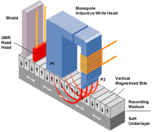

# 20. Vnější paměti osobního počítače, fyzické a logické uspořádání dat

#### Úvod

    Slouží k dlouhodobému a trvalému uložení dat, ale také k přenosu dat.
    Pomalejší paměti než vnitřní, ale umožňují dlouhodobé uchování velkých objemů dat a programů, a to trvale i po vypnutí počítače.Z vnější paměti se načítá operační systém a další data.

### Princip číslicového magnetického záznamu a čtení

    Data, která mají být zapsány na disk se převedou na bity a pomocí elektromagnetu, které generuje elektromagnetické pole (dost silné na to, aby změnilo směr magnetizace) jsou zapsány do skupin “zrn“ a ty jsou zmagnetizovány na 0 nebo 1.Čtení je pomocí magnetického čtecího senzoru.

    Indukční prvek zapíše bity informace jako zmagnetizované oblasti ve stopách, které jsou později čteny MR-senzorem

    Kolmý zápis nahrazuje padesát let používaný podélný, u něhož byl klíčovým prvkem prstencový elektromagnet, mezi jehož póly bylo vyvoláváno pole, které procházelo také magnetizovatelnou látkou, kterou orientovalo vhodným směrem.Ke zvýšení hustoty záznamu se přešlo z podélného záznamu na kolmý.

### mag. disk a jeho části + činnost

#### Dělení

#### Schéma pevného disku

#### Elektromechanické části pevného disku

##### Disková hlava

    Umístěna na pohyblivém raménku vystavovacího mechanizmu.
    Pohybuje se ve vzdálenosti řádu desetin mikronu nad povrchem disku
    U starších disků a disket se pro čtení i zápis používají hlavy založené na principu magnetické indukce.
    Dnes se u disků používají magnetorezistivní - MR hlavy
    Indukční hlavu používá pouze pro zápis, pro čtení se používá prvek založený na změně elektrického odporu při vystavení magnetickému poli

##### Pohon disku, hřídel

    Na společné hřídeli je umístěno několik diskových kotoučů
    Na pohonu disku, otáčkách hřídele, je závislá průměrná čekací doba. Čím jsou otáčky větší, tím je čekací doba menší. Vyšší rychlost otáčení disku ještě nemusí znamenat přínos.Čím více otáček, tím horší provozní podmínky. S rostoucím počtem otáček roste tvorba tepla uvnitř pouzdra disku, což zvyšuje nároky na ventilaci.

##### Diskové kotouče (plotny)

    Nejdůležitější částí disku, protože právě na nich jsou uložena data.
    Plotny jsou většinou vyrobeny z hliníkových slitin. Výjimka je Hitachi, ta vyrábí plotny se skla.Dnes jsou plotny velké 3.5" a 2.5".

##### Vystavovací mechanismus

    Jeho úkolem je vystavit hlavy nad požadovanou stopu. Důležitý je jeho pohon, který je dnes proveden pomocí kmitající cívky.Při ukončení práce s diskem a vypnutí počítače se hlavy musí přesunout do takzvané parkovací zóny, kde po zastavení ploten dosednou na jejich povrch.

#### Elektronické části pevného disku

    Centrem pevného disku je jeho elektronika.(První disky neměly skoro žádnou elektroniku)
    Příchod IDE (Integrated Drive Electronics) - disky už mají řadič integrován v sobě.
    Elektronika sestává z desky s plošnými spoji, kde se nacházejí: řadič (mikroprocesor), paměti RAM (registry, cache), ROM, obvody rozhraní, konektory, konfigurační přepínače.
    Hlavními funkcemi elektroniky jsou:
    - kontrola rychlosti otáček disku
    - kontrola přesunu hlav nad plotnami
    - zprostředkování operací READ/WRITE
    - správa geometrie disku
    - zesílení signálu z hlav a jejich převádění
    - řízení toku informací
     
    Řadič – jeho úkolem je na základě vnějších požadavků řídit čtení/zápis dat na HDD. Svými řídícími impulsy rovněž koordinuje činnost všech částí HDD. Programy (mikrokód) podle kterých pracuje se nacházejí v paměti ROM.
    
    ROM (Read Only Memory).- je v ní uložen miniaturní OS pevného disku (firmware), řízení pohonu, kódování a dekódování dat, pokus o odstranění chyb při čtení, nebo zápisu atd.
    
    RAM (CACHE) – statická RAM, která obecně slouží k dočasnému uložení dat mezi částmi počítače, které pracují různou rychlostí, jejím úkolem je urychlení přenosu dat. 
    U HDD má kapacitu mezi 8 až 32 MB.
     
    Pokud se cache používá při zápisu (tzn. funguje writeback caching), data, která pošle systém pevnému disku, se uloží do cache a elektronika disku vyšle informaci o tom, že data byla úspěšně uložena. Teprve pak se stará o jejich skutečné uložení. Tento postup funguje do té doby, dokud je přívod elektrické energie. Při výpadku se totiž ztratí všechna data v cache a co je horší, operační systém o tom neví, neboť dostal zprávu, že byl zápis úspěšně proveden. To může vést třeba k poškození operačního systému a úplné ztrátě dat.

### rozhraní

#### PATA (Parallel Advanced Technology Attachment)

    rozhraní využívá 40ti-pinového konektoru, na nějž se připojují ploché datové kabely

#### SATA (Serial Advanced Technology Attachment)

    Oproti PATA využívá původní verze SATA pouze 1bitovou šířku, ale při taktovací frekvenci 1500MHz = teoretická přenosová rychlost 1,5 Gbit/s s propustností 150MB/sec.
    Další verte SATA II má teoretickou rychlost 3Gbit/s s propustností 300MB/sec.
    A SATA III mí teoretickou rychlost 6Gbit/s s propustností 600MB/sec a její rozhraní je kompatibilní se SATA II.
    SATA podporuje technologie hot-swap - schopnost připojit a odpojit zařízení za běhu počítače tak, aby je operační systém rozpoznal

### Parametry pevného disku

    Hardware parametry: formát disku, rozhraní, kapacita (GB, TB),Otáčky(RPM),Cache (MB), přístupová doba (ms), počet ploten, spotřeba energie (W), hmotnost (g), odolnost 
    /* odolnost třeba proti otřesu - Vybavení G-senzorem, který je schopen rozpoznat, kdy pevný disk padá na zem. Integrovaný systém umí v takovém případě zaparkovat hlavičky na bezpečná místa, kde nedojde k jejich poškození. */
    Parametry geometrie: počty stop, sektorů, cylindrů, čtecích a zapisovacích hlaviček (většinou 2 na plotnu), počet a velikost clusterů.

### Geometrie Disku

    Před zápisem jakýchkoliv dat je nutné pevný disk nejprve naformátovat. Formátování pevného disku zahrnuje tyto tři kroky
    1.) Fyzické, neboli nízkoúrovňové formátování (LLF – low level format).
    2.) Rozdělení disku na oddíly.
    3.) Logické, neboli vysokoúrovňové formátování (HLF – high level format).

#### Fyzické

    Toto formátování je prováděno přímo výrobcem disku. Během nízkoúrovňového formátování je plotna pomocí elektromagnetického záznamu rozdělena na stopy a sektory oddělené mezerami.

##### Stopa (track)

    Oblast pro ukládání dat ve tvaru soustředné kružnice. Počet stop na jedné straně plotny se může pohybovat od několika tisíc po desetitisíce. Každá stopa je rozdělena na menší části, kterým se říká sektory.

##### Sektor (sector)

    Část jedné stopy, ohraničená na začátku i konci identifikačními značkami, určujícími mimo jiné jeho číslo, polohu, začátek a konec. Jde o základní jednotku pro ukládání dat. Standardní sektory mají velikost 512 bajtů. Ve skutečnosti je to více, například 571 bajtů, z toho 512 bajtů připadá na ukládání dat a zbytek slouží k uložení identifikačních údajů sektoru.
    
    Stopy a sektory se číslují. Sektory v jedné stopě jsou očíslovány od čísla 1, zatímco stopy, hlavy nebo cylindry se číslují od čísla 0. Nultá stopa je na vnějším okraji plotny.

##### Cylindr

    Sada stop se stejným číslem na různých stranách ploten. Takové stopy se nacházejí nad sebou ve stejné vzdálenosti od středu plotny a vytváří pomyslný válec. Pojem cylindr je významný především z hlediska efektivního čtení a zápisu dat. Hlavičky se totiž nemohou pohybovat nezávisle, ale nacházejí se vždy nad sebou. Z toho také plyne, že nejefektivnější je číst data ze sektorů, které jsou na jedné stopě a jejichž stopy jsou ve stejném cylindru. Jedině tak lze v nejkratší době přečíst maximální množství informací.

##### Cluster

    Operační systém si potom z jednotlivých sektorů skládá alokační jednotky = clustery. 
    Cluster je nejmenší použitelné množství dat pohromadě. 
    Použití clusterů umožňuje výrazně snížit režii při adresaci a evidenci uložených dat. 
    Velikost clusteru je dána především velikostí diskového oddílu a použitým souborovým systémem.
    Kapacita disku se vypočítá jako součin CHS – cylindry x hlavičky x sektory.

#### Logické

##### Oddíly

    Logická struktura disku se vytváří pomocí vysokoúrovňového formátování. 
    Slouží k organizaci dat uložených na pevném disku. 
    Umožňuje jeden fyzický disk rozdělit na více oddílů, které se v operačním systému tváří jako samostatné disky.
    Informace o tom, na kolik oddílů je disk rozdělen a jak jsou data organizována (kde jsou na disku umístěna), jsou uloženy v tabulkách, které tvoří logickou strukturu disku (tzv. souborový systém disku).
    Rozdělení pevného disku na oddíly se provádí v případě, kdy chce uživatel oddělení uložených dat. Každý oddíl lze naformátovat jiným souborovým systémem.
    Každému oddílu je přiřazeno jedinečné písmeno v rozmezí C až Z.
    V operačním systému se pak každý jeví jako samostatný pevný disk.

##### Souborový systém

    Datová struktura vytvořená vysokoúrovňovým formátováním pevného disku, která slouží k organizaci souborů a tedy i adresářů na pevném disku tak, aby je bylo možné snadno najít a přistupovat k nim.
    Souborový systém umožňuje ukládat data do souborů, které jsou označeny názvem a příponou. 
    
    Umožňuje vytvářet také adresáře, pomocí kterých lze soubory organizovat do stromové struktury. Informace uložené v systému souborů dělíme na METADATA a DATA.
    Metadata - popisují strukturu systému souborů a nesou doplňující informace: velikost souboru, čas poslední změny souboru, čas posledního přístupu k souboru, vlastník souboru, oprávnění uživatelů, seznam bloků dat, které tvoří vlastní soubor atd…
    Data - obsah souboru
    Software, který realizuje souborový systém, bývá obvykle součástí operačního systému. Většina operačních systémů podporuje několik různých souborových systémů
    
    Windows – FAT, NTFS, ISO 9660
    Linux – ext2, ext3, ext4, JFS…
    Základní části logické struktury disku
    
    MBR (Master Boot Record)
    Tvoří základ logické struktury. Záznam je umístěn na začátku disku (nultá stopa, první sektor). 
    Má dvě části - zaváděcí záznam a Partition table (tabulku oblastí)
    Zaváděcí záznam - obsahuje krátký program spuštěný při startu počítače BlOSem. Jeho úkolem je načíst tabulku oblastí a najít aktivní oblast, ze které se načte operační systém
    
    Partition table (tabulka oblastí) – obsahuje informace o dělení disku na oblasti.
    Rozdělení oddílů: Primární (OS), Rozšířený a Logický (D,E,F…)

### Nové vývojové směry HDD a výhody polovodičového SSD

#### Nové vývojové směry HDD

    HAMR – Heat Assisted Magnetic Recording (seagate)
    na každou zapisovací hlavičku je přidána miniaturní laserová dioda, , která konkrétní místo na disku během zápisu zahřeje a umožní tak zapsat miniaturní informaci při požadované kvalitě, polaritě a stabilitě
    Díky miniaturizaci prostoru potřebného pro zapsání informace dochází k řádovému navýšení hustoty zápisu
    Konkrétní místo se při zápisu asi na nanosekundu vždy zahřívá přibližně na 650 stupnů celsia.
    
    MAMR – Microwave Assisted Magnetic Recording (WD)
    využívá vysokofrekvenční pole generované točivým oscilátorem v zapisovací hlavě.
    Oscilátor vytváří magnetické mikrovlny s frekvencí 20 až 40 GHz, které během zápisu snižují koercitivitu záznamového média.
    
    SMR - Shingled magnetic recording
    Chce zmenšit plochu pro stejné množství dat.
    zápis zahušťuje tím, že stopy zapíše tak blízko k sobě, že následující se částečně překrývá s tou předchozí.
    Problém je zápis. Pokud zapisujete, poruší zapisovací hlave záznam v následující stopě.

#### Výhody SSD (Solid State Drive)

    je postaven na principu vysokorychlostních polovodičových pamětí typu FlashROM.
    Rychlost
    SATA a mSATA – cca 500MB/s
    PCIe – 1700 – 7000 (zápis 5300) MB/s (PCIe – neskutečně rychlý, sběrnici používají grafické karty až 15750 MB/s)
    NVME (Non Volatile Memory Express).
    nulová hlučnost (neosahuje pohyblivé součástky),
    malá hmotnost,
    nízká spotřeba elektrické energie, nízké ztrátové teplo,
    Nevýhody:
    Cena je vyšší,
    teoretická životnost paměťové buňky: 100.000× přepis informace,
    po čase dochází k degradaci výkonu (závisí na počtu použitých buněk)

