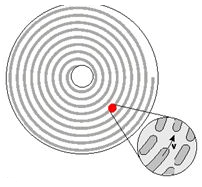
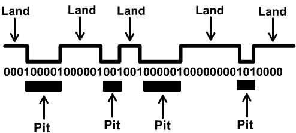
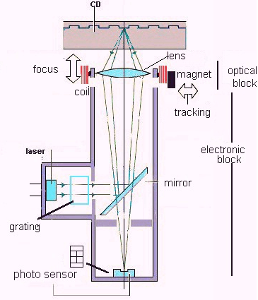
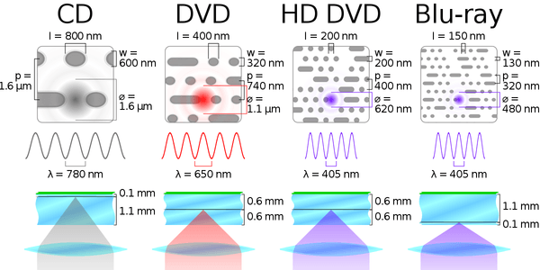
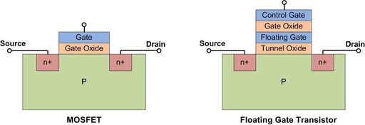

# 21. Nemagnetické nosiče informace pro osobní počítače, uspořádání dat

### Různé principy číslicového optického záznamu a čtení

    Optická pamět je disk o průměru 120mm s otvorem uprostřed o průměru 15mm.
    Mají tloušťku 1,2 mm.
    Určeny především pro čtení zaznamenané informace.
    Vyžadují pro svou funkci optickou mechaniku(čtení, zápis).

#### Struktura

    Na rozdíl od HDD ploten nemá stopy a sektory o různých délkách, místo toho má jednu spirálovou stopu začínající od středu disku, na které jsou stejně dlouhé sektory. Drážky spirály jsou do disku lisovány.

    Jako každá paměť musí umožnit realizovat dva logické stavy 0 a 1. 
    Logické hodnoty jsou realizovány odraznými ploškami (lands) a rozptylovými pity (pits). 
    Pity a plošky neznamenají 1 nebo 0. Log 1 tvoří přechod mezi nimi, buď z pitu na plošku nebo z plošky na pit. Ponechání stejného stavu ať plošky nebo pitu je log 0. Aby se určilo, kde končí bit je daná norma délky bitu, díky tomu mechanika pozná kolik je za sebou 0.

    Celková kapacita paměti je dána především velikostí jednotlivých pitů, vlnovou délkou laseru a vzdáleností stop. Čím menší velikost pitu, tím větší celková kapacita.
    Rozdělují se 4 typy: CD, DVD, HD DVD, Blu-Ray
    Poté podle možnosti přepisu:
    - ROM(Read Only Memory) Data jdou do disku při výrobě.Jen pro čtení.
    - R (Recordable) – disk obsahuje vrstvu barviva, data se do vrstvy zapíší pomocí laseru. Laserem se vypalují pity. Nedá se přepsat, zapsaná data nelze vymazat ani změnit.
    - RW (Rewritable) – disk se dá přepisovat 

### CD (Compact Disc)

#### CD-DA (Digital Audio) a CD-ROM

    CD-DA je nestarší, záznam pouze audia o maximální délce 74 minut. 
    Poté vzniklo CD-ROM, které umožňovalo záznam i jiných dat. Jeho maximální kapacita byla 650 MB a používal standard ISO-9660. Do něj byla data ukládána při výrobě pomocí raznice.
    Mají vrstvy (od směru čtení, ze spoda disku): ochranná polykarbonová vrstva, stopa obsahují pity a plošky, reflexní odrážecí vrstva, ochranná vrstva často obsahují ze shora nějaký obrázek

#### CD-R

    Mělo stejné formátování, strukturu dat i způsob záznamu. 
    Je do něj přidána vrstva organického barviva. Mezi polykarbonovou vrstvu a reflexní vrstvu. Při vypalování laser zahřeje barvivo a vypálí pit cca 300-400 stupňů. Vypálený pit nedosahuje kvality jako vylisovaný pit (nemá dokonalý tvar a je mělčí), proto CD-R nemůžou přečíst starší mechaniky.Maximální kapacitu má stejnou jako oba předchozí.
    Později byla kapacita zvýšena a vyšší kapacita znamená:
    - Zmenšení vzdálenosti mezi stopami
    - Zmenšení časti pro jeden bit (použití nižší normy)

#### CD-RW

    Disk obsahuje vrstvu z chemické sloučeniny, která mění působením tepelné energie laseru svůj stav z krystalického stavu, který je vysoce odrazivý na amorfní, který rozptyluje laserový paprsek.
    Sloučenina má teplotní bod pro tání = změnění krystalické podoby na amorfní a poté nižší teplotní bod než pro tání je pro krystalizaci z amorfní podoby.Umožňuje vymazat nebo změnit data, ale vrstva se opotřebovává a počet přepisů je cca 1000. Podle činnosti se mění výkon laseru. 
    Zápis – největší výkon, dochází k roztání krystalické vrstvy
    Mazání – střední výkon, dochází k rekrystalizaci vrstvy
    Čtení – Nejnižší výkon, podle odraznosti se pozná vrstva
    Složení vrstvy je Ge-Sb-Te (Germanium, Antimon, Tellur) nebo  Ag-In-Sb-Te (Stříbro, Indium, Antimon, Tellur)

#### Mechanika pro CD-DA(popis a princip, pro novější se mění maličkosti)

    Nejdůležitější část je optická hlava, která obsahuje laserovou diodu, čočky pro usměrnění laserového paprsku, polopropustné zrcadlo, foto diodu
    Laser pro CD má vlnovou délku 780 nm, je červený.
    Rozhraní: SATA, USB (pro externí) a starší ATA, SCSI, LPT
    Parametry: rozměry (v palcích), rozhraní, podpora typů DVD a CD, rychlost zápisu a čtení (ve formátu 2x, 4x, 6x … 52x), nějaké speciální funkce

##### Princip

    Laserový paprsek z laserové diody je zaostřen pomocí čoček na malé místo disku. 
    Když se dostane na disk, tak narazí na polykarbonátovou vrstvu, při jejím průchodem, ale není zaostřen. (proto se dokáže přečíst bez problému i disk se škrábanci)
    Když dopadne laserový paprsek na plošku, tak odrazí světlo zpět. Pokud paprsek dopadne na pit, tak se světlo rozptýlí a zpátky bude odraženo minimum (do optické hlavy).
    Poté odražený paprsek se vrátí optické hlavy, tam se pomocí zrcadlo dostane do fotodiody.
    Podle toho kolik světla se dostane do fotodiody, tak na jejím výstupu bude napětí (hodně – napětí bude, málo – napětí skoro nulové).

##### Pohon disku

    Tu zajišťuje elektrický motorek. Pohon má různé rychlosti na středu disku a na okrajích, protože struktura je spirála, takže na okrajích je více informací na otočku než na středu.
    2 druhy pohonu
    - CLV (Constant Linear Velocity) – u audio CD mění při čtení dat průběžně otáčky tak, aby byl zajištěn konstantní datový tok. U středu je cca 530 otáček a na okraji cca 230 za minutu. Laser přečte vždy stejný kus stopy (stejný počet bitů) za jakýkoliv časový úsek.
    Základní rychlost u CD je 150 kB/s, zvýšení rychlosti se označuje např: 52x co znamená 150*52 = 7800 kB/s
    - CAV (Constant Angular Velocity) – U datových CD, kde se požaduje co možná nejvyšší přenosová rychlost. Proto je disk roztočen co nejvíce, rychlost otáček je konstantní.

##### Nosič disku

    je ovládán manuálně, tlačítkem pro vysunutí a zasunutí. Pokládá se na něj disk.

##### Elektronika mechaniky

    řadič, RAM (cache a registry), ROM s firmwarem
    
    Funkce elektroniky: kontrola rychlosti otáčení disku, kontrola přesunu hlavičky nad stopou, správa vyrovnávací paměti cache, zesilování elektrických signálu, které jdou z optické hlavy a jejich  následné převedení na bity.

##### Mechanika pro CD-R

    Použit výkonnější laser pro vypalování pitů, zároveň umí svůj nastavit výkon pro čtení CD-DA a ROM bez jejich poškození.
    Čtení – 0,5 mW
    Zápis 4-12 mW podle rychlosti

##### Mechanika pro CD-RW

    Obsahuje ještě výkonnější laser, protože pro tání je potřeba 600 stupňů, Výkon laseru až 20 mW

#### Logická struktura disku CD

    Logická struktura CD disků je specifikována mezinárodním standardem ISO 9660. Pouze CD tohoto formátu je přenosné mezi Windows, Linux, MacOS, DOS.
    Původní standard umožňoval pojmenovat soubor pomocí 8 znaků + 3 znaky pro příponu. Rozšíření standardu ISO 9660, které vyvinul Microsoft dlouhých názvů souborů a použití Unicode sady na CD se nazývá Joliet, které povoluje až 64 znaků v názvu souboru. Romeo povoluje až 128 znaků.

##### Části logické struktury

    PCA - Principal component analysis
    Obvykle bývá první. Slouží k nastavení výkonu laseru pro vypálení daného disku.
    
    PMA - Program Memory Area
    Obsahuje informaci o počtu stop a jejich umístění.
    
    Session
    Je to zapsaný segment CD, který může obsahovat jednu nebo více stop jednoho typu. 
    Při zápisu dat se jedná pouze o jednu stopu. 
    Při audio záznamu jsou všechny stopy v jedné session. 
    Jeden disk může obsahovat i více sessions, ty se nazývají multisession.
    Každá session má:
    - Lead In - Oblast, která je na začátku každé session vyhrazená pro zápis TOC (Table Of Contents) (podobná partition table). Jsou zde zaznamenány čísla stop a jejich začátky. Zapisuje se při uzavírání session. 
    - Lead Out – oblast, která označuje konec každé session.

### DVD (Digital Versatile “Video“ Disc)

    Shodné rozměry s CD. Byl určen pro ukládání videa ve vysoké kvalitě.
    Větší kapacita disku je způsobena větší hustotou záznamu, menší mezery mezi pity, menší místo pro záznam bitu, menší mezery mezi spirálou
    Také disk může být oboustranný nebo dvouvrstvý.

#### Dvouvrstvý

    má spodní vrstvu polo transparentní. Laser se podle toho, se kterou vrstvou chce pracovat zaostří.
    Velikosti disku 12cm 4,7GB, dvouvrstvý 8,5 GB a oboustranný 9,4 GB  
    Má několik formátů video, audio, ROM, +R/RW, RAM (místo spirály má kružnice rozdělené na sektory, je přepisovatelný až 100000 krát)

#### Mechaniky pro DVD

    - musí mít přesnější laser a fotodiodu, aby dokázaly přečíst menší bity.
    - lepší ostření pro dvouvrstvé disky
    - Mají menší vlnovou délku laseru, kvůli tomu nelže číst CD, proto mechanika  mají i další laser pro CD

### HD DVD (High definition DVD)

    má stejnou základní DVD.
    Disky HD DVD mohou být vytvářeny stejnými výrobními postupy, jako jsou postupy aktuálně používané pro technologii DVD. 
    HD DVD může mít až tři vrstvy a každá může obsahovat až 15 GB.
    Mechaniky pro HD DVD používají menší laserovou vlnovou délku 405 nm, která má modrofialovou barvu

### Blu-Ray

    Nástupce DVD disků. 
    Původně určený pro videa v hodně vysoké kvalitě včetně prostorového zvuku.
    Menší polykarbonová vrstva, velice malá odolnost proti poškrábání.
    Zjednodušeně HD DVD s menšími pity atd.. obrázek

### Přehled výměnných polovodičových pamětí na technologii Flash

    Výměnné uložiště: SD karty a USB flash disky
    Vlastnosti
    • Stabilní uložení informací - uchová data i bez napájení
    • Umožňují přímé čtení i zápis (stejně jako paměti typu RAM)
    • Nízká úroveň napájení - velice nízký příkon vhodný pro přenosná zařízení
    • Stálost - jsou schopny odolat velkým otřesům bez ztráty dat
    • Rychlost - extrémně krátká vybavovací doba
    Nevýhoda - Mají omezenou životnost na cca 100 000 cyklů výmaz / zápis.
    Rozhraní USB 2.0,USB 3.0, USB C
    Parametry: kapacita, typ usb, rychlost čtení a zápisu, materiál obalu, rozměry, hmotnost

### princip uchování dat v buňce

    V buňce je použit tranzistor FGMOS (Floating Gate MOSFET)
    Je podobný MOSFETu, ale má 2 brány: Control gate a Floating gate (ta je tam přidaná)
    Pokud jsou ve Floating Gate elektrony, tak buňka uchovává 0. Pokud nejsou, tak uchovává 1.

#### Nastavování

    Elektrony se do FGMOSu dostanou když na control Gate je napětí a source a drain jsou uzemněny, tím mají elektrony dostatek energie překročil izolační vrstvu a dostat se do floating Gate a jelikož je izolovaná, tak uchová elektrony i bez napětí.
    Aby se elektrony z paměti dostaly pryč, tak je záporné napětí na control Gate a napětí probíhá source a drain, to dostane elektrony přes izolaci pryč přes drain.
    Elektrony ve Floating Gate zůstávají neomezeně dlouho.

#### Čtení

    Při čtení je to FGMOSu vpuštěno napětí, pokud nejsou ve floating gate elektrony tak napětí projde a proudový senzor za tranzistorem ho změří, tím počítač ví, že je bit o hodnotě 1.
    Pokud jsou ve floating gate elektrony, tak napětí neprojde, tím počítač, ví, že bit má hodnotu 0.

