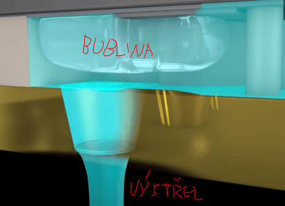

# 23. Tiskárny pro osobní počítače, používaná rozhraní osobního počítače

    Tiskárna je výstupní periferní zařízení počítače, sloužící k převodu digitální reprezentace textu a obrazu na papír nebo fólii jako hmotný výstup.

### Impaktní

    pracují na principu psacího stroje, takže musí dojít k úderu raznice na barvící pásku, čímž dojde k přenosu barviva na papír.

#### Jehličková

    Hlava obsahuje jehlu, pružinu, elektromagnet, barvící pásku
    Používají metodu sestavovaných znaků.
    Malé provozní náklady,nekvalitní tisk, hlučná, pomalá.

#### Řádková

    Nemají hlavu, mají řadu kladívek vedle sebe (kladívka jsou seřazeny v modulech).
    Elektromagnet “vypaluje“ kladívka přes barvící pásku na papír, poté dojde k posunu papíru.
    Lavice, na které sedí kladívka, se posunuje o trošku do stran.
    Tiskne se na papír s dírkami po stranách.
    Malá poruchovost, vysoká rychlost tisku, nízké náklady na tisk.
    Hodně hlučná, hodně drahá.

### Neimpaktní

    Tištěný obraz vzniká buď bezkontaktním přenosem barviva na papír (inkoustové, laserové), nebo dotykem části tiskové hlavy s papírem či barvící fólií.
    Např: inkoustové, laserové, termální (tepelné)

#### Inkoustová

    V tiskové hlavě se nacházejí trysky, ze kterých je nanášen (vystřikován) inkoust v podobě malých kapiček na papír. 
    Nanášení inkoustu z trysek má 2 základní druhy:

##### Tepelný způsob

    Tiskne se pomocí hlav s tryskami.

#### Princip trysky

    Elektrický proudový impuls přivedený ne rezistor a ten způsobí okamžité ohřátí inkoustu v daného místě trubičky na cca 300 C.
    Tímto zahřátím dochází téměř k okamžitému odpaření části inkoustu, vzniká rozpínající se vzduchová bublina. 
    Ta vyvolá přetlak, jenž vystřelí kapičku inkoustu z trysky na papír. 

    Po odeznění elektrického impulsu dojde k ochlazení a bublinka se smršťuje. Tím vzniká podtlak, který způsobí nasátí nového inkoustu ze zásobníku do trysky. 

    Tuto metodu používá většina dnešních inkoustových tiskáren. Hlava je tepelně namáhána. Je nutný speciální inkoust pro vysoké teploty. Tyto tiskárny se občas nazývají bublinkové (Bubble Jet).Nános inkostu tvoří větší “Main drop“ a menší “Satellite“.

##### Piezoelektrická metoda

    Tento typ využívá k tisku piezoelektrickou deformaci tryskové komory. Část trysky tiskové hlavy je tvořena z mnoha jemných piezoelektrických vláken, které se deformují při přivedení napěťového impulsu. 

    Boční stěny tryskové komůrky se před tiskem rozšíří přivedením napěťového impulsu.Při tisku se polarita napětí obrátí. Trysková komůrka zmenší objem, část inkoustu vystřelí z trysky. Tato koncepce umožňuje v určitých mezích dávkování množství inkoustu.A tím lepší reprodukci barev při barevném tisku. 

    Také je možnost zásobníku s pevnou náplní
    Využívá se inkoust pevného skupenství.Tento inkoust se před tiskem rozehřeje na 92C a tím se z něj stane stav kapalný, který je poté dodáván tryskám.Výhodou oproti kapalným inkoustům je kvalita tisku a nešpiní
    Tato metoda se spíše používá pro firemní (velké a drahé) tiskárny, ne domácí.
    Parametry většinou.Na hlavu až 5000 trysek, průměr trysky až 0,005mm
    Nízká pořizovací cena, Nejsou hlučné, rychlé (ne pevný inkoust), snadný barevný tisk.Rychlé opotřebení tiskových hlav, rozpíjení inkoustu na nekvalitním papíře

#### Laserová

    Říká se jim stránkové - V paměti těchto tiskáren je nejprve vytvořen obsah celé stránky a ta je poté vytištěna.Při tisku se nejprve vytvoří rastrová bitová mapa výsledného obrazu, která představuje síť bodů, které se budou tisknout. Bitová mapa je před vlastním přenosem do tiskové mechaniky naplněna logickými hodnotami, které specifikují, zda se jednotlivé konkrétní body budou nebo nebudou tisknout. 
    Velikost jednotlivých bodů je dána počtem těchto bodů DPI (Dots Per Inch).
    Kvalitnější (ostřejší) a také levnější tisk než u inkoustových, delší výdrž toneru.Je dražší a vetší než inkoustové.

##### Princip

    Založen na vzájemném silovém působení částí, které jsou nabity náboji 
    Dále se využívá fotocitlivých vlastností světelného válce, který je potažen speciální polovodičovou vrstvou.
    1.) nabití světelného válce záporným nábojem
    Základním prvkem tiskové jednotky je tiskový válec, vyrobený z elektricky vodivého materiálu (slitina hliníku). 
    Na povrchu válce je nanesena vrstva polovodičového materiálu, která se ve tmě chová jako izolant. 
    Je-li však osvětlena dostatečně silným zdrojem světla, stane se elektricky vodivou.
    Tato vrstva se nabije plošným záporným nábojem pomocí nabíjecí jednotky.

    Nabíjecí jednotku tvoří drát napnutý nad světlocitlivým válcem s vysokým elektrickým potenciálem, na kterém vzniká povrchový výboj. Nabije povrch válce. V místech, kde na elektricky nabitý válec dopadne světlo, dojde k vybití náboje.

    2.) osvit světelného válce
    Laserem lze vykreslit libovolný neviditelný obraz.
    Laserový paprsek se vychyluje do předem vypočteného místa prostřednictvím rychle rotujícího mnohoúhelníkového zrcadla.
    Oblast, která byla vystavena laseru je neutrálně nabitá (je tedy kladnější než záporné)

    3.) přenos toneru na světelný válec
    Toner se nachází ve vývojnici, kde se nabije záporně a od tamtuď je poslán na magnetický válec (je v těsné blízkosti se světlocitlivým) na kterém se drží.
    Poté dojde k přeskakování částic na světlocitlivý na osvětlená místa laserem, protože jsou neutrálně nabitá a záporné částice nejsou od nich odpuzovány.
    = Neviditelný obraz je zviditelněný pomocí toneru. 
    4.) přenos toneru z válce na papír
    Záporně nabitý toner se přenese na kladně nabitý papír (je nabíjen přes přenosovou jednotku).
    Dojde k přenesení toneru z válce na papír.
    5.) fixace toneru na papír
    Ve fixační jednotce se toner při teplotě 180 °C roztaví a spojí s papírem.
    6.) vyčištění světelného válce
    Po dokončení předání toneru mezi papírem a válce bude válec osvícen (nebude již nabit záporně) a gumovou stěrkou se z něj toner setře.

#### LED tiskárny

    Podobné jako laserové.
    Laser je nahrazen LED maticí. Podle pokynů řídicí jednotky LED diody válec osvětlují a tím vytváří obraz.Oproti laserové je rychlejší v tisku.

### Barevný tisk

    Tiskárny používají barevný model CMYK = Cyan, Magenta, Yellow, blacK (Key).
    Pořadí barev v názvu, je pořadí nanášení barev na papír.
    Laserová tiskárny má proces přenosu toneru 4krát (každá barva má vlastní válec). To stejné u inkoustové, ale tam jsou 4 hlavy.
    Ta se dá vyrobit smícháním ostatních 3 barev, ale je nedokonalá (nevznikne úplně černá, ale spíše hodně tmavě hnědá). A bylo by to zbytečné plýtvání 3 inkoustů (barev).Tisk RGB obrázku vyžaduje jeho převedení do modelu CMYK. O to se stará ovladač tiskárny.

### Fototisk

    Nejlepší pomocí termosublimačních tiskáren (kvalitní, rychlý).
    Fotografie vytištěné tímto způsobem jsou chráněné proti vlhkosti, UV záření a teplotě (jsou pořád stejné i po dlouhé době) a zvýšená ochrana proti vodě
    Fungují na principu sublimace - změna skupenství z pevného na plynné bez kapalného mezistupně

#### Princip

    Barvivo je naneseno na pásce o šířce papíru. Páska se zahřeje pomocí tiskové hlavy na určitou teplotu, tím se barva přemění na plyn a obtiskne se na papír. Po přenesení na papír se opět vrátí do pevného skupenství.
    Páska je většinou z celofánu a skládá se ze čtyř vrstev CMYO (O – Overcoat – ochranná vrstva)(U některých dnešních tiskáren je další vrstva – černá, kvůli kvalitě viz výš u barev)Kvalita fotek, možnost změnit teplotu barvy (256 úrovní), plynulé barevné přechody.Vysoké provozní náklady, pouze pro fotky.

### 3D tiskárny

    Z počítačového modelu vyrobí fyzický model.
    Všechna zařízení na výrobu 3D modelů pracují na principu rozložení počítačového modelu do tenkých vrstev a jejich následném sestavení do reálného modelu v pracovním prostoru tiskárny.
    Mají rameno, které se hýbe po ose X, Y, Z. Před začátkem výroby se rameno kalibruje.Jsou 2 metody vytvoření 3D objektu:

#### Aditivní metoda

    Jednotlivé vrstvy materiálu se na sebe nanášejí metodou tavení, nebo spékání, případně se vytvrzují UV zářením či reakcí s lepidlem.
    Tavení probíhá v ramenu.Pracuje od ze zdola nahoru.
    Při této metodě nevzniká skoro žádný odpad.

#### Subtraktivní metoda

    Z celistvého bloku se materiál odebírá obráběcími stroji, dokud se nevytvoří požadovaný tvar. Při této metodě vzniká hodně odpadu. Oproti aditivní je omezena v tvorbě.

#### Technologie

    DLP (Digital Light Processing) – tloušťky vrstvy 0,05mm (hladké a přesné modely), tiskárna obsahuje projektor který tvrdí materiál.
    SLS (Selective Laser Sintering) – použit práškový materiál, který se spečen laserem

#### Materiály

    ABS – kopolymer, odolný vůči mechanickému poškození, odolný vůči vysokým teplotám a kyselinám
    PLA (polylactic acid) – vyrobený z kukuřičného nebo bramborového škrobu, pružný a hodně používaný
    NYLON – silný, odolný a všestranný, flexibilní v tenkých vrstvách

### Rozhraní

    Pomocí rozhraní se připojují k počítači vnější zařízení, které jsou umístěné mimo skříň počítače.
    Rozhraní je realizováno elektronickými obvody, ze kterých jsou vyvedeny konektory
    Rozhraní mají normy, ty popisují způsob přenosu dat, tvar a počet pinů konektoru…

#### Paralelní – přenos bitů současně (najednou) (označovány červeně)

    Není moc používané, původně bylo určeno pro tiskárny.
    Třeba Canon konektor na počítači (25 pinů), na tiskárně byl rozdílný konektor.

#### Sériové - přenos bitů (v řadě) po sobě (označovány modře)

    Pomalejší než paralelní, je snadněji programovatelné.
    Původně používané pro připojení myší.

### Rozhraní MCU

#### RS-232/UART

    Odesílá a přijímá data v bajtech + 2 bity (start a stop, které označují, kde data začínají a končí) -3V až -25V pro log 1.3V až 25V pro log 0
    Datová rychlost je pomalá (cca 19 200bps).Kabel je signál + zem (může být dlouhý až 15 metrů).9 nebo 24 kolíkové konektory
    Používaný pro průmyslová zařízení pro řízení nebo monitorování

#### I2C

    Nízkorychlostní sériová sběrnice.
    Používá se pro odesílání dat z jednoho čipu na druhý na stejné desce počítače nebo po velmi krátkých kabelech.Max rychlost 3 Mb/s, ale většinou nepřekročí 100kb/s.3 vodiče – data, hodinový signál a zem

#### SPI

    sériové periferní rozhraní
    4 vodiče – data out, data in, hodiny a signál, který urřuje jestli je zařízení master nebo slave.Rychlost 20Mb/s

#### USB

    Univerzální sériová sběrnice.Obsahuje 2 vodiče, 15V DC (napájení) a zem
    Data jsou odesílána v bajtech v paketech podle jedinečného protokolu.

#### RS-485

    Používá kroucený párový kabel, který může být dlouhý až 1,2Km
    Kabel je ve skutečnosti sběrnicí, ke které lze připojit mnoho zařízení.

