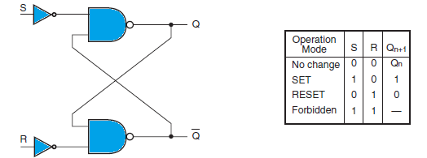
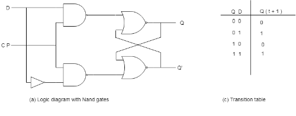
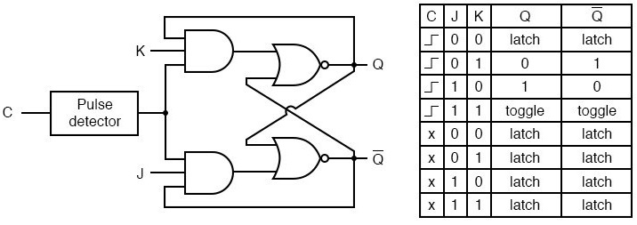

# 5. Sekvenční obvody, jejich realizace, použíté klopné obvody

### Definice

    Sekvenční obvod se liší od kombinačního nezávislostí na okamžité hodnotě signálu.
    U sekvečního nám nezáleží na hodnotách na hradlo vstupovanými dokud nepřepneme signál CLK = synchonizační impuls do logické jedničky.Tím získáváme obvod, který je schopen si zapamatovat stav(obsahují pamět).

### Synchronní

    Je zaveden řídící synchronizační signál(hodinový signál, hodiny).
    Změna vstupní proměnné se promítne do stavu sekvenčního obvodu až při příchodu hodinového signálu.

### Asychronní

    se změna vstupní proměnné promítne ihned do stavu sekvenčního obvodu

### Astabilní

    Astabilní klopné obvody, označované také jako AKO, nemají žádný stabilní stav, což znamená, že tyto obvody neustále oscilují (překlápějí se) mezi jedním a druhým stavem podle nastavené časové konstanty. AKO jsou proto používány jako impulzní generátory, tónové generátory, blikače.

### Monostabilní

    Monostabilní klopný obvod, označovaný jako MKO, má jeden stabilní stav, ze kterého je možné jej přepnout do stavu nestabilního. Obvod se sám po určité době přepne zpět do stabilního stavu. Tento typ obvodu je možné použít například jako zpožďovací prvek.
    
    Obvod je možno použít jako generátor impulsu definované délky, lze také realizovat pomocí časovače 555, viz MKO pomocí obvodu 555. Dále jako zpožďovač impulsů, dělička impulsů, nebo v čítačích impulsů.

### Bistabilní

    Bistabilní klopný obvod je klopný obvod, který má dva stabilní stavy. Mezi těmito stavy lze přepínat pomocí signálů přivedených na vstupy. Tyto obvody se proto používají jako paměťové prvky.
    
    BKO mají mnoho variant a provedení. Nejznámější jsou: RS, JK, D a T.

### Typy klopných obvodů

### RS

    RS je jedním z nejzákladnějších a nejjednodušších Bistabilních klopných obvodů.
    
    Vstup R se označuje jako Reset. Přivedení hodnoty logická 1 na tento vstup vynuluje hodnotu Q (neboli nastaví výstup na hodnotu logická nula).
    Vstup S se označuje jako Set, přivedení hodnoty logická 1 na tento vstup nastaví hodnotu Q na logickou 1.
    
    Pokud je na R a S zároveň logická 1, mluvíme o zakázaném nebo také hazardním stavu. Znamená to, že tento stav není definován a pokud nastane tato vstupní kombinace, není předem možné určit, v jakém stavu se bude nacházet výstup obvodu.
    
    Aby se tomuto stavu zabránilo, konstruují se tzv. RS obvody s prioritou. A to buď set nebo reset. V případě, že by u normálního obvodu mělo dojít k hazardnímu stavu, obvod s prioritou se přepne buď do 1 (priorita set) nebo do 0 (priorita reset).
    RS klopný obvod lze realizovat pomocí dvou dvouvstupých hradel typu NAND nebo NOR.[1] Výstup prvního členu se vede do jednoho ze vstupů druhého členu, výstup druhého se vede do jednoho ze vstupů prvního.

### D

    Klopný obvod D realizuje jednobitovou pamět.
    
    Z obvodu RS se snadno vyrobí tím, že na vstup R přivedeme negovanou hodnotu vstupu S.
    Výstupy klopného obvodu kopírují stav vstupního signálu Data po dobu, po kterou je vstupní signál Clk ve stavu log.1. Při hodnotě log.0 na vstupu Clk zůstává na výstupech zachován poslední stav, který byl zapamatován při hodnotě Clk = log.1.

### JK

    JK má vstupy funkčně shodné s obvodem RS: J nastavuje hodnotu logická 1, vstup K nastavuje hodnotu logická 0. 
    
    Pokud jsou oba vstupy J a K aktivní (u KO RS mluvíme o zakázaném stavu), vnitřní hodnota se při hodinovém pulzu neguje. Oproti RS se tento klopný obvod vyrábí pouze v synchronní variantě.
    
    Tento obvod nese označení po vědci jménem Jack Kilby (proto zkratka JK), který jej v roce 1958 představil ve firmě Texas Instruments (patent na jeho jméno vyšel o rok později). Protože název obvodu nemá žádný odvozený význam, existuje v angličtině mnemotechnická pomůcka pro označení vstupů „jump-kill“, tedy „nahoď-zruš“.

### Realizace sekvenčního obvodu

    V digitální technice se klopné obvody realizují pomocí logických hradel. Nejjednodušším klopným obvodem je asynchronní klopný obvod typu RS, který se skládá ze dvou hradel zapojených se zpětnou vazbou (cross-coupled circuit, feedback). Ostatní typy jsou založené na něm.

### Využití klopných obvodů

    Klopné obvody jsou používány na široké spektrum aplikací
    - Čítače
    - Frekveční děliče
    - Posuvné registry
    - Datové registry
    - eliminace plovoucí nuly
    - Ukládání dat
    - Přenos dat
    - Latch
    - Paměť