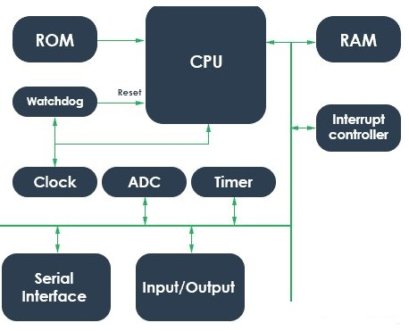
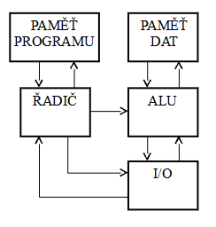
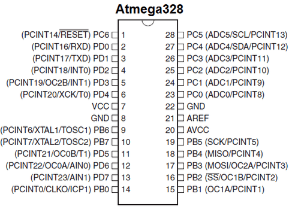
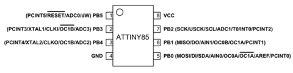

# 7. Mikrořadiče (MCU), jeho struktura, význačné integrované periferie

### Charakteristiky MCU

    Mikrokontrolér či jednočipový počítač se vyznačuje jedním integrovaným obvodem, který je velmi spolehlivý a je schopen vykonávat právě jednu aplikaci.Zpravidla obsahuje vše co potřebuje a často také obsahuje spoustu podpůrných obvodů.

### blokové schéma MCU a jeho CPU

### Mikrořadič minimálně obsahuje:

    - CPU/mikroprocesor 
    - generátor hodinového signálu CLK 
    - paměťový subsystém  
    - I/O subsystém 
    
    Dále jsou běžně přítomny: 
    
    - čítače (pro práci v reálném čase), 
    - sériový port, I2C sběrnice, SPI rozhraní,
    - řadič přerušení, 
    - ale i A/D převodníky s multiplexory, D/A převodníky, obvody logického řízení a řízení spotřeby atd.  `

### Harvardská Koncepce ČP 

    Mikrořadiče jsou z hardwarového hlediska hardvardskou architekturou, jelikož zakomponovávají procesor, pamět, i/o periferie atd.

### Architektury MCU

Vývoj systému s MCU staví návrháře před protichůdné požadavky, které nabízí dvě možnosti řešení:

    1) k mikrořadiči připojit z vnějšku rozšiřující sběrnici s potřebnými obvody
       
    2) mikrořadič rozšířit uvnitř, tj. vytvořit nový čip – klon, derivát, který nově zahrne původní mikrořadič a navíc i ty pomocné obvody, které vyžaduje aplikace. 
       
    Zásadní rozdíl proti variantě
    
    1) rozšíření „vnější sběrnice“ je v tom, že při rozšiřování na „vnitřní sběrnici“ nedochází k ome­zování funkcí vývodů MCU (např. paralelních portů) a tím k deklasování jeho výhod. Rozšiřování na vnitřní sběrnici 
       
    2) je ovšem v možnostech jen výrobců MCU.Ti však produkují stále větší počet takto zdokonalených typů, se složením zřetelně orientovaným na určité aplikace, ale se zachováním plné instrukční kompatibility s původním typem MCU. 

### Rozlišení

    Rozlišujeme podle:
        - Podle instrukční sady
        - Šířky slova
        - Počet vstupů/výstupů
        - Oscilátoru

### Instrukční sada

    Instrukční sady dělíme na: 
    
    - CISC (Complex Instruction Set Computer)
    
        Označení complex vyjadřuje skutečnost, že strojové instrukce pokrývají  velmi široký okruh funkcí.
    
        Tyto instrukce by se dali naprogramovat pomoci jednodušších již obsažených strojových instrukcí (například násobení je možné nahradit sčítaním a bitovými posuny).
    
    - RISC (Reduced Instruction Set Computer)
    
        RISC udává procesory s redukovanou instrukční sadou, jejichž návrh je zaměřen na jednoduchou, vysoce optimalizovanou sadu strojových instrukcí, která je v protikladu s množstvím specializovaných instrukcí ostatních architektur.
    
        Registry bývají víceúčelové, což zjednodušuje návrh překladačů.

### Šířka slova

    Jedním ze základních ukazatelů procesoru je počet bitů, tj šířka operandu (slova), který je procesor schopen zpracovat v jednom kroku.
    
    První procesory byly 4 bit.Brzy přišly 8 bitové procesory, u nichž se zjednodušeně dá říci, že umí počítat s číly od 0 do 255.Operace s většími čísly pak musí být rozděleni do více kroků.
    
    Tradičně máme MCU s 8 bit, 16 bit a 32 bit.

### Počet vstupů/výstupů

    Jak název uvádí každý mikrokontrolér obsahuje jiný počet vstupů a výstupů a je proto vhodné vzít v potaz aplikaci.
    
    Např. atmega328 (která je obsažena ve veřejně známém Arduinu Unu) využila všech 21 digitálních I/O pinů.

     Místo toho je vždy možnost zvolit menší mikrokontrolér a tím ušetřit jak náklady tak spotřebu.Například pro připojení jednoduchého teploměru by nám stačil můj oblíbený ATTiny85 s pěti piny, které bohatě stačí na primitivní aplikaci.

### Oscilátor

        Existuje většinou vnitřní oscilátor(odporový obvod kondenzátoru).
        Nevyžadují se žádné externí komponenty: Můžete spolehlivě předpokládat, že frekvence je správně zvolena, protože oscilátor byl navržen stejnými lidmi, kteří navrhli zbytek mikrokontroléru. Významné výkonnostní parametry - např. Počáteční přesnost, pracovní cyklus, teplotní závislost - jsou (snad) v datovém listu.
    
        Externí může být krystal, Hodiny CMOS, keramický rezonátor, kondenzátor.
        Když potřebujete vážně vysokou přesnost a stabilitu bez dodatečných nákladů krystalového oscilátoru IC, rozhodněte se pro samostatný přístup k krystalům.

### Integrované periferie

        Jednočipový mikropočítač nebo také mikrokontrolér (MCU) obsahuje kromě procesoru i další obvody, jako jsou časovače, nevolatilní a volatilní paměť, dále vstupně výstupní obvody, takže je schopen samostatné funkce.

        Za průkopníky v této kategorii můžeme považovat 8bitový procesor Intel i8051, který poprvé integroval všechny základní periferie (jádro procesoru, paměť RAM, EEPROM, čítače a časovače) na jediném čipu. 
    
        Většina dnešních mikrokontrolérů obsahuje UART modul, SPI rozhraní, PMW časovače.

### Výrobci

    - Nejznámnějším výrobcem v současti je Firma Microchip, jelikož koupila firmu Atmel, která produkuje světově známé mikrokontroléry řady Atmega, jenž jsou používané v deskách Arduino a jejích klonech.
      
    - Další známé firmy jsou STMicroelectronics, kteří výrazně více produkují 32bit mcu, jenž nabízejí daleko větší výpočetní výkon.
    Jejich sady, ale nejsou tak zdokumentované pro veřejnost, ale nemůžeme říct, že by se o to STM snažilo.

### Přerušovací systém

    Jednoduše řečeno přerušení přeruší běh zpracovávaného programu a přesměruje jej na tzv. „ rutinu pro obsluhu přerušení “, po jejíž vykonání se vrátí zpět za místo, odkud byl původní běh programu přerušen a pokračuje dál ve zpracování.
    
    V době vykonávání rutiny přerušení může však přijít požadavek přerušení programu od jiného zdroje přerušení. Pokud má nově příchozí požadavek vyšší prioritu, přeruší se zpracování požadavku přerušení s nižší prioritou a začne se zpracovávat nový požadavek. Po zpracování nového požadavku se dokončí požadavek s nižší prioritou a poté mikrokontrolér pokračuje ve vykonávání původního programu.
    
    Mikrokontroléry AVR disponují 21 zdroji přerušení, každý z nich má svůj vektor přerušení, t.j.  svoji adresu umístění v paměti programu. Po příchodu požadavku přerušení program skočí na tuto adresu. Zde musí být uložena rutina (program)  pro obsluhu daného přerušení. Přerušení mají pevně určenou prioritu. Nejvyšší prioritu má signál RESET.

### Status Registr

    Všechna přerušení, která budeme používat, musí být aktivována nastavením příslušných bitů  ve vstupně/výstupních registrech a bitem I globálního povolení přerušení v registru SREG.

    Registr SREG obsahuje stavové bity běžné u všech procesorů. Bit I (bit7) musí být nastaven na „1“, pro globální povolení přerušení.
    
    Pokud je přerušení aktivováno, je bit I automaticky nulován, čímž je zakázán příjem dalších přerušení. Řízení programu přechází do rutiny obsluhy přerušení. Uživatel může bit I v obslužné rutině  nastavit, pak je možné přijmout další přerušení. Po návratu z obsluhy přerušení je bit I automaticky nastaven, čímž je opět povolen příjem přerušení.

### Programovací jazyky pro MCU

    Pro programování mikrokontrolérů se původně používal strojový kód, ale dnes se používá vícero jazyků jako:
    Python,Javascript,C/C++,Assembler.
    
    Nejvíce na programování MCU se využívá C, které je nejblíže k HW jak je to možné.C vám dovolí programovat přímo registry bez ztráty kontroli nad jednotlivými komponenty mikrokontroléru.

### Vývojové prostředí pro programování MCU

    Jako vývojové prostředí se používá Arduino IDE založené na Javě, které funguje skvěle pro hromadu vývojových desek a mikrořadíčů.Je jednoduché a má vše co programátor může potřebovat.Další vývojové prostředí je MPLAB známy pro programování PIC.Jako poslední bych uveřejnil velmi dobré Microchip studio od firmy Microchip(dřívé Atmel).

### Assembler

    Pro programování je velice dobrý Assembler z důvodů:
    
    - Programování v něm oproti jiným jazykům znaméná rychlejší vykonání kódu.
    - S jeho pomocí prozkoumáte všechny výhody MCU
    - Používáním Assembleru máte přesný a přímý přístup ke všem prostředkům
    - V porovnání s Vyššímy jazyky má Assembler méně pravidel a omezení.

