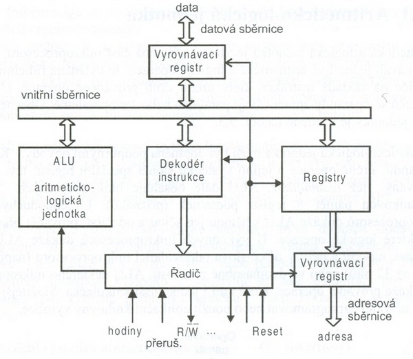
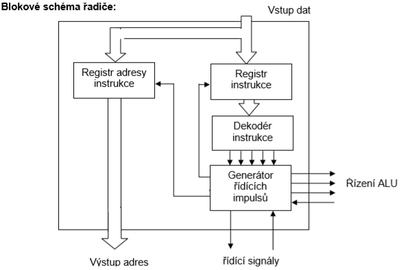

# 9. Mikroprocesor v reálném režimu, adresování LA a FA

### Definice

    Jedná se o základní režim pro mikroprocesory z rodiny x86.
    Typickými vlastnostmi režimu reálných adres je segmentace paměti s 20bitovou adresací (tedy nanejvýš 1 MiB přímo adresovatelné paměti) a neomezený přímý přístup do celé paměti i ke všem perifériím. Nelze tedy zajistit spolehlivé fungování multitaskingu.

### Důvody zavedení a jeho provozování

    Realný režim odpovídá jedinému pracovnímu režimu starších mikroprocesorů Intel 8086.To je také důvod, proč procesory z rodiny x86(včetně nejmodernějších 64 bitových procesorů) dodnes z důvodu zpětné kompability začínají svůj běh právě v reálném módu a do jiného režimu je musí explicitně přepnout jádro operačního systému.

### Porovnání Reálného režimu s Chráněným režimem

| Reálný režim                                                                         | Chráněný režim                                                                                             |
| ------------------------------------------------------------------------------------ | ---------------------------------------------------------------------------------------------------------- |
| 16b HW systém procesoru:  1x celočíselná ALU  1x reálná FPU  Obě v EU - Execution Unit  | Vícejádrový procesor:   32b/ 64b HW s HyperThreadingem   (1jádro – 2 vlákna)                                   |
| OP RAM 1MB   Dělená na konstatní segmenty 64kB velikosti Cache 1 úrovně pro 0 procesor | OP RAM ≥ 4 GB   Dělená na segmenty proměnlivé velikosti 4 GB 2/3 úrovně Cache (L1, L2, L3)                   |
| IO obvody s komunikací 16b /  8b Adresový prostor 64kB                                 | IO obvody s komunikací 16b / 8b   Adresový prostor 64kB                                                      |
| Jeden program   (jedno úlohový systém)                                                 | Multitasking, virtuální program   Programy – úrovně aplikací                       &nbsp;&nbsp;&nbsp;&nbsp;&nbsp;&nbsp;&nbsp;&nbsp;&nbsp;&nbsp;&nbsp;&nbsp;&nbsp;&nbsp;&nbsp;&nbsp;&nbsp;       - úrovně supervizoru |
| Celková redukce procesoru na jednoduchý (8086) 16b Pr.                               |                                                                                                            |

    Jeho provedení by se dalo popsat jako:
    - samostatné okno s příkazovou řádkou
    - Úvodní činnost procesoru po zapnutí (POST) a příprava na Chráněný režim 
    - Pracuje jedno úlohově

### Struktura Mikroprocesoru

    Jedná se o více účelové,signálem hodin řízené, registrově založené zařízení,
    které přijme data ve formě binárního kódu a náležitě zpracuje dle instrukcí ve své paměti.

    Mikroprocesor je obvykle složen na jednom čipu a skládá se z několika částí:
    - ALU
    - Řadič
    - Sběrnice(Adresní,datová,řídící)
    - Program counter
    - Registry
    - Execution Unit

### ALU (Arithmetic Logic Unit)

    Jednotka ALU provádí všechny aritmetické a logické operace s datovými operandy v pevné řádové čárce.
    V mnoha dalších procesorech je na jednom procesoru více než jedna ALU, obvykle rozdělené na jednotky pro práci s celočíselnými operandy a jednotky pro práci s operandy v plovoucí řádové čárce(Jednotka FPU).

    Jednotlivé ALU pracují relativně nezávisle, takže procesor může v jednom hodinovém taktu provést více instrukcí ve více jednotkách současně.

### Řadič

    Řadiče jsou výkonové obvody, které na základě zpracovaných instrukcí generují řídící signály a tím řídí určitou část počítače. Pracují jako podpůrné obvody CPU (DMA, IRQ) nebo jako překladače mezi CPU a periferním zařízením (řadič disků, klávesnice, síťová karta, grafická karta, zvuková karta, atd.) Řadiče jsou integrovány na základní desce nebo jsou ve formě přídavné desky.
    
    Hlavní funkce řadičů:
    - oddělují hardware od software
    - vzájemně přizpůsobují rychlost zpracování dat mezi jednotlivými obvody    pracující různou rychlostí
    - převádějí data z formátu CPU na formát používaný přídavným zařízením
    - případně zesilují elektrické signály 
    - 

### Registry

    Mikroprocesory mají dočasné úložiště známe jako registry.Tyto úložiště udržují instrukce, adresy,data atd.Některé instrukce vyžadují použití speciálních registrů jako část instrukce.Každý registr má speciální funkci jako registr instrukce,program counter,registr akumulátoru a paměťový adresní registr.

### Sběrnice

    Mikroprocesory využívají systém sběrnic na kterých přesouvají data.Sběrnice se dají chápat jako vodiče, které mají specifický účel.
    Na datové sběrnici se přesouvají data mezi procesorem a operační pamětí.Kontrolní sběrnice posílá informace o vyžadovaných nastaveních a kontrole více činností.
    Adresní sběrnice vysílá adresy mezi procesorem a operační pamětí pro přístup na požadovanou adresu.

### EU (Execution Unit)

    Vykonávací jednotka vykonává operace a kalkulace jak je napsáno v programu.Může to mít svou interní řídící jednotku, registry a ostatní interní jednotky jako ALU, adresní počítací jednotku (AGU),FPU, LSU.

    Je běžné pro moderní procesory mít více paralelních funkčních jednotek ve své vykonávací jednotce, cemuž se říka superskalární design. 

### Velikost a zobrazení OP

    operační pamět umožňuje čtení i zápis používaný pro dočasné uložení zpracovávaných dat a spuštěných programů.

    Přístup k operační paměti je mnohem rychlejší než k vnější paměti, procesor pomocí adresy přímo vybírá požadovanou buňku operační paměti. Paměť je s procesorem spojena pomocí rychlé sběrnice; pro další urychlení se mezi procesor a operační paměť vkládá rychlá vyrovnávací paměť typu cache, která mívá 2 až 3 úrovně.

    Fyzický adresový prostor (FAP) paměti se jeví jako souvislý prostor paměťových míst (buněk) určité velikosti (typicky 1, 2, 4 nebo 8 bytů). Tyto buňky jsou pak lineárně adresovány adresami pevné délky. Velikost tohoto prostoru je omezena buď kapacitou a počtem paměťových modulů nebo velikostí adresy (adresa o velikosti n bitů umožňuje adresovat 2n paměťových míst).

### Segmentace paměti důvod zavedení segmentace paměti, 

    Původní požadavak na správu OP od programátorů:
    - Přenositelnost programů mezi 2 počítači
    - ochrana kódu a dat spuštěného programu před "poškozením"

    To zajistí členění OP na celistvé úseky - segmenty

    Umístnění segmentu - dát jeho bázi na volné místo OP (V různých poč. je tento program v různých místech OP, kde je volno)

    Adresovaání jen uvnitř segmentu - offset v segmentu (offsetová adresa musí být uložitelná do násobků pam. místa - pam místo 1 Byte => offset 2 Byte)

    Velikost segmentu 64 KB
    velikost ukazatelů 16 bitů (registrů PC,SI,SP) - nepřesáhnou hranici 64 kB

### typy segmentů, jejich báze a ukazatelé

    Máme čtyři typy segmentů

| Typ | Offsetový reg. | pozn. |
|-|-|-|
| Kódový (Code) | reg. PC/reg. IP | 1 i více sergmentů (2,3,..) na proces jen jeden aktivní |
| Data | reg. Si,Di,BX,BP libovolný z nich | 1 i více segmentů (2,3,..) na proces jen jeden aktivní |
| Zásobník (Stack) | reg. SP | SP řídíčí řadič Proc. je jen 1 segm STACK |
| Extra data | reg. SI,DI,BX,BP libovolný z nich | stejné jako u DATA |

    Kvůli požadavku na přenositelnost programů je zavedena Logická Adresa(LA), která má tvar LA = báze segmentu:offset uvnitř segmentu

    Báze - začátek segmentu v OP 1MB 
    Offset - adresa uvnitř segmentu 64KB

    
| Registry báze | Offset ukazatele |
|-|-|
| CS | PC či IP |
| DS | SI,DI,BX,BR |
| SS | SP,BP |
| ES | SI,DI,BS,BR |

    Příkl. CS:PC nebo DS:SI atd.

### výpočet LA z FA (příklad!)

    